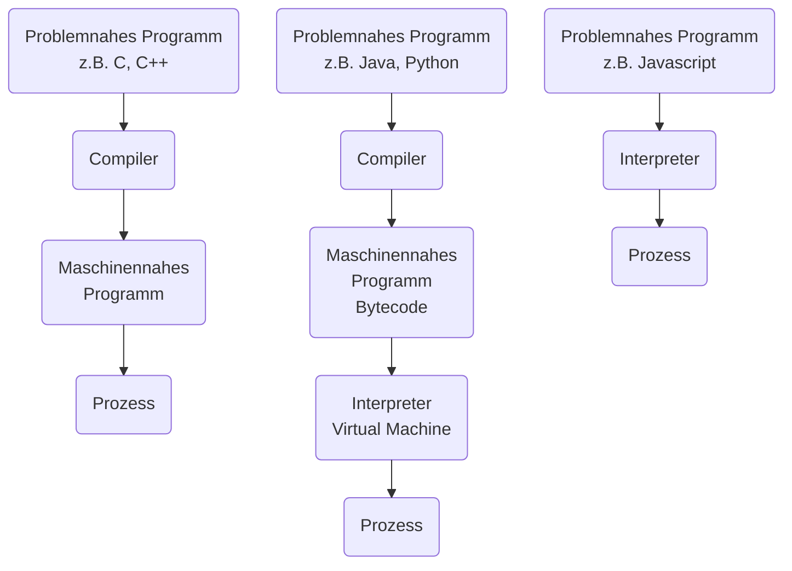

## Programmiersprachen Grundlagen

##### Algorithmus, Sprache und Programm

>Programme sind für einen Prozessor gefasste Verarbeitungsvorschriften, die bestimmen, was der Computer in welcher Reihenfolge wie oft tun soll, wenn das Programm ausgeführt wird. 
>Solche Verarbeitungsvorschriften nennt man im Allgemeinen „Algorithmen“.

> Die von einem Computer verstandene, sprachliche Form eines Algorithmus nennt man ein Programm.

##### Compiler vs Interpreter



|               | Compilersprachen                          | Interpretersprachen                        |
| ------------- | ----------------------------------------- | ------------------------------------------ |
| Autonomie     | Compiler nur für Entwicklung erforderlich | Interpreter auch zur Laufzeit erforderlich |
| Überprüfungen | intensiv, zeitaufwendig                                          | oberflächlich, wenige                                           |
| Fehlerbehandlung              | Vokabular, Grammatik, z.T. Semantik zur Compilezeit                                          | Entwicklungsumgebungen, Debugginghilfen zur Laufzeit                                           |
| Programmausführung              | sehr schnell                                          | etwas langsamer                                           |
| Programmentwicklung              | etwas mühevoller                                          | direkter                                           |
| Beispiele              | C, C++, Pascal, Java, Python                                          | Python-Bytecode, Java-Bytecode, Javascript                                           |


## Variablen
##### Definition und Datentypen

> Eine Variable ist eine benannte Referenz auf ein Datenelement.

| Datentyp | Bezeichnung |
| ---- | ---- |
| int, float | Zahlen |
| list, tuple, range, str | Squenz |
| set, frozenset | Mengen |
| dict | Mapping |
| bool | Wahrheitswert |
##### Beispiele 
| Datentyp | Literal |
| ---- | ---- |
| int | 35 |
| float | 3.124 |
| bool | True |
| str | "HdM" |
| list | [1,235,7,6] |
| tuple | (5,2,67,2) |
| set | {6,2,65,7} |
| dict | {"Uni":"Hdm", "Semester":1} |
##### Type Conversion

Implizite Type Conversion
```python
x = 10
y = 1.53623
s = x + y
# hier werden x(Integer) und y(Float) zu s(Float) zusammengefügt ohne das explizit anzugeben

print(s)
#Output: 11.53623
```

Explizite Type Conversion
```python
x = 10
y = "Nummer:"

s = y + str(x)
# hier wird x explizit zu einem String umgewandelt

print(s)
#Output: Nummer:10
```
## Operatoren

##### Arithmetisch
| Operator | Beschreibung |
| ---- | ---- |
| x + y | Addition |
| x - y | Subtraktion |
| -x | Negation |
| x * y | Multiplikation |
| x ** y | Exponentiation $x^y$ |
| x / y | Division |
| x // y | Ganzzahl Division (ohne Rest) |
| x % y | Modulo-Operator (Rest der Division von x und y) |
##### Vergleich
| Operator | Beschreibung |
| ---- | ---- |
| x < y | kleiner |
| x <= y | kleiner gleich |
| x > y | größer |
| x >= y | größer gleich |
| x == y | gleich |
| x != y | ungleich |
| x is y | identisch |
| x is not y | nicht identisch |
##### Logisch
| Operator | Beschreibung |
| ---- | ---- |
| x and y | wenn beide True |
| x or y | wenn x oder y True |
| not x | wenn x False |

## Funktionen

##### Definition 

>Eine Funktion stellt ein Unterprogramm (auch Prozedur oder engl.: subroutine) dar.

> Ein Unterprogramm ist ein Teil eines Programms, dass eine Teil-Lösung eines Problems bereitstellt.
> Das Unterprogramm ist aus anderen Teilen des Programms aufrufbar (meistens durch dessen Namen).

> Unterprogramme können selbst wiederum aus Unterprogrammen bestehen.


##### Aufbau

 - def; Schlüsselwort um eine Funktion zu definieren
 - Name der Funktion
 - In Klammern die Liste der Parameter
 - :
 - Anweisungen eingerückt mit *tab* oder *4 leerzeichen*
 - "return" gibt das Ergebnis zurück
##### Beispiel

```python
def Name(x,y):
	return x + y
``` 
## Kontrollfluss

##### Definition

> Programmieren heißt, Anweisungen in einer Datei abzulegen.

> Ohne Kontrollfluss-Anweisungen führt der Interpreter diese Anweisungen von oben nach unten und links nach rechts aus.

> Mit Kontrollfluss-Anweisungen kann man
> - Anweisungen in Abhängigkeit von Bedingungen ausführen
> - Anweisungen wiederholt ausführen
> - den normalen Ablauf auf andere Weise beeinflussen

##### Aufbau

Allgemeine Form einer Kontrollfluss-Anweisung:
~~~python
control flow statement details:
	statement
	statement
~~~
(Wie bei Funktionen werden Statements mit einem *tab* oder *4 Leerzeichen* eingerückt)

##### Arten
| Typ | Keyword |
| ---- | ---- |
| Schleifen | while, for |
| Entscheidungen | if-else |
| Ausnahmebehandlung | try-except-finally, raise |
| Verzweigung | break, continue, return |


##### if

> if führt die Statements *nur dann* aus wenn die Beingung erfüllt ist.
```python
zahl = 4.5

if zahl > 4:
	print("größer 4:" + str(zahl))
```
> größer 4: 4.5
##### else

>Statements in else werden *nur dann* ausgeführt, wenn die vorherige if nicht ausgeführt wurde.
```python
zahl = 3.2

if zahl > 4:
	print("größer 4:" + str(zahl))
else:
	print("kleiner 4:" + str(zahl))
```
> kleiner 4: 3.2
##### elif

>Statements in elif werden *nur dann* ausgeführt, wenn die vorherige if (oder elif) nicht ausgeführt wurde *und* die Bedingung erfüllt ist.
```python
zahl = 2.0

if zahl > 4:
	print("größer 4:" + str(zahl))
elif zahl == 2.0:
	print("exakt 2:" + str(zahl))
else:
	print("kleiner 4:" + str(zahl))
```
> exakt 2: 2.0


##### range()

> range() "gehöhrt" nicht zum Kontrollfluss, es ist eine Eingebaute Funktion.
> Es ist hier da sie oft in Schleifen genutzt wird (siehe Kapitel *for* später).

range(y) gibt eine hochzählende Liste von 0 und der Länge y

range(5): (0,1,2,3,4)
range(10): (0,1,2,3,4,5,6,7,8,9)


Es *können* mehr Parameter angegeben werden: range(x,y,z)
x: start der liste
y: ende der liste (ohne y selber, also 5 endet mit 4)
z: um wieviel es hoch gehen soll pro schritt

 range(2,11,2): (2,4,6,8,10)
 range(0,-6,-1): (0,-1,-2,-3,-4,-5)
##### while

>while wiederhohlt die Statements bis die Bedingung nicht mehr efüllt ist.
```python
zahl = 0

while zahl < 5:
	print(zahl, end=', ')
	i += 1
```
> 0, 1, 2, 3, 4,
##### for

>for widerholt die Statements und geht dabei die Angegebene Sequenz durch, so lange bis die gesamte Sequenz einmal durchgegangen wurde

> also in dem Beispiel wird die Sequenz (0,1,2,3,4) durchgegangen wobei "zahl" immer den Wert des momentanden Elements annimmt
```python
for zahl in range(5):
	print(zahl, end=", ")
```
>0, 1, 2, 3, 4,

##### break

> break unterbricht Schleifen

```python
for zahl in range(100):
	if zahl == 10:
		break
	print(zahl, end=", ")
```
>0,1,2,3,4,5,6,7,8,9,10,

da das "break"-Statement *vor* dem "print"-Statement ist, wird "10" nicht ausgegeben.

##### continue

> Überspringt die jetztige Iteration und fährt mit der nächsten weiter.

```python
for zahl in range(10):
	if zahl == 5:
		continue
	print(zahl, end=", ")
```
>0, 1, 2, 3, 4, 6, 7, 8, 9

##### try-except-finally

>"try" führt Statements aus solang keine "Exceptions" (Fehler; aber auch absichtlich mit "raise") geworfen werden.

>Statements in "except" werden ausgeführt wenn try nicht ausgeführt wurde.

(try-except sind ähnlich zu if-else, nur bei try-except geht es um Probleme nicht Bedingungen)

> "finally" wird immer ausgeführt, egal ob ein Fehler auftritt oder nicht

```python
try:
	for zahl in range(10):
		if zahl == 5:
			raise ValueError
		print(zahl, end=', ')

except ValueError:
	print('Number is 5')
```
>0, 1, 2, 3, 4, Number is 5

Nach "except" kann auch ein spezifischer Fehlertyp angegeben werden.
In dem Fall wird except nur ausgeführt wenn genau dieser Fehler auftritt.

## Collections

##### Definition und Übersicht

>Collections sind Sammlungen von Daten

| Kategorie | Datentyp | Beispiel / Literal |
| ---- | ---- | ---- |
| mutable(veränderbare) Sequence | list | \[1,78,5,378,3] |
| immutable(unveränderbare) Sequence | str | "Hello World" |
| immutable(unveränderbare) Sequence | tuple | (0,4,67) |
| immutable(unveränderbare) Sequence | tange | range(10) |
| Mapping | dict | {"Uni":"Hdm", "Semester":1} |
| Set | set | {1,2,3,12,15} |
##### Operatoren für Sequenzen 

in den Beispielen:
x: Sequenz
y: andere Sequenz
n: Nummer
m: andere Nummer

| Operator | Beschreibung |
| ---- | ---- |
| n in x | True wenn, n in x enthalten ist |
| n not in x | True wenn, n nicht in x enthalten ist |
| x + y | Kombiniert x und y |
| n * x | Fügt die Sequenz x n-mal zusammen |
| x\[n] | n-te Element von x |
| x\[n:m] | Slice von x ab n bis m |
| len(x) | Länge von x |
| min(x) | Kleinstes Element von x |
| max(x) | Größtes Element von x |
| x.count(n) | Wie of n in x enthalten ist |
##### Operatoren für veränderliche Sequenzen (Listen)

| Operator | Beschreibung |
| ---- | ---- |
| x\[n] = m | Setzt das n-te Element von x auf den Wert m |
| x\[n:m] = y | Setzt den Abschnitt von n bis m in x auf y |
| del x\[n:m] | Löscht alle Elemente von n bis m in x |
| x.append(n) | Fügt Element n ans Ende von x an |
| x.clear() | Entfernt alle Elemente |
| x.copy() | Flache Kopie von x |
| x.deep_copy() | Tiefe Kopie von x |
| x.extend(y) | Erweitert x mit der iterablen y |
| x \*= n | Vervielfacht x n-mal |
| x.insert(n,m) | Fügt m an der Stelle n in x ein |
| x.pop(n) | Löscht das n-te Element in x und gibt es zurück |
| x.remove(n) | Enfernt das erste n in x |
| x.reverse() | Umdrehen der Reihenfolge |

##### Strings

> Zeichenketten (Strings) sind Instanzen der Klasse str.
> Nach Instantiierung können Strings nicht mehr verändert werden! 
> Sie sind (engl.) immutable!

Beispiel:
~~~python
s = "Das ist ein String"

print(s.count("i"))
#Output: 3

print(s.upper())
#Output: DAS IST EIN STRING

print(s.lower())
#Output: das ist ein string

t = s.split(" ")
print(t)
#Output: ["Das", "ist", "ein", "String"]
#Der Output hier ist eine Liste

" ".join(t)
#Output: Das ist ein String
#join fügt die Liste wieder zu einem String zusammen

print(s.find("s"))
#Output: 2
#(Seqenzen fangen immer bei 0 an)

print(s[:3])
#Output: Das
#Ein Slice vom String bis index 3
~~~

##### Listen

> Listen können Referenzen auf Objekte beliebigen Typs enthalten.

Beispiel:
```python
l = [1,2,3,4,5,10,20]

for i in l:
	print(i, end=", ")
#Output: 1, 2, 3, 4, 5, 10, 20,

print(l[3:])
#Output: [4,5,10,20]

l.append(100)
print(l)
#Output: [1,2,3,4,5,10,20,100]

l += [1,2,3]
print(l)
#Output: [1, 2, 3, 4, 5, 10, 20, 100, 1, 2, 3]

print(len(l))
#Output: 11

print(l.pop())
#Output: 3

print(l)
#Output: [1, 2, 3, 4, 5, 10, 20, 100, 1, 2]
```

##### Tupel

> Tupel sind wie Listen nur nichtänderbar (immutable)

Beispiel:
```python
t = (1,2,4,8)

print(t)
#Output: (1,2,4,8)

print(t[1])
#Output: 2

#packing
p = 10,20 
print(p)
#Output: (10,20)

#unpacking
n, m = (10,20)
print(n, m)
#Output: 10 20
```

##### Dictionaries

> Dictionaries sind Mppings welche aus Key-Value Paaren bestehen

Beispiel:
```python
d = {"name" : "Name", "score" : 0.85}
#"name" und "score" sind die Keys
#"Name" und 0.85 sind die Values

#das oben kann auch für bessere Übersicht so geschrieben werden:
d = {"name" : "Name", 
	 "score" : 0.85}

scores = {3654 : 0.42,
		  1111 : 0.23,
		  9351 : 0.91}

print(scores[1111])
#Output: 0.23

#Dictionaries werden auch oft genested (also ein Dictionary in einem Dictionary)

uniScores = {4500 : {"Uni": "HdM", "score" : 0.74},
			 6590 : {"Uni": "Uni Stuttgart", "score" : 0.51},
			 9000 : {"Uni": "HfT", "score" : 0.67}}

print(uniScores[9000])
#Output: {"Uni": "HfT", "score" : 0.67}

print(uniScores[4500]["Uni"])
#Output: HdM

for key, value in scores.items():
	print("key:", key, "value:", value)
#Output:
#key: 3654 value: 0.42 
#key: 1111 value: 0.23 
#key: 9351 value: 0.91

for item in scores.items():
	print(item)
#Output:
#(3654, 0.42) 
#(1111, 0.23) 
#(9351, 0.91)

for key in scores.keys():
	print(key)
#Output:
#3654
#1111
#9351

for value in scores:
	print(value)
#Output:
#0.42
#0.23
#0.91

scores.pop(1111, 0.23)
print(scores)
#Output: {3654: 0.42, 9351: 0.91}

c = dict(zip( [1,2,3], ["a","b","c"] ))
print(c)
#Output: {1: 'a', 2: 'b', 3: 'c'}
```


## Objektorientiertes Programmieren

##### Definitionen
| Name | Beschreibung |
| ---- | ---- |
| Objekt (object) | Ein Software-Objekt bestehend aus Attributen und Methoden. |
| Klasse (class) | Die Schablone für Objekte mit derselben Struktur und demselben Verhalten. |
| Vererbung (inheritance) | Eine Klasse erbt Struktur und Verhalten von ihren Oberklassen. |
##### Struktur

> Ein Objekt hat Attribute und Methoden / Funktionen

__Zum Beispiel die Klasse "Auto":__

Attribute:
- Maximalgeschwindigkeit
- Drehzahl
- Gang

Methoden / Funktionen:
 - Schalten
 - Bremsen
##### Beispiel

~~~python
# Start der neuen Klasse "Car" (Das ist dann die "Schablone" für jede neue Insanz eines Autos)
class Car: 

#Die __init__ Funktion wird bei der Erstellung eines neuen Autos automatisch ausgeführt
#Es werden die Attribute "rpm", "speed" und "gear" hier definiert
	def __init__(self): 
		self.rpm = 0 
		self.speed = 0 
		self.gear= 0 

#Hier beginnt die erste Methode "change_rpm", sie hat die Parameter "self" und "new_value"
#self kann nicht manuel gesetzt werden und ist nötig anzugeben, damit die Methode auf das Objekt selber, und damit auch den zugehörigen Attributen zugreifen kann.
	def change_rpm(self, new_value): 
#das Attribut "rpm" wird auf den Wert von dem "new_value" Paremeter gesetzt 
		self.rpm = new_value 

#das selbe wie oben nur mit gear
	def shift(self, new_value): 
		self.gear = new_value 

	def apply_brakes(self, decrement): 
# hier wird die "speed" auf "speed" minus den Parameter "decrement" gesetzt
# Das könnte auch als "self.speed -= decrement" geschrieben werden
		self.speed = self.speed - decrement
		


#Das ab hier ist ausserhalb von der Klasse

#Erstellung 2 neuer Insantzen von der "Car" Klasse
car1 = Car()
car2 = Car()

#Nutzung der oben definierten Methoden, in den Klammern werden die Parameter angegeben
car1.change_rpm(2500) 
car1.shift(2) 

car2.change_rpm(2500) 
car2.shift(2) 
car2.change_rpm(4000) 
car2.shift(3)
~~~
##### Instantiierung

Wie oben gezeigt werden Insanzen einer Klasse wie folgt erstellt:
~~~python
car1 = Car()
~~~
> hier ist "car1" eine Insanz der "Car" Klasse

Die Insantz hat die selbe Funktionalität, wie in der Klasse angegeben.
Auf die Klassenfunktionen und Variablen können wie folgt zugegriffen werden:
```python
car1.shift(2)
print(car1.gear)
```
> "shift" ist eine Methode der Klasse Car
> "gear" ist eine Variable der Klass Car
##### Decorators und pass

Decorators werden mit einem "@" über einer Methode angegeben.
Mit dem Decorator "@staticmethod" oder "@classmethod" können Klassenmethoden innerhalb Klassen angegeben werden.
Beispiel:
```python
class NewClass:
	def __init__(self):
		self.x = 10

	@staticmethod
	def static_method():
		return NewClass.x

	@classmethod
	def class_method(cls):
		return cls.x

	def empty_method():
		pass
```

> wegen pass kann der Inhalt von "empty_method()" leer sein ohne Fehler zu generieren.
> "pass" kann in Klassen, Funktionen (def .... :) , for, if, usw. (alles mit einem ":" ) genutzt werden.

Weil es einer aus dem höheren Semester erwähnt hat:
mit "pass" kann man dann die "kleinsten" Methoden, Klassen, usw. machen, falls das gefragt wird.

##### Zugriffsangaben

> Es sollte von aussen nicht auf Klassenvariablen und Funktionen zugegriffen werden, welche mit Unterstrichen markiert sind, wie die \_\_init\_\_ Methode zum Beispiel.

> Python *verhindert* es nicht aber so soll man es halt machen

| Konzept | Beispiel | Einschränkungen |
| ---- | ---- | ---- |
| public | self.x | keine |
| protected | self.\_x\_ | darf aus der eigenen Klasse und Subklassen zugegriffen werden |
| private | self.\_\_x\_\_ | darf *nur* aus der eigenen Klasse zugegriffen werden  |
##### Special Methods

> Special Methods sind schon in python eingebaute Methoden die aber überschrieben werden können.

Beispiele (nicht alle angegeben):

| Operation | Methode |
| ---- | ---- |
| == | \_\_eq\_\_ |
| != | \_\_ne\_\_ |
| < | \_\_lt\_\_ |
| > | \_\_gt\_\_ |
| + | \_\_add\_\_ |
| - | \_\_sub\_\_ |
| * | \_\_mul\_\_ |
| // | \_\_floordiv\_\_ |
| / | \_\_div\_\_ |
| % | \_\_mod\_\_ |
|  | \_\_new\_\_ |
|  | \_\_init\_\_ |
| del() | \_\_del\_\_ |
| len() | \_\_len\_\_ |
##### Vererbung

>Eine Klasse, die von einer anderen Klasse abgeleitet wird, wird Subklasse (subclass, abgeleitete Klasse, erweiterte Klasse, Unterklasse, Kindklasse) genannt.

>Die Klasse, von der die Subklasse abgeleitet ist, wird Superklasse (superclass, Basisklasse, Elternklasse) genannt.

>Außer der Klasse object hat jede Klasse mindestens eine unmittelbare Superklasse (“Mehrfachvererbung"). Jede Klasse ist aber mittelbar Subklasse von *object*.

>Eine Subklasse erbt alle Members, Variablen, Methoden von ihrer Superklasse.

Beispiel:
```python
class Car:
	def __init__(self):
		self.max_speed = 0.0
		self.range = 0.0

	def set_max_speed(self,new_speed):
		self.max_speed = new_speed

	def get_max_speed(self):
		return self.max_speed

	def set_range(self,new_range):
		self.range = new_range

	def get_range(self):
		return self.range

class Electric_Car(Car):
	def __init__(self):
		#führt die init-Methode der "Car" Klasse aus
		super().__init__()
		self.battery_size = 0.0

	def set_battery_size(self,new_battery_size):
		self.battery_size = new_battery_size

	def get_battery_size(self):
		return self.battery_size
```
> Da Klasse "Electric_Car" von der Klasse "Car" erbt hat diese auch zugrieff auf die Methoden von "Car" wie z.B. "set_range". 

##### Abstrakte Klassen

> Abstrakte Klassen dienen als erweiterbare Klassen (Superklassen), deren Methoden ergänzt oder überschrieben werden sollen.

>Abstrakte Klassen können sog. abstrakte Methoden enthalten. Dies sind Methoden ohne Implementierung, d.h. ohne Methodenkörper.


Um eine Abstrakte Klasse zu definieren muss diese von "ABC" erben.
Um eine Abstrakte Methode zu definieren muss diese den "@abstractmethod" decorator haben.
"ABC" und "abstractmethod" müssen aus "abc" importiert werden.

Beispiel:
```python
from abc import ABC, abstractmethod

class New_Abstract_Class(ABC):
	@abstractmethod
	def new_abstract_method(self):
		pass
```

Jede nicht abstrakte Subklasse von einer abstrakten Klasse muss die abstrakten Methoden überschreiben.