# 01 Einführung

## Einordnung Wirtschaftsinformatik

### Deinition

>Wissenschaft, die sich mit der Gestaltung rechnergestützter Informationssysteme in der Wirtschaft (Betriebe) befasst.

## Informationsysteme / Anwendungssysteme
### Definition

>Ein Informationssystem besteht aus Menschen und Maschinen (Rechner samt Software, Netzen, Kommunikationseinrichtungen), die Information erzeugen und/oder benutzen und die durch Kommunikationsbeziehungen miteinander verbunden sind.

| Informationssystem | Anwendungssystem |
| ---- | ---- |
| - Menschen - Guppen - Organisation - Kommunikationseinrichtungen | - Software - Hardware - Infrastrukture |

>Anwendungssysteme sind in Informationssystemen voll enthalten!
### Arten von Informationssystemen

| Art | Definition |
| ---- | ---- |
| rechnergestütztes Informationssystem | - Erfassung - Speicherung - Übertragung - Transformation von Informationen |
| operatives Informationssystem | Erleichterung der alltäglichen betrieblichen Leistungsprozesse mit betrieblichen Anwendungsprogrammen |
| Planungssystem oder Managementunterstützungssystem | Unterstützt die Führungskräfte eines Betriebs bei der - Planung - Überwachung - Einhaltung der Pläne |
## Informationssysteme und Betriebe
### Erfolg

Technologie-Akzeptanz-Modell (TAM)
 - es muss nützlich sein
 - es muss einfach zu bedienen sein

Informationssystem-Erfolgsmodell von DeLone und McLean
 - Zufriedenheit der Nutzer
 - Wird genutzt
### Integration

- Vertikale Integration: verknüpft Teilsysteme des gleichen Funktionsbereichs auf verschiedenen Stufen(Arbeiter und Management)
- Horizontale Integration: verbindet Teilsysteme aus unterschiedlichen Funktionsbereichen auf einer Ebene
## Wechselwirkungen mit der Gesellschaft
### Problemfelder

| Gebiet | Herausforderung |
| ---- | ---- |
| Digitalisierung | - BigData - IT-Sicherheit - Industrie 4.0 - Wettbewerb (Reifegrad) - digitale Spaltung |
| Globalisierung | - IT-Sicherheit - Steigerung der Komplexität der Verwaltung |
| Outsourcing | - Abhängigkeiten von anderen - Verlust von Arbeitsplätzen |
| Arbeit | - Rationalisierung und Verlust von Arbeitsplätzen |
| Freizeit | - Soziale Vereinsamung - Informationsüberflutung - Vergleiche (Instagram) |
| Umwelt | - Stromverbrauch - Elektroschrott |
| Sicherheit | - Datenschutz - Überwachung (Staat, Arbeit) |
# 02 Geschäftsprozesse
## Definitionen

Geschäftsprozess
>Komplexer, aus mehreren Funktion bestehender Arbeitsablauf zur Erledigung einer betrieblichen Aufgabe.
>Die Funktionen stehen in einem **zeitlich-sachlogischen Zusammenhang** und tragen zu einem betriebswirtschaftlichen Ziel bei.

Prozessorientierung
>Ansatz zur Organisation eines Betriebs, der die Geschäftsprozesse in den Mittelpunkt stellt

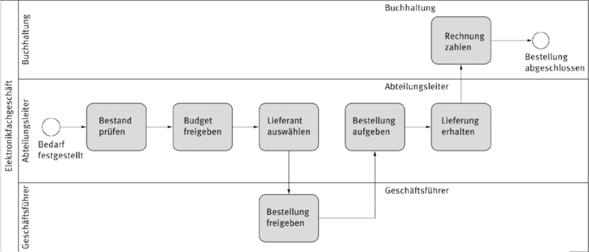

## Geschäftsprozessmanagement
>Geschäftsprozesse **effizienter** und **effektiver** machen

| Rolle | Verantwortlichkeit |
| ---- | ---- |
| Geschäftsführung | - Gestaltung der Geschäftsprozesse - Beauftragt initiative Prozessverbesserung - Strategische Ausrichtung |
| Prozessverantwortlicher | - Prozesse effizient und effektiv gestalten - Planung und Führung der Prozesse |
| Prozessteilnehmer | - Routieneaufgaben |
| Systemanalytiker | - Analyse zur Verbesserung der Prozesse |
| Anwendungsentwickler | - korrekte Umsetzung der Prozessvorgaben in betrieblichen Informationssystemen |

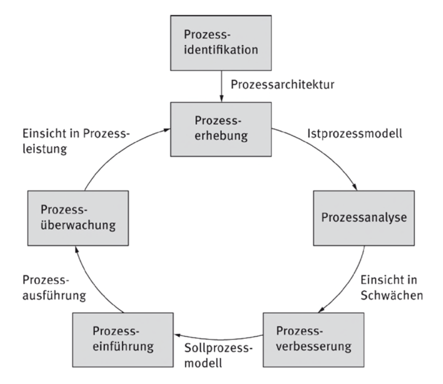

## Prozessidentifikation
### Prozesse benennen
Eine Benennung muss folgende Eigenschaften haben:
- Konsistent
- Wiederspruchsfrei
### Prozesslandkarte
>Grafische Darstellung der wesentlichen Prozesse mit Aufgabe, Zusammenhängen und Schnittstellen

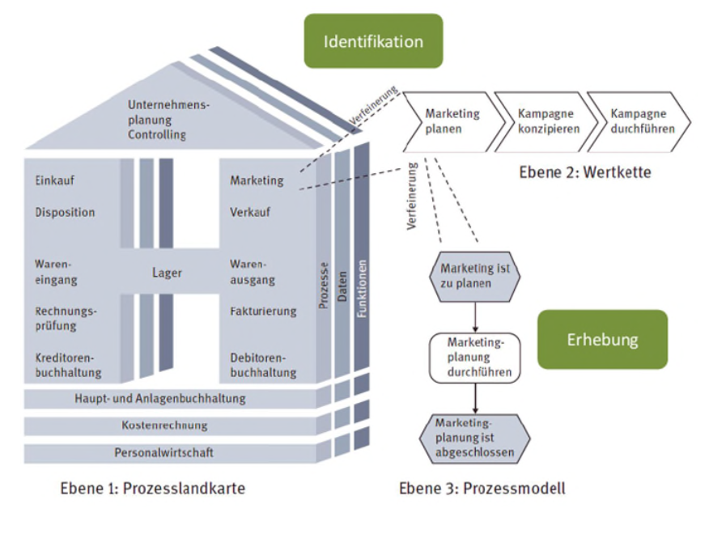

### Referenzmodelle (Beispiele)
>Modell, das eine anerkannte gut Lösung für ein häufig auftretendes Problem bietet.

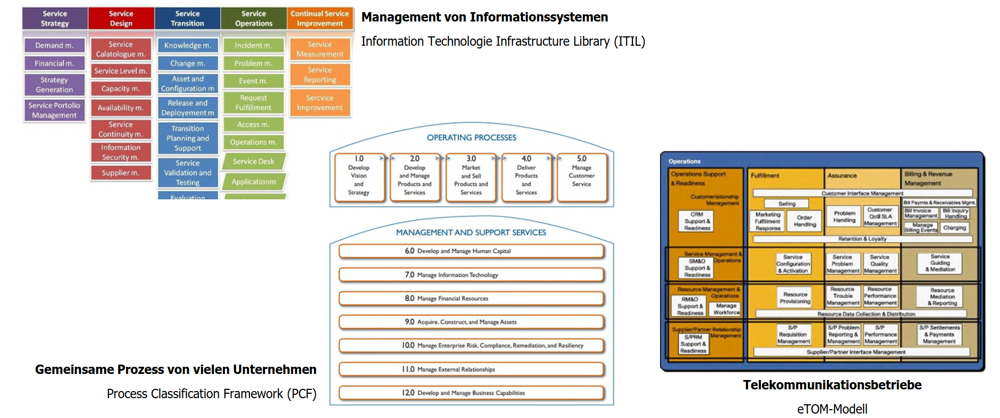
### Prozesse bewerten
- Strategische Wichtigkeit
- Verbesserungs-würdigkeit
- Verbesserungs-fähigkeit
### Prozesse strukturieren (Modellieren)
>Vorgabe zur systematischen Organisation und Beschreibung von Prozessen eines Betriebs.

Abstraktionsebenen:
1. Prozesslandkarte
2. Wertschöpfungsebene
3. Prozessmodelle

## Prozesserhebung
>**Sammlung von sämtlichen Informationen** zu einem Prozess und dessen **Aufbereitung** in Form eines **Istmodells**
### Herausforderungen
- Prozesse sind arbeitsteilig organisiert
- Heben das Abstraktionsniveaus
- Verwendung geeigneter Terminologie
- Prozessteilnehmer haben oft wenige Kenntnisse von Modellierungssprachen
### Methoden
- Bestehende Dokumentation
- Beobachtung im Echtbetrieb
- Interviews
- Workshops
## Prozessanalyse
>Das systematische Aufspüren von Schwachstellen und deren Ursachen
### Wertbeitragsanalyse
>einteilung der Funktionen in wertschöpfungs-Kategorien

- Wertschöpfende Funktionen
- Geschäftserforderliche Funktionen
- Nicht wertschöpfende Funktionen
### Ursache-Wirkungs-Diagramm
>Mögliche Ursachen für Probleme finden. Ursachen werden in sechs Bereiche unterteilt.

- Mensch
- Maschinen
- Umwelt
- Material
- Methoden
- Messung

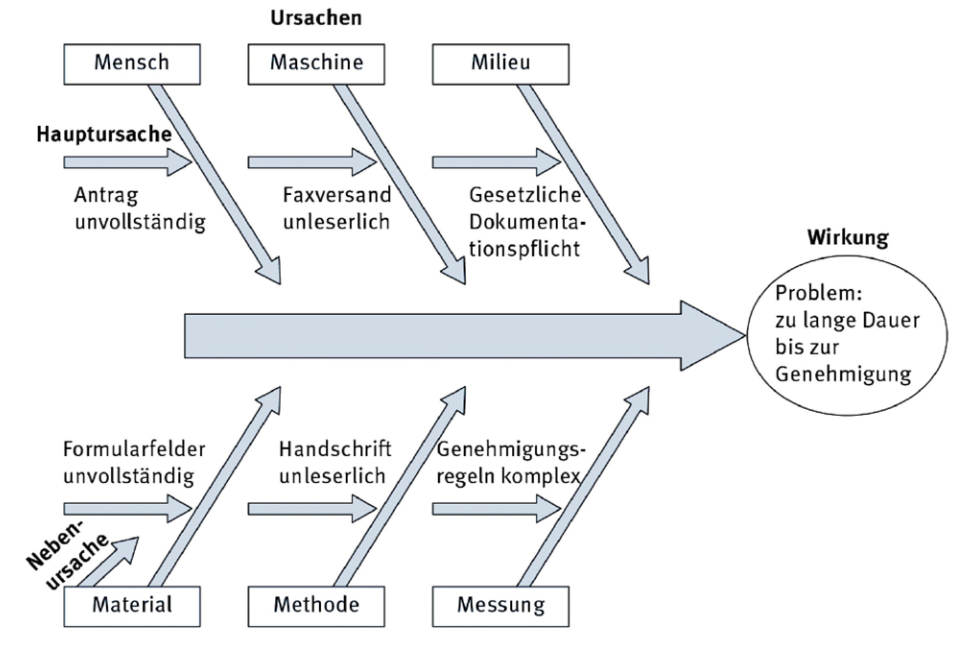

## Prozessverbesserung
>Entwickelt Vorschläge under Verbesserungen zu gefundenen Schwachstellen
### Dimensionen
>Es ist nicht möglich alle Dimensionen zur gleichen Zeit zu verbesseren

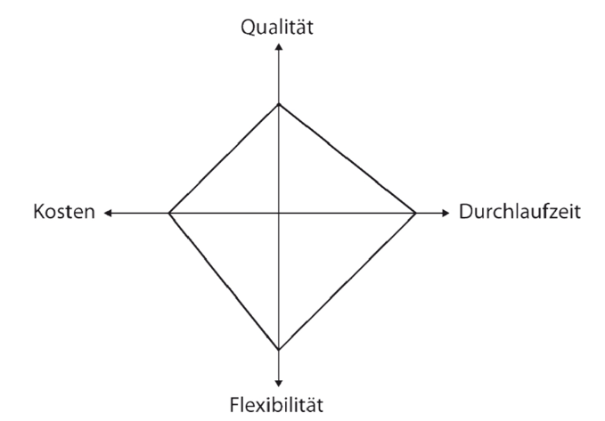

### Redesign-Heuristik
>Maßname zur Umgestaltung eines Geschäftsprozesses, die mit der Erwartung einer Verbesserung in zumindest einer Dimension verbunden ist.
>Es gibt viele Heuristiken welche die Probleme beim erreichen bestimmter Ziele beschreibt.

## Prozesseinführung
>Maßnahmen um die Prozessnötige Infrastruktur bereitzustellen.
### Geschäftsprozessmanagementsysteme (GPMS)
>Ein Softwaresystem das die Entwicklung von Geschäftsprozessen in allen Bereichen unterstützt.

Typen:
- **Groupware-Systeme**: fördert Zusammenarbeit der Benutzer
- **Ad-hoc-Workflowsysteme**: Prozessabläufe können im Bedarfsfall geändert werden
- **Strukturierte Workflowsysteme**: Arbeiten mit genormten Abläufen
## Prozessüberwachung

### mit Kennzahlen

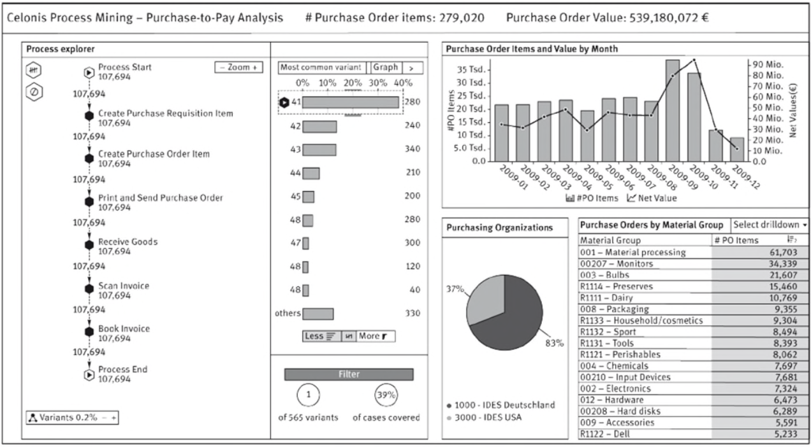

### mit Prozess-Mining
>Analyse des gesamten Systems

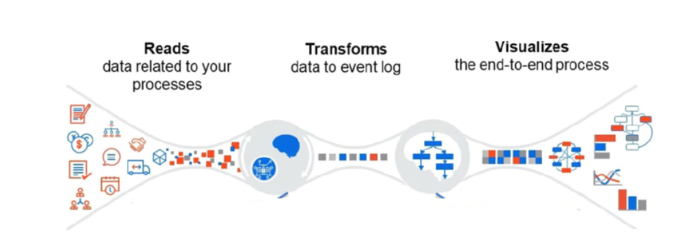

# 03 Modellierung betrieblicher Informationssysteme
## Grundlagen der Modellierung
### Was ist Modellierung?
>Unter der Modellierung (engl.: modeling) versteht man die vereinfachende und zweckorientierte Abbildung eines Sachverhalts. Der Begriff Abbildung lässt sich hier sowohl als Verrichtung als auch als Ergebnis verstehen. Als Verrichtung beschreibt die Modellierung den Vorgang, einen Sachverhalt nach Maßgabe eines bestimmten Zwecks zu verkürzen und abzubilden. Als Ergebnis erhält man aus diesem Vorgang ein Modell (engl.: model).
### Modellierung vs. Modell
Charakteristika der Modellierung:
- Abbildungscharakter (Modell hat Bezug zur Wiener U-Bahn)
- Vereinfachungseigenschaft (Teil aus der Realwelt -> Zweckorientierung)
- Zweckorientierung (Stadtplan vs. Netzplan)
### Prinzipien des Modellierens
>Die **Partitionierung** bezeichnet die Zerlegung eines großen Problems oder Sachverhalts in einzelne, weitgehend isolierbare Teilbereiche.
BSP: Zerlegung in einzelne U-Bahn Linien, Zerlegung von Aufgaben, Organisationseinheiten oder Daten

>Die **Projektion** beschreibt die Betrachtung eines Sachverhalts aus einer bestimmten Perspektive. 
>Dabei werden Sachverhalte weggelassen, die für diese Perspektive nicht relevant sind.
BSP: Netzplan = Perspektive auf Haltestellen, Rollen in Prozessen

>Die **Abstraktion** bezeichnet das Ausblenden von Details und ermöglicht so eine Konzentration auf die wesentlichen Sachverhalte.
BSP: In beiden U-Bahn Modellen wird von zwei Schienensträngen abstrahiert zu einer Linie

GEMEINSAM FÖRDERN SIE DIE VEREINFACHUNGSEIGENSCHAFT DER MODELLIERUNG
### Arten von Modellen
- Istmodell: ein Modell, das einen Sachverhalt in seinem aktuellen Zustand in der Realwelt beschreibt.
- Sollmodell: Es zeigt einen Sachverhalt, wie er sich in der Zukunftg darstellen soll. Referenzmodelle abstrahieren von einem konkreten Sachverhalt.
- Referenzmodell: Versucht für eine allgemeine Problemstellung eine anerkannte Lösung darzustellen.
- Idealmodell: Versucht im Gegenzug zu einem Referenzmodell für eine individuelle Problemstellung eine individuelle Lösung darzustellen.
## Modellierungssprachen
### Was ist eine Modellierungssprache?
>Unter einer Modellierungssprache versteht man eine künstliche Sprache, die für den Zweck der Modellierung geschaffen worden ist. 
>Diese Sprache besteht aus einer Reihe von Konstruktionselementen (Syntax) mit vordefinierter Bedeutung (Semantik).
>Diese Elemente können gemäß vorgegebenen Regeln (Grammatik) zu einem Modell zusammengefügt und benannt werden.
### Die Modellierungssprache BPMN
>Die BPMN (Business Process Model and Notation) ist eine Modellierungssprache, um den Ablauf eines Prozesses im Hinblick auf zeitlich-sachlogische Abhängigkeiten zwischen Aktivitäten und Ereignissen zu beschreiben. Gatter beschreiben Entscheidungen und Parallelausführungen.

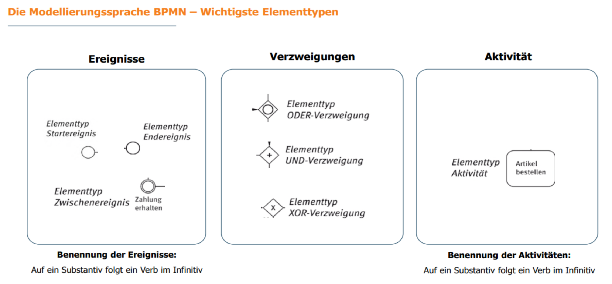

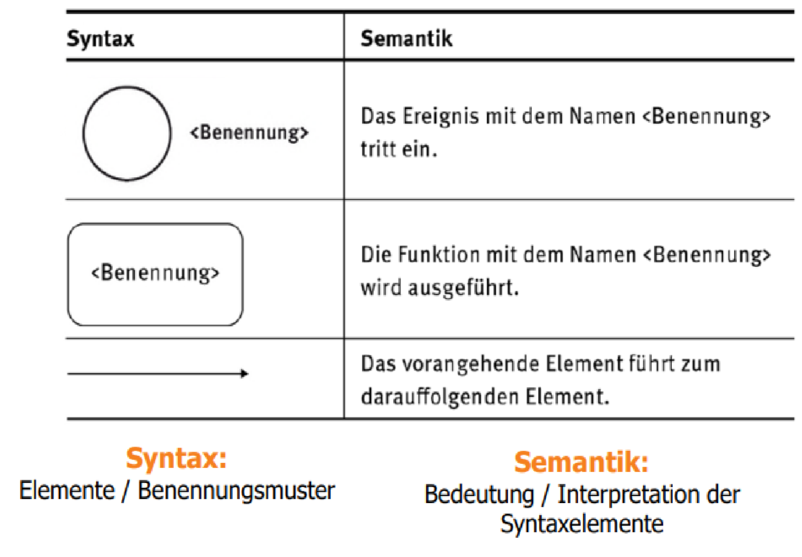

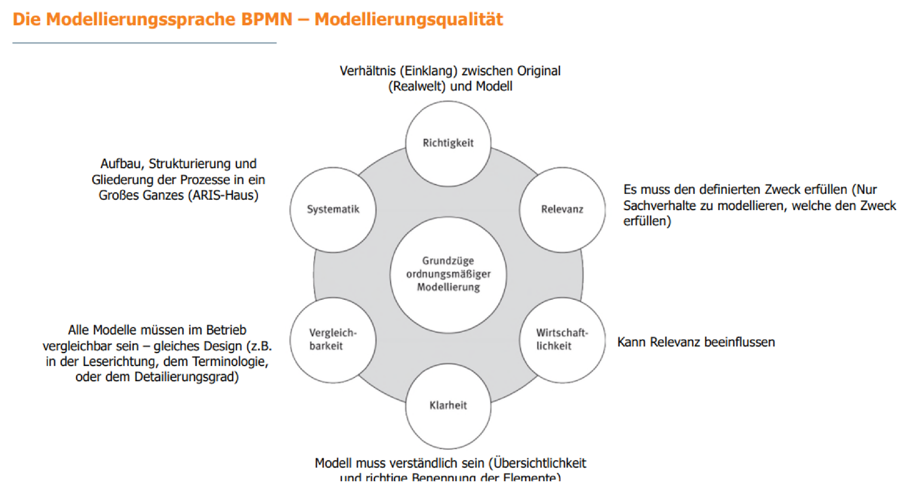

### ARIS-Architekturmodell Architektur integrierter Informationssysteme
>Die Architektur integrierter Informationssysteme ist die gesamtheitliche Beschreibung der Prozesse, Organisationsstrukturen, Funktionen, Daten und Kommunikationsbeziehungen der Informationssysteme eines Betriebs.

- ARIS stellt Methoden für eine integrierte Unternehmensmodellierung zur Verfügung, bei der alle Sichten und Beschreibungsebenen berücksichtigt werden.
- Im Vordergrund: Modellierung, Analyse und Optimierung von Geschäftsprozessen.

ARIS unterscheidet fünf Sichten:
- Organisationssicht
- Funktionssicht
- Datensicht
- Steuerungssicht
- Leistungssicht

ARIS unterscheidet drei Beschreibungsebenen:
- Fachkonzept
- DV-Konzept
- Implementierung

In jeder Sicht und Ebene werden verschiedene Modellierungssprachen verwendet.

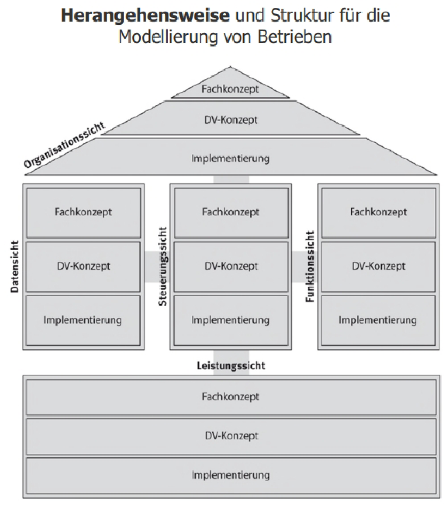

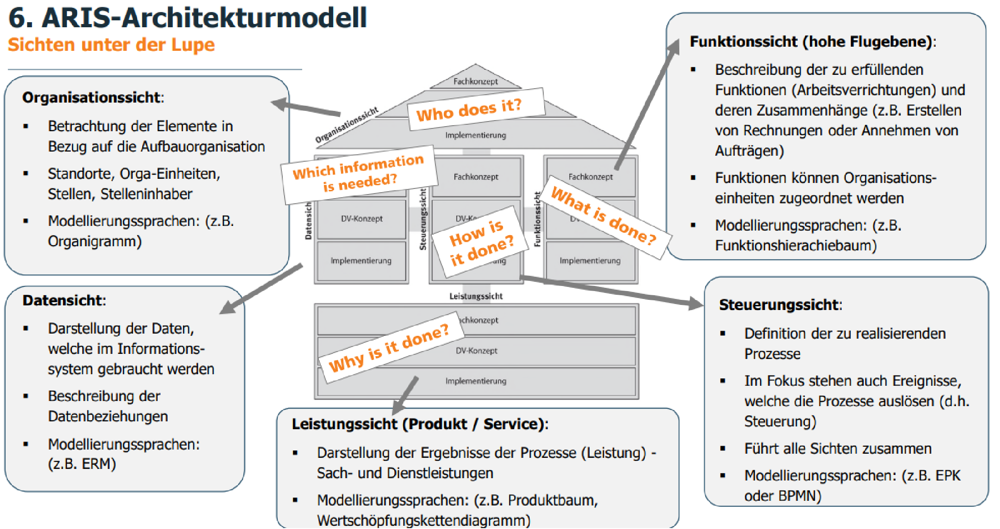

Jeder Prozess (steuerungssicht)...
- wird von einem Akteur umgesetzt (Organisationssicht)
- benötigt und erzeugt Daten (Datensicht)
- setzt sich zusammen aus verschiedenen Funktionen
- hat einen Output (Leistungssicht)
### Modellierung der Organisationssicht Am Beispiel eines Organigramms
>In Organigrammen werden gemäß der gewählten Strukturierungskriterien die gebildeten Organisationseinheiten mit ihren Beziehungen grafisch dargestellt. Organisationseinheiten sind Träger der zum Erreichen der Unternehmensziele durchzuführenden Aufgaben. Organigramme dienen zur Beschreibung der Organisationssicht in ARIS.
### Modellierung der Funktionssicht Am Beispiel eines Zieldiagramms
>Zieldiagramme stellen die Zerlegung von betrieblichen Zielen in eine Hierarchie von untergeordneten Zielen dar.

- Möchte die Ziele des Unternehmens explizit machen
- Sie werden in ARIS der Funktionssicht zugeordnet.
- Ganz oben steht ein sehr allgemeines Ziel. Jede Ebene verfeinert das allgemeine Ziel
- Ziele sollten „smart“ formuliert werden

- s = spezifisch 
- m = messbar 
- a = akzeptiert 
- r = realistisch 
- t = terminiert
### Modellierung der Funktionssicht Am Beispiel eines Zieldiagramms
>Der Funktionshierarchiebaum stellt die Zerlegung von betriebliche Funktionen in eine Hierarchie von Unterfunktionen dar.

- Funktionshierarchiebäume dienen zur Beschreibung der Funktionssicht in ARIS
- Funktionen sind auf höherer Ebene Arbeitsvorrichtungen mit einem In- und Output
- Funktionen werden in Teilfunktionen zerlegt (Hierachie)
### Modellierung der Datensicht Am Beispiel eines Entity-Relationship-Modells
>Das Entity-Relationship-Modell definiert die Datenelemente mit ihren Attributen, die in einem Informationssystem gespeichert werden sollen. 
>Zusätzlich werden die Beziehungen zwischen diesen Datenelementen definiert.

> Das Kardinalitätsverhältnis drückt den Grad einer Beziehung aus und besagt, wie viele Entities eines beteiligten Entitätstyps mit wie vielen Entities des anderen beteiligten Entitätstyps in Beziehung treten können.

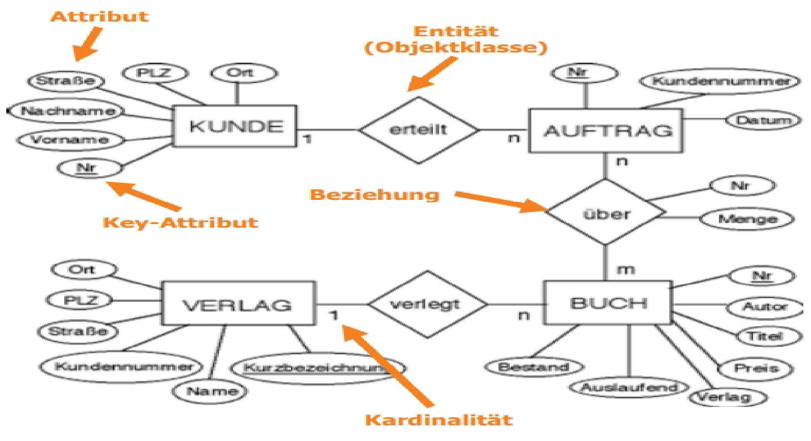
### Modellierung der Leistungssicht Am Beispiel eines Produktbaumes
>Produktbäume stellen die Zerlegung von Leistungen in eine Hierarchie von Teilleistungen dar.

- Eine Leistung repräsentiert ein Produkt oder eine Dienstleistung
- Die Produkte werden in ihre Bestandteile zerlegt
- So ist es möglich auch Stücklisten zu beschreiben
- Produktbäume sind auch ein Hilfsmittel für die Beschaffung
- Sie werden in ARIS der Leistungssicht zugeordnet

### Modellierung der Steuerungssicht Am Beispiel eines Wertschöpfungskettendiagramm
>Das Wertschöpfungskettendiagramm stellt betriebliche Prozesse auf einem abstrakten Niveau dar und veranschaulicht, wie die dargestellten Prozesse miteinander zusammenhängen.

- Sie dienen in ARIS zur Beschreibung der Steuerungssicht
- Werden genutzt, um die Gesamt- oder Teilabläufe des Unternehmens darzustellen
### Modellierung der Steuerungssicht Am Beispiel eines Ereignisgesteuerte Prozessketten
>Die ereignisgesteuerte Prozesskette (EPK) ist eine grafische Modellsprache und dient der systematischen Darstellung von Geschäftsprozessen.

- Die Ereignisse stehen im Vordergrund
- Diese Prozesse werden mithilfe definierter Syntaxregeln und einer semiformalen Modellierungssprache erstellt.
- Diese sind der Steuerungssicht zugeordnet
# 04 ERP-Systeme
>Unter ERP (enterprise resource planning) versteht man eine aus mehreren Komponenten bestehende integrierte betriebliche Anwendungssoftware, die die operativen Prozesse in allen wesentlichen betrieblichen Funktionsbereichen unterstützt. 
>Die Integration wird dabei von einer zentralen Datenbank getragen, wodurch Datenredundanzen vermieden und integrierte Geschäftsprozesse ermöglicht werden.

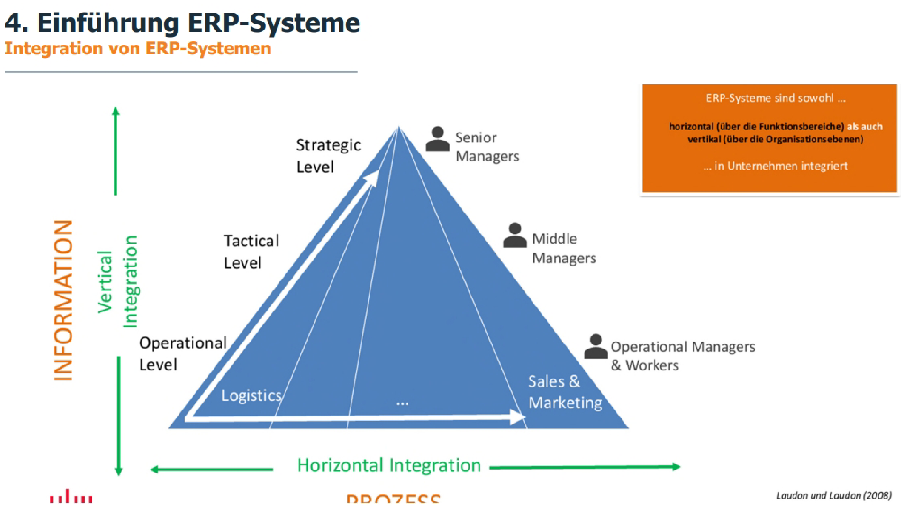
### Wo werden ERP Systeme integriert?

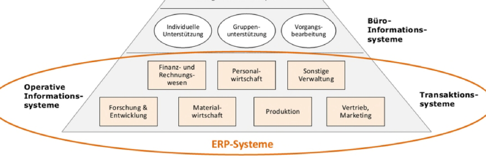
### Unternehmen welche ERP Systeme bereitstellen
>Ein ERP-System soll alle Bereiche miteinander verzahnen, damit die Prozesse nahtlos durch alle Bereich laufen können

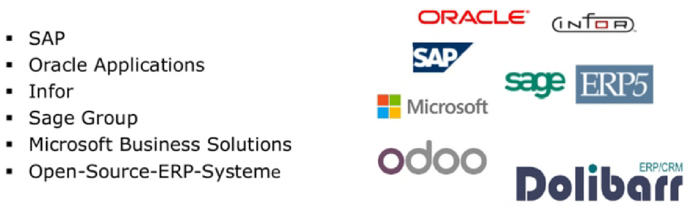
## Anwendungsbereiche ERP-Systeme, Typische Komponenten von ERP-Systemen
### Finanz- und Rechnungswesen
Das betriebliche Finanz- und Rechnungswesen wird unterschieden in:
- Finanzierung/Investition die Bereitstellung und zielgerichtete Verwendung finanzieller Mittel
- Rechnungswesen die systematische Erfassung der durch die betrieblichen Leistungsprozesse entstehenden Transaktionen und die Überwachung der Wirtschaftlichkeit
- Externes Rechnungswesen: Gegenüber außenstehenden Interessenten, wie beispielsweise Investoren, Banken, Finanzämtern, Krankenkassen usw. ist entsprechend den gesetzlichen Vorschriften Rechenschaft abzulegen.
- Internes Rechnungswesen: Der Geschäftsführung sind die zur Planung, Steuerung und Kontrolle erforderlichen Daten zu liefern

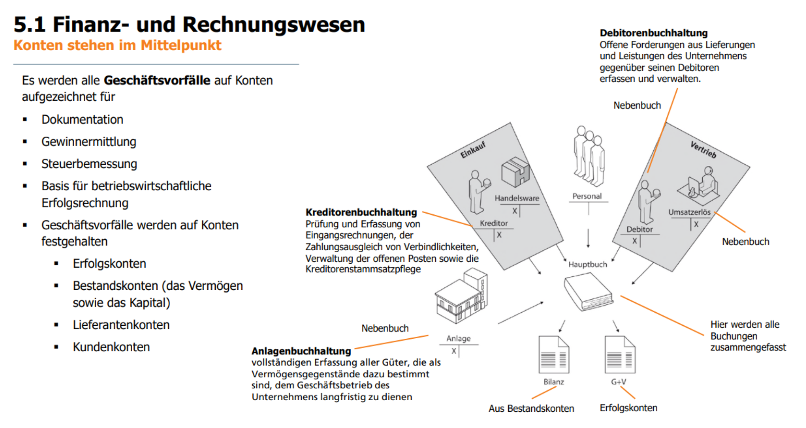
### Personalwirtschaft
>Unter Personalwirtschaft oder Personalwesen versteht man die Bereitstellung und den zielgerichteten Einsatz von Mitarbeitern in Betrieben.

- Wirtschaftliche Ziele sind die Sicherstellung der Verfügbarkeit von bestgeeigneten Mitarbeitern und ihres effizienten Arbeitseinsatzes
- Soziales Ziel ist die bestmögliche Gestaltung der Arbeitsverhältnisse für die Mitarbeiter.
### Materialwirtschaft
>Unter Materialwirtschaft versteht man die Planung, Steuerung, Verwaltung und Kontrolle der Materialbestände und –bewegungen innerhalb eines Betriebs und zwischen dem Betrieb und seinen Marktpartnern.

In der Industrie ist die Materialwirtschaft eng verzahnt mit der Produktion, die mit den richtigen Roh-, Hilfs- und Betriebsstoffen, Zulieferteilen und Halbfabrikaten zur:
- richtigen Zeit am
- richtigen Ort in der
- richtigen Menge und der
- richtigen Qualität versorgt werden muss
Darüber hinaus ist allgemein die Versorgung mit indirekten Gütern wie Büroartikel, Ersatzteilen oder Serviceleistungen erforderlich.

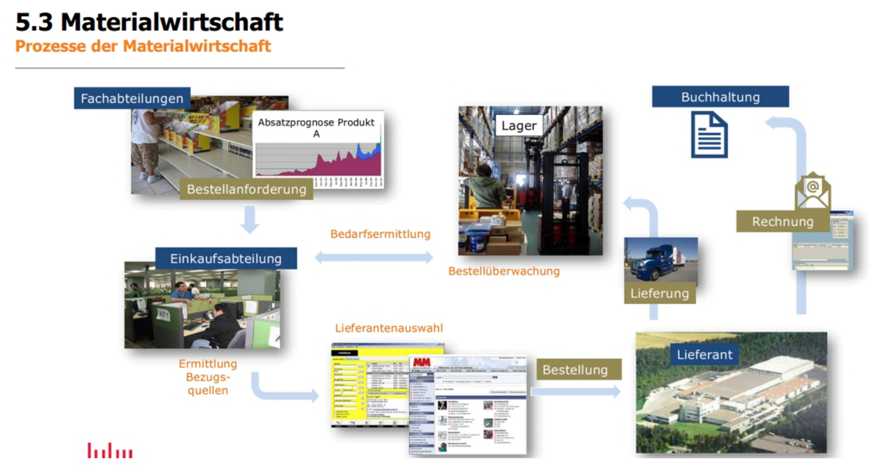
### Produktion
>Unter Produktion im weiteren Sinn versteht man die Erzeugung von Produkten und Dienstleistungen aller Art in allen Bereichen der Wirtschaft und Gesellschaft.

>Die Produktion im engeren Sinn beinhaltet die industrielle Leistungserstellung: Aus Rohstoffen, Zulieferteilen und Halbfabrikaten werden in einem vom Menschen bewirkten Transformationsprozess unter Einsatz von Arbeit, Betriebsmitteln und Werkstoffen lagerbare Sachgüter erzeugt.

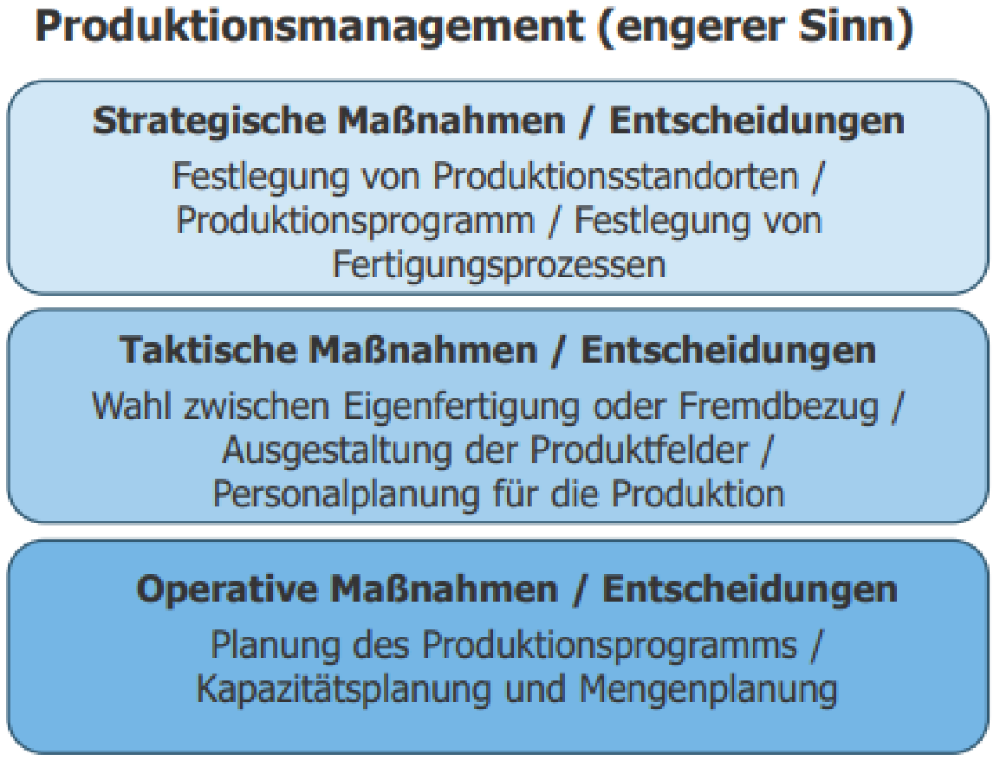
### Produktionsplanungs- und -steuerungssystem
>Die operative Produktionsplanung legt zur Deckung eines vorliegenden oder erwarteten Bedarfs das Produktionsprogramm sowie den mengenmäßigen und zeitlichen Produktionsablauf für ein gegebenes Fertigungssystem kurzfristig fest und sorgt für die Bereitstellung der notwendigen Arbeitskräfte, Betriebsmittel und Werkstoffe.

>Die Produktionssteuerung löst die hierfür erforderlichen Fertigungsaufträge aus und überwacht deren Durchlauf
### Stücklisten sind wichtiger Bestandteil der Produktionsplanung
>Eine Stückliste (bill of materials; BOM) ist ein Verzeichnis der Mengen aller Rohstoffe, Teile und Baugruppen, die für die Fertigung einer Einheit eines Erzeugnisses oder einer Gruppe erforderlich sind.
### Vertrieb
>Der Vertrieb ist eine betriebliche Fubnktion in Unnternehmen, die Produkte oder Dienstleistungen für Kunden oder Endverbraucher verfügbar machen soll. (Marketing-Mix; Distributionspolitik)

>In ERP-Systemen umfasst Vertrieb meist weitere Elemente des Marketing-Mix z.B. Preisfindung
# 05 Managementunterstützungssysteme

# 06 Informationssysteme

# 07 Grundlagen des Computers
## Definitionen
### Computer
>Computer als programmgesteuerter Rechenautomat

>Computer als Automat für Algorithmen
>Algorithmus als Schritt-für-Schritt-Anweisung für die Lösung eines (mathematischen) Problems (z.B. für eine Entscheidung)

>Computer Verarbeiten ausschließlich digitale Daten
>Computer wandelt analoge und digitale Daten um
### Digitale Daten
>Digitale Daten sind in Form von Zahlen dargestellt
>Digitale Daten sind die kleinste Informationseinhiet, können nicht weiter aufgelöst werden
>Daten liegen aber meist in Form von Bilder, Tönen, Videos, etc vor
### Analog
>Daten in Wellenform (Elektrische Signale von variabler Stärke)
### Digital / Binär
>Daten mit nur zwei Zuständen: 0 (OFF), 1 (ON)

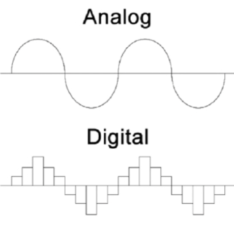
### Grundgatter (logic gates)
- AND
- OR
- NOT
- NAND
- NOR
- XOR
- etc..
>Mit den Logikbaustreinen kann man Rechnungen durchführen und Daten verarbeiten.
## CPU
### Transistoren
>Transistoren haben verschiedene Formen, die meist genutzten lassen nur Strom durch, wenn ein (kleiner) Aktivierungsstrom von der Seite gegeben wird.
>Eine große Menge von Transistoren nennt man intigrierte Schaltung (IC) oder Mikrochip.
>Computer CPUs bestehen aus milliarden von Transistoren und führen so Rechnungen durch.
### Aufbau Prozessor

### Ausführung Maschinenbefehle

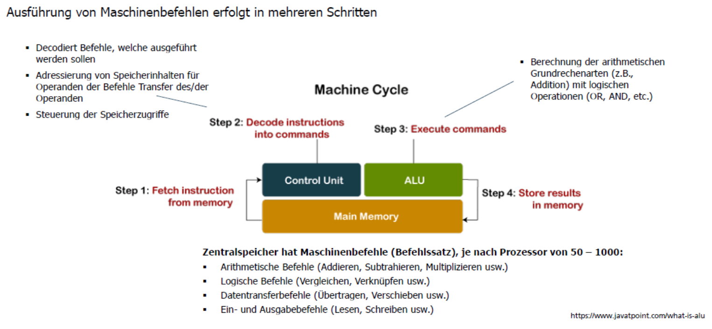
### Taktfrequenz
>Die Taktfrequenz eines Prozessors gibt an, mit welcher Frequenz die Verarbeitungseinheiten Operationen durchführen.
### Moore's Law
>Faustformel: Leistungsfähigkeit (Anzahl der Transistoren auf Mikro-Chips) verdoppelt sich ca. alle 18 Monate.
## Geschichte des Computers
### Erste Rechenhilfsmittel
Abakus (2500 v.Chr.), Rechenbrett der Antike

Einführung des Stellenwertsystems (Basis-10 Zahlensystem)
Die Ziffer 0 ermöglicht die Vervielfachung des Wertes einer Ziffer
### Erste mechanische Rechenmaschiene
**1642** vom Franzosen **Blaise Pascal** efunden.
Die Pascaline konnte sechstellige Zahlen addieren, und sollte seinem Vater helfen, der als Steuerbeamter tätig war.
### Analytical Engine
Erfunden vom britischen Mathematikprofessor **Charles Babbage (1791-1871)**.
Die Analytical Engine ist der Entwurf einer mechanischen Rechenmaschine für allgemeine Anwendungen.
### Elektromechanischer Rechenautomat
**1940** erfindet **Konrad Zuse** die Z3, den ersten funktionsfähigen programmierbaren, elektromagnetischen Rechenautomaten.

- Verwendung des binären Zahlensystems Gleitkommazahlenberechnung
- Ein- und Ausgabegeräte
- Möglichkeit der Benutzerinteraktion während des Rechenvorgangs
- Mikroprogramme
- Pipelining von Instruktionsfolgen
- Numerische SonderwerteParallele Ausführung von Operationen so weit wie möglich
## Elektrik vs Elektronisch
### Elektrik
>Umschreibt alles was mit Strom zu tun hat
### Elektrisches Gerät
>Alle Geräte, die elektrische Energie für die Ausführung verwenden. BSP: Generator
### Elektronik
>Umschreibt alles was damit zu tun hat, elektrischen Strom zu leiten, kontrollieren und regulieren
### Elektronisches Gerät
>Die Vorrichtung, die den Elektronenfluss zur Ausführung der Aufgabe steuert. BSP: Motor
### Elektromechanisches Gerät
>Beinhaltet Schaltelemente, die durch einen Elektromagneten gesteuert werden. BSP: Elektromotor
## Rechner
### Entwicklung elektronischer Rechner

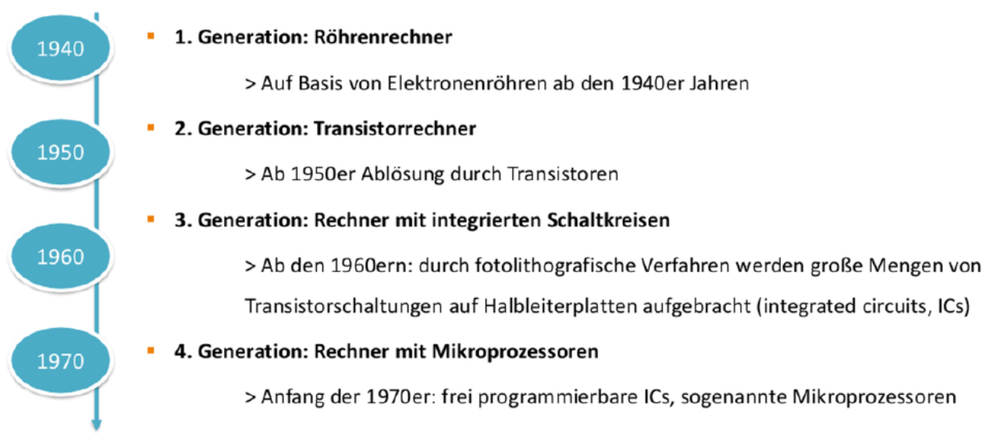

### Arten von Rechnern
- Großrechner
- Minicomputer
- Workstation
- Personalcomputer (PC)
- Persönliche Informationshilfsmittel (mobile Geräte, die als universelles Instrument verwendet werden, um geschäftliche und private Aufgaben zu erledigen)
## Software
>Software ist ein Sammelbegriff für Computerprogramme
>Detaillierte Handlungsanweisung an einen Prozessor
>Prozessor führt ausschließlich Maschinenbefehle durch

>Erstellung komplexer Handlungsanweisungen in Maschinenbefehlen für den Menschen aufwendig, fehleranfällig und prozessorabhängig.
>Deshalb Proframmiersprachen
## Programmiersprache
>Eine Programmiersprache, deren Befehle sich am Anwendungsbereich orientieren, wird als höhere Programmiersprache bezeichnet. 
>Höhere Programmiersprachen abstrahieren vom Befehlssatz des Prozessors und verwenden Elemente der natürlichen Sprache und/oder der Mathematik für das Formulieren von Programmen.
### Arten von Programmiersprachen

| Art | Beschreibung | Beispiel |
| ---- | ---- | ---- |
| Imperativ | - Formulierung von komplexen Anweisungen | C, C++ |
| Objektorientiert | - Beschreibung des Realweltprogramms durch Objekte und Klassen des Anwendungsbereiches - Leichter durch die Abstraktion | Python, Java |
| Funktional | - Definition von Funktionen (input -> output) | Haskell, F# |
| Logisch | -Beschreibung des Realweltprogramms durch (Prädikaten-)Logik | Prolog, ASP |
# 08 Hardware
## Physikalische Grundlagen
Verarbeitung -> Zentraleinheit
	- Prozessor, inkl. Rechen- Steuerwerk, Eingabe- und Ausgabewerk, Speicherwerk, Datentransfer-System
Ein- & Ausgabe + Speicher -> Peripherie
	- Maus, Tastatur, Monitor, Drucker, Festplatte, Server etc
## EVA(S) Prinzip
>Grundlegendes Prinzip der Datenverarbeitung und Reihenfolge

E - Eingabeeinheit
V - Verarbeitungseinheit
A - Ausgabeeinheit
(S - Speicher)

>Dieser Prozess existiert auch bei uns Menschen, daher universeller Prozess der Datenverarbeitung

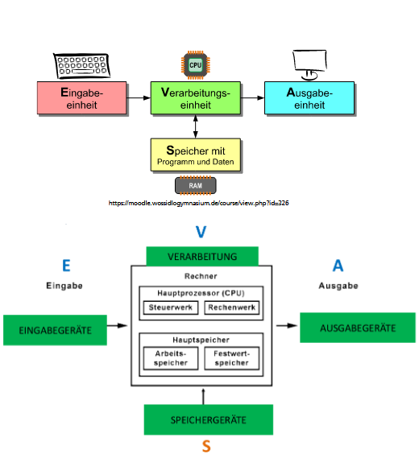

## Hardware-Komponenten

### Mainboard

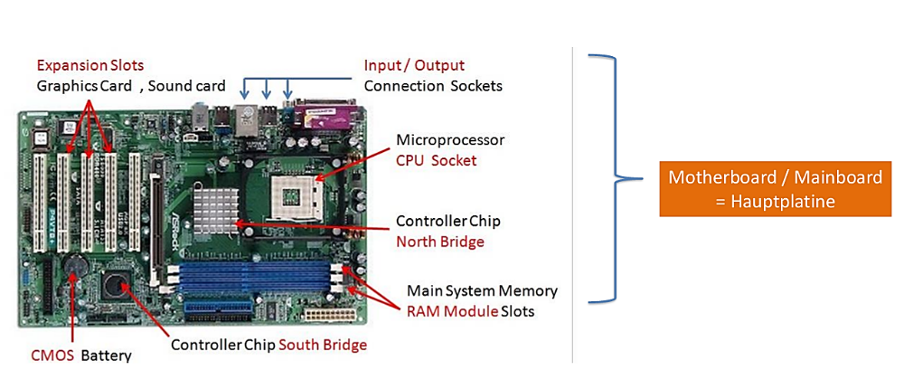

Hauptplatinen sind immer ähnlich aufgebaut, wichtigste Komponenten:
- Northbridge
	  verbindet alle Computerkomponente, welche besonders schnell miteinander kommunizieren müssen, also Prozessor, Arbeitsspeicher(RAM) und schnelle Grafikkarten
- Southbridge
	  verbindet restliche Komponente, Festplatten, Netzwerkkarte und das BIOS

In modernen Systemen wird die Northbridge oft auch direkt im Prozessor integriert, zudem enthält die Southbridge meist einen Netzwerk- und Grafikkontroller.

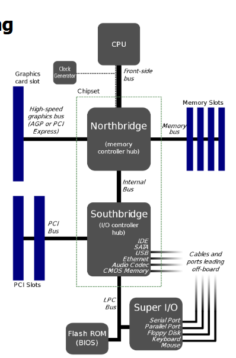
### Grafikkarte (GPU)
Aufgaben
- Erzeugen einer Pixelgrafik aus einer anderen Darstellungsform
- Speichern dieser Pixelgrafik, des Bildschirminhalts
- Steuerung des Bildschirms, damit er den Bildschirminhalt anzeigt

Kenngrößen
- maximale Auflösung BSP: 1920x1080 Pixel (Full HD)
- Taktfrequenz, wie schnell Berechnungen durchgeführt werden können. Wird in Hertz angegeben (bedeutet pro Sekunde)
- Speicherkapazität, eigener Arbeitsspeicher der GPU. BSP: 8GB
### Netzwerkkarte
>Kommunkation mit dem Internet
>WLAN (dratlos) oder LAN (per Kabel)
 
**Übertragungsrate**, wie viele Daten pro Sekunde. 
BSP: Megabit pro Sekunde, Mbps
### Schnittstellen
- PCI
	  Eine der ersten und bis heute immer noch in verbesserter Form angewandte Technik und Möglichkeit, schnell und einfach interne Peripheriegeräte an das Mainboard anschließen zu können.
- PCIe
	  PCI-Express Schnittstelle oder PCIe bzw. PCI-E genannt, ist ein Erweiterungsstandard zur Verbindung von Peripheriegeräten 
	  BSP: Controller, Maus; aber auch: GPU, Netzwerkkarte
- SATA
	  Anschluss von von Massenspeichern wie Festplatten, SSDs und CD/DVD-Laufwerken an Computern
- IDE
	  Alte Festplatten-Schnittstelle, bei der die Steuerungselektronik bzw. der Controller in das Festplattengehäuse integriert ist.
### Eingabegeräte
- Maus
	  Cursor auf Bildschirm bewegen, Maustasten
- Scanner
	  Überbegriff für Geräte, welche flache Gegenstände, meist Bilder oder Textseiten in den Computer übertragen
- Mikrofon
	  Ton-Eingabe
- Webcam
	  Im Rahmen von Videoconferencing mittels VoIPdas Bild des Gesprächsteilnehmers aufzunehmen
### Ausgabegeräte
>Das Ausgabegerät zeigt das Ergebnis der Verarbeitung von Rohdaten an, die über ein Eingabegerät in den Computer eingegeben werden

- peripheres Gerät zur Ausgabe von Computerdaten
- Es gibt eine Reihe von Ausgabegeräten, z.B. Text, Bilder, Hardcopy, Audio oder Video 
  BSP: Bildschirm / Monitor, Touchscreen, Kopfhörer
### Monitore
- CRT - alt
- LCD - weit verbreited
- LED - neu

Touchscereen: ermöglicht Input
### Speicher
>Ein Schreib-Lese-Speicher kann gelesen und beschrieben werden.

>Festwertspeicher (ROM) kann nur gelesen werden und Informationen sind unveränderbar.

>Direktzugriffsspeicher (Arbeitsspeicher, ROM) ist ein Speicher, bei dem jede einzelne Speicherstelle über ihre fest zugeordnete Adresse gelesen oder beschrieben (und damit auch gelöscht) werden kann. Die Zugriffszeit ist für alle Speicherstellen in etwa gleich lang.

>Flüchtiger Speicher verliert bei Ausfall der Versorgungsspannung seinen Inhalt.

>Nicht flüchtiger Speicher behält seinen Inhalt auch ohne Versorgungsspannung.

>Flash Speicher ist ein spezieller ROM-Typ, dessen Inhalt durch Anlegen eines elektrischen Felds in bestimmten Speicherbereichen, sogenannten Sektoren oder Blöcken (zum Beispiel 512 Bytes), auf einmal gelöscht wird.
>- Die Speicherzellen können nicht – wie bei gewöhnlichen ROM-Chips – einzeln gelöscht werden. Das Schreiben erfolgt je nach Chiparchitektur selektiv für jede einzelne Zelle oder auf einmal für einen gesamten Block
>- Flash-Speicher haben eine begrenzte Lebensdauer, die sich durch die maximale Anzahl von Löschzyklen ergibt.

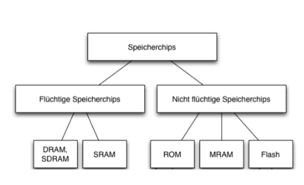
### Ram
>Arbeitsspeicher bezeichnet den kurzfristigen Speicher eines Computers. Dieser enthält alle Daten, die Sie gerade nutzen – von geöffneten Webseiten bis hin zu einer Mausbewegung über den Bildschirm

>DDR steht für Double Data Rate, DDR ist die RAM-Technologie

RAM besteht aus einer Reihe an nummerierten Speicherzellen gleicher Größe.
Die Bit-Zahl der Architektur bestimmt sowohl die maximale Anzahl, als auch die Größe der Speicherzellen.
Auf jede Speicherzelle kann gleich schnell zugegriffen werden, wenn man ihre Adresse kennt.
### Hardware & Software
- Hardware, alle physischen Bestandteile
- Software, alle nicht physischen Komponenten

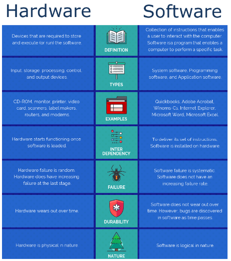
# 09 Mathematische Grundlagen
## Logik
Warum ist ein Verständnis der Logik in der Wirtschaftsinformatik 
Teilmenge: $C \subseteq A$
relevant?
- Repräsentation von Wissen (z.B. im Bereich KI)
- Grundlage für Datenbank-Anfragesprachen (SQL)
## Aussagenlogik
### Definition
> Die Basis sind strukturlose Elementaraussagen, denen ein Wahrheitswert zugeordnet wird.
> In der klassischen Aussagelogik gilt:
> - Aussage ist **WAHR** oder
> - Aussage ist **FALSCH**
### Junktoren / Logische Operatoren

| Verknüpfung | Schreibweise | Beispiel |
| ---- | ---- | ---- |
| Konjunktion | $a \land b$ | Ich bink krank und gehe zum Arzt. |
| Disjunktion | $a \lor b$ | Ich gehe zum Arzt oder der Arzt kommt vorbei (oder beides). |
| Subjunktion | $a \rightarrow b$ | Wenn ich krank bin, dann gehe ich zum Arzt. |
| Bijunktion | $a \leftrightarrow b$ | Wenn ich krank bin, dann gehe ich zum Arzt und umgekehrt. (Ich gehe genau dann zum Arzt, wenn ich krank bin.) |

Negation: $\lnot$
### De-Morgen-Theorem
>Die De Morganschen Gesetze sind zwei grundlegende Regeln für logische Aussagen.

- NOT
- NAND
- NOR
- AND
- OR
## Mengen
### Defintion
>Die Mengenlehre schafft Grundlagen zur Logik

Mengen werden über ihre Elemente bestimmt.
Ist m ein Element von M so schreibt man $m \in M$

Elemente von Mengen können selber Mengen sein.
Ist m kein Element von M so schreibt man $m \notin M$

Die leere Menge.
Es gilt $\varnothing = \{ \}$

Teilmenge: $C \subseteq A$

Teilmenge: $B \subset A$

### Zahlenmengen

| System | Beispiel |
| ---- | ---- |
| Natürliche Zahlen | $\mathbb{N} = \{1,2,3,...\}$ |
| Natürliche Zahlen mit 0 | $\mathbb{N}_0 = \{0,1,2,3,...\}$  |
| Ganze Zahlen | $\mathbb{Z} = \{...,-3,-2,-1,0,1,2,3,...\}$ |
| Rationale Zahlen | $\mathbb{Q}$ (alle Bruchzahlen) |
| Reelle Zahlen | $\mathbb{R}$ (Kommazahlen) |
### Mengenoperationen

| Operation | Schreibweise |
| ---- | ---- |
| Schnitt | $A \cap B$ |
| Vereinigung | $A \cup B$ |
| Differenz | $A \ \backslash \ B$ |
### Zahlensysteme

Binärsystem = Base 2

Oktalsystem = Base 8

Hexadezimasystem = Base 16

# 10 Betriebssysteme

# 11 Datenkommunikation und Rechnernetze

# 12 Datenspeicherung
