# 01 Einführung

## Einordnung Wirtschaftsinformatik

### Deinition
Wissenschaft, die sich mit der Gestaltung rechnergestützter Informationssysteme in der Wirtschaft (Betriebe) befasst.
## Informationsysteme / Anwendungssysteme
### Definition
Ein Informationssystem besteht aus Menschen und Maschinen (Rechner samt Software, Netzen, Kommunikationseinrichtungen), die Information erzeugen und/oder benutzen und die durch Kommunikationsbeziehungen miteinander verbunden sind.

| Informationssystem | Anwendungssystem |
| ---- | ---- |
| - Menschen - Guppen - Organisation - Kommunikationseinrichtungen | - Software - Hardware - Infrastrukture |

>Anwendungssysteme sind in Informationssystemen voll enthalten!
### Arten von Informationssystemen

| Art | Definition |
| ---- | ---- |
| rechnergestütztes Informationssystem | - Erfassung - Speicherung - Übertragung - Transformation von Informationen |
| operatives Informationssystem | Erleichterung der alltäglichen betrieblichen Leistungsprozesse mit betrieblichen Anwendungsprogrammen |
| Planungssystem oder Managementunterstützungssystem | Unterstützt die Führungskräfte eines Betriebs bei der - Planung - Überwachung - Einhaltung der Pläne |
## Informationssysteme und Betriebe
### Erfolg

Technologie-Akzeptanz-Modell (TAM)
 - es muss nützlich sein
 - es muss einfach zu bedienen sein

Informationssystem-Erfolgsmodell von DeLone und McLean
 - Zufriedenheit der Nutzer
 - Wird genutzt
### Integration

- Vertikale Integration: verknüpft Teilsysteme des gleichen Funktionsbereichs auf verschiedenen Stufen(Arbeiter und Management)
- Horizontale Integration: verbindet Teilsysteme aus unterschiedlichen Funktionsbereichen auf einer Ebene
## Wechselwirkungen mit der Gesellschaft
### Problemfelder

| Gebiet | Herausforderung |
| ---- | ---- |
| Digitalisierung | - BigData - IT-Sicherheit - Industrie 4.0 - Wettbewerb (Reifegrad) - digitale Spaltung |
| Globalisierung | - IT-Sicherheit - Steigerung der Komplexität der Verwaltung |
| Outsourcing | - Abhängigkeiten von anderen - Verlust von Arbeitsplätzen |
| Arbeit | - Rationalisierung und Verlust von Arbeitsplätzen |
| Freizeit | - Soziale Vereinsamung - Informationsüberflutung - Vergleiche (Instagram) |
| Umwelt | - Stromverbrauch - Elektroschrott |
| Sicherheit | - Datenschutz - Überwachung (Staat, Arbeit) |
# 02 Geschäftsprozesse
## Definitionen
#### Geschäftsprozess
Komplexer, aus mehreren Funktion bestehender Arbeitsablauf zur Erledigung einer betrieblichen Aufgabe.
Die Funktionen stehen in einem **zeitlich-sachlogischen Zusammenhang** und tragen zu einem betriebswirtschaftlichen Ziel bei.
#### Prozessorientierung
Ansatz zur Organisation eines Betriebs, der die Geschäftsprozesse in den Mittelpunkt stellt

## Geschäftsprozessmanagement
Geschäftsprozesse **effizienter** und **effektiver** machen

| Rolle | Verantwortlichkeit |
| ---- | ---- |
| Geschäftsführung | - Gestaltung der Geschäftsprozesse - Beauftragt initiative Prozessverbesserung - Strategische Ausrichtung |
| Prozessverantwortlicher | - Prozesse effizient und effektiv gestalten - Planung und Führung der Prozesse |
| Prozessteilnehmer | - Routieneaufgaben |
| Systemanalytiker | - Analyse zur Verbesserung der Prozesse |
| Anwendungsentwickler | - korrekte Umsetzung der Prozessvorgaben in betrieblichen Informationssystemen |

## Prozessidentifikation
### Prozesse benennen
Eine Benennung muss folgende Eigenschaften haben:
- Konsistent
- Wiederspruchsfrei
### Prozesslandkarte
Grafische Darstellung der wesentlichen Prozesse mit Aufgabe, Zusammenhängen und Schnittstellen

### Referenzmodelle (Beispiele)
Modell, das eine anerkannte gut Lösung für ein häufig auftretendes Problem bietet.

### Prozesse bewerten
- Strategische Wichtigkeit
- Verbesserungs-würdigkeit
- Verbesserungs-fähigkeit
### Prozesse strukturieren (Modellieren)
Vorgabe zur systematischen Organisation und Beschreibung von Prozessen eines Betriebs.

Abstraktionsebenen:
1. Prozesslandkarte
2. Wertschöpfungsebene
3. Prozessmodelle

## Prozesserhebung
**Sammlung von sämtlichen Informationen** zu einem Prozess und dessen **Aufbereitung** in Form eines **Istmodells**
### Herausforderungen
- Prozesse sind arbeitsteilig organisiert
- Heben das Abstraktionsniveaus
- Verwendung geeigneter Terminologie
- Prozessteilnehmer haben oft wenige Kenntnisse von Modellierungssprachen
### Methoden
- Bestehende Dokumentation
- Beobachtung im Echtbetrieb
- Interviews
- Workshops
## Prozessanalyse
>Das systematische Aufspüren von Schwachstellen und deren Ursachen
### Wertbeitragsanalyse
>einteilung der Funktionen in wertschöpfungs-Kategorien

- Wertschöpfende Funktionen
- Geschäftserforderliche Funktionen
- Nicht wertschöpfende Funktionen
### Ursache-Wirkungs-Diagramm
>Mögliche Ursachen für Probleme finden. Ursachen werden in sechs Bereiche unterteilt.

- Mensch
- Maschinen
- Umwelt
- Material
- Methoden
- Messung

## Prozessverbesserung
Entwickelt Vorschläge under Verbesserungen zu gefundenen Schwachstellen
### Dimensionen
Es ist nicht möglich alle Dimensionen zur gleichen Zeit zu verbesseren

### Redesign-Heuristik
Maßname zur Umgestaltung eines Geschäftsprozesses, die mit der Erwartung einer Verbesserung in zumindest einer Dimension verbunden ist.
Es gibt viele Heuristiken welche die Probleme beim erreichen bestimmter Ziele beschreibt.

## Prozesseinführung
Maßnahmen um die Prozessnötige Infrastruktur bereitzustellen.
### Geschäftsprozessmanagementsysteme (GPMS)
>Ein Softwaresystem das die Entwicklung von Geschäftsprozessen in allen Bereichen unterstützt.

Typen:
- **Groupware-Systeme**: fördert Zusammenarbeit der Benutzer
- **Ad-hoc-Workflowsysteme**: Prozessabläufe können im Bedarfsfall geändert werden
- **Strukturierte Workflowsysteme**: Arbeiten mit genormten Abläufen
## Prozessüberwachung

### mit Kennzahlen

### mit Prozess-Mining
>Analyse des gesamten Systems

# 03 Modellierung betrieblicher Informationssysteme
## Grundlagen der Modellierung
### Was ist Modellierung?
Unter der Modellierung (engl.: modeling) versteht man die vereinfachende und zweckorientierte Abbildung eines Sachverhalts. Der Begriff Abbildung lässt sich hier sowohl als Verrichtung als auch als Ergebnis verstehen. Als Verrichtung beschreibt die Modellierung den Vorgang, einen Sachverhalt nach Maßgabe eines bestimmten Zwecks zu verkürzen und abzubilden. Als Ergebnis erhält man aus diesem Vorgang ein Modell (engl.: model).
### Modellierung vs. Modell
Charakteristika der Modellierung:
- Abbildungscharakter (Modell hat Bezug zur Wiener U-Bahn)
- Vereinfachungseigenschaft (Teil aus der Realwelt -> Zweckorientierung)
- Zweckorientierung (Stadtplan vs. Netzplan)
### Prinzipien des Modellierens
Die **Partitionierung** bezeichnet die Zerlegung eines großen Problems oder Sachverhalts in einzelne, weitgehend isolierbare Teilbereiche.
BSP: Zerlegung in einzelne U-Bahn Linien, Zerlegung von Aufgaben, Organisationseinheiten oder Daten

Die **Projektion** beschreibt die Betrachtung eines Sachverhalts aus einer bestimmten Perspektive. 
Dabei werden Sachverhalte weggelassen, die für diese Perspektive nicht relevant sind.
BSP: Netzplan = Perspektive auf Haltestellen, Rollen in Prozessen

Die **Abstraktion** bezeichnet das Ausblenden von Details und ermöglicht so eine Konzentration auf die wesentlichen Sachverhalte.
BSP: In beiden U-Bahn Modellen wird von zwei Schienensträngen abstrahiert zu einer Linie

GEMEINSAM FÖRDERN SIE DIE VEREINFACHUNGSEIGENSCHAFT DER MODELLIERUNG
### Arten von Modellen
- Istmodell: ein Modell, das einen Sachverhalt in seinem aktuellen Zustand in der Realwelt beschreibt.
- Sollmodell: Es zeigt einen Sachverhalt, wie er sich in der Zukunftg darstellen soll. Referenzmodelle abstrahieren von einem konkreten Sachverhalt.
- Referenzmodell: Versucht für eine allgemeine Problemstellung eine anerkannte Lösung darzustellen.
- Idealmodell: Versucht im Gegenzug zu einem Referenzmodell für eine individuelle Problemstellung eine individuelle Lösung darzustellen.
## Modellierungssprachen
### Was ist eine Modellierungssprache?
Unter einer Modellierungssprache versteht man eine künstliche Sprache, die für den Zweck der Modellierung geschaffen worden ist. 
Diese Sprache besteht aus einer Reihe von Konstruktionselementen (Syntax) mit vordefinierter Bedeutung (Semantik).
Diese Elemente können gemäß vorgegebenen Regeln (Grammatik) zu einem Modell zusammengefügt und benannt werden.
### Die Modellierungssprache BPMN
Die BPMN (Business Process Model and Notation) ist eine Modellierungssprache, um den Ablauf eines Prozesses im Hinblick auf zeitlich-sachlogische Abhängigkeiten zwischen Aktivitäten und Ereignissen zu beschreiben. Gatter beschreiben Entscheidungen und Parallelausführungen.

### ARIS-Architekturmodell Architektur integrierter Informationssysteme
>Die Architektur integrierter Informationssysteme ist die gesamtheitliche Beschreibung der Prozesse, Organisationsstrukturen, Funktionen, Daten und Kommunikationsbeziehungen der Informationssysteme eines Betriebs.

- ARIS stellt Methoden für eine integrierte Unternehmensmodellierung zur Verfügung, bei der alle Sichten und Beschreibungsebenen berücksichtigt werden.
- Im Vordergrund: Modellierung, Analyse und Optimierung von Geschäftsprozessen.

ARIS unterscheidet fünf Sichten:
- Organisationssicht
- Funktionssicht
- Datensicht
- Steuerungssicht
- Leistungssicht

ARIS unterscheidet drei Beschreibungsebenen:
- Fachkonzept
- DV-Konzept
- Implementierung

In jeder Sicht und Ebene werden verschiedene Modellierungssprachen verwendet.

Jeder Prozess (steuerungssicht)...
- wird von einem Akteur umgesetzt (Organisationssicht)
- benötigt und erzeugt Daten (Datensicht)
- setzt sich zusammen aus verschiedenen Funktionen
- hat einen Output (Leistungssicht)
### Modellierung der Organisationssicht Am Beispiel eines Organigramms
In Organigrammen werden gemäß der gewählten Strukturierungskriterien die gebildeten Organisationseinheiten mit ihren Beziehungen grafisch dargestellt. Organisationseinheiten sind Träger der zum Erreichen der Unternehmensziele durchzuführenden Aufgaben. Organigramme dienen zur Beschreibung der Organisationssicht in ARIS.
### Modellierung der Funktionssicht Am Beispiel eines Zieldiagramms
>Zieldiagramme stellen die Zerlegung von betrieblichen Zielen in eine Hierarchie von untergeordneten Zielen dar.

- Möchte die Ziele des Unternehmens explizit machen
- Sie werden in ARIS der Funktionssicht zugeordnet.
- Ganz oben steht ein sehr allgemeines Ziel. Jede Ebene verfeinert das allgemeine Ziel
- Ziele sollten „smart“ formuliert werden

- s = spezifisch 
- m = messbar 
- a = akzeptiert 
- r = realistisch 
- t = terminiert
### Modellierung der Funktionssicht Am Beispiel eines Zieldiagramms
>Der Funktionshierarchiebaum stellt die Zerlegung von betriebliche Funktionen in eine Hierarchie von Unterfunktionen dar.

- Funktionshierarchiebäume dienen zur Beschreibung der Funktionssicht in ARIS
- Funktionen sind auf höherer Ebene Arbeitsvorrichtungen mit einem In- und Output
- Funktionen werden in Teilfunktionen zerlegt (Hierachie)
### Modellierung der Datensicht Am Beispiel eines Entity-Relationship-Modells
Das Entity-Relationship-Modell definiert die Datenelemente mit ihren Attributen, die in einem Informationssystem gespeichert werden sollen. 
Zusätzlich werden die Beziehungen zwischen diesen Datenelementen definiert.

Das Kardinalitätsverhältnis drückt den Grad einer Beziehung aus und besagt, wie viele Entities eines beteiligten Entitätstyps mit wie vielen Entities des anderen beteiligten Entitätstyps in Beziehung treten können.

### Modellierung der Leistungssicht Am Beispiel eines Produktbaumes
>Produktbäume stellen die Zerlegung von Leistungen in eine Hierarchie von Teilleistungen dar.

- Eine Leistung repräsentiert ein Produkt oder eine Dienstleistung
- Die Produkte werden in ihre Bestandteile zerlegt
- So ist es möglich auch Stücklisten zu beschreiben
- Produktbäume sind auch ein Hilfsmittel für die Beschaffung
- Sie werden in ARIS der Leistungssicht zugeordnet

### Modellierung der Steuerungssicht Am Beispiel eines Wertschöpfungskettendiagramm
>Das Wertschöpfungskettendiagramm stellt betriebliche Prozesse auf einem abstrakten Niveau dar und veranschaulicht, wie die dargestellten Prozesse miteinander zusammenhängen.

- Sie dienen in ARIS zur Beschreibung der Steuerungssicht
- Werden genutzt, um die Gesamt- oder Teilabläufe des Unternehmens darzustellen
### Modellierung der Steuerungssicht Am Beispiel eines Ereignisgesteuerte Prozessketten
>Die ereignisgesteuerte Prozesskette (EPK) ist eine grafische Modellsprache und dient der systematischen Darstellung von Geschäftsprozessen.

- Die Ereignisse stehen im Vordergrund
- Diese Prozesse werden mithilfe definierter Syntaxregeln und einer semiformalen Modellierungssprache erstellt.
- Diese sind der Steuerungssicht zugeordnet
# 04 ERP-Systeme
Unter ERP (enterprise resource planning) versteht man eine aus mehreren Komponenten bestehende integrierte betriebliche Anwendungssoftware, die die operativen Prozesse in allen wesentlichen betrieblichen Funktionsbereichen unterstützt. 
Die Integration wird dabei von einer zentralen Datenbank getragen, wodurch Datenredundanzen vermieden und integrierte Geschäftsprozesse ermöglicht werden.

### Wo werden ERP Systeme integriert?

### Unternehmen welche ERP Systeme bereitstellen
Ein ERP-System soll alle Bereiche miteinander verzahnen, damit die Prozesse nahtlos durch alle Bereich laufen können

## Anwendungsbereiche ERP-Systeme, Typische Komponenten von ERP-Systemen
### Finanz- und Rechnungswesen
Das betriebliche Finanz- und Rechnungswesen wird unterschieden in:
- Finanzierung/Investition die Bereitstellung und zielgerichtete Verwendung finanzieller Mittel
- Rechnungswesen die systematische Erfassung der durch die betrieblichen Leistungsprozesse entstehenden Transaktionen und die Überwachung der Wirtschaftlichkeit
- Externes Rechnungswesen: Gegenüber außenstehenden Interessenten, wie beispielsweise Investoren, Banken, Finanzämtern, Krankenkassen usw. ist entsprechend den gesetzlichen Vorschriften Rechenschaft abzulegen.
- Internes Rechnungswesen: Der Geschäftsführung sind die zur Planung, Steuerung und Kontrolle erforderlichen Daten zu liefern

### Personalwirtschaft
>Unter Personalwirtschaft oder Personalwesen versteht man die Bereitstellung und den zielgerichteten Einsatz von Mitarbeitern in Betrieben.

- Wirtschaftliche Ziele sind die Sicherstellung der Verfügbarkeit von bestgeeigneten Mitarbeitern und ihres effizienten Arbeitseinsatzes
- Soziales Ziel ist die bestmögliche Gestaltung der Arbeitsverhältnisse für die Mitarbeiter.
### Materialwirtschaft
>Unter Materialwirtschaft versteht man die Planung, Steuerung, Verwaltung und Kontrolle der Materialbestände und –bewegungen innerhalb eines Betriebs und zwischen dem Betrieb und seinen Marktpartnern.

In der Industrie ist die Materialwirtschaft eng verzahnt mit der Produktion, die mit den richtigen Roh-, Hilfs- und Betriebsstoffen, Zulieferteilen und Halbfabrikaten zur:
- richtigen Zeit am
- richtigen Ort in der
- richtigen Menge und der
- richtigen Qualität versorgt werden muss
Darüber hinaus ist allgemein die Versorgung mit indirekten Gütern wie Büroartikel, Ersatzteilen oder Serviceleistungen erforderlich.

### Produktion
Unter Produktion im weiteren Sinn versteht man die Erzeugung von Produkten und Dienstleistungen aller Art in allen Bereichen der Wirtschaft und Gesellschaft.

Die Produktion im engeren Sinn beinhaltet die industrielle Leistungserstellung: Aus Rohstoffen, Zulieferteilen und Halbfabrikaten werden in einem vom Menschen bewirkten Transformationsprozess unter Einsatz von Arbeit, Betriebsmitteln und Werkstoffen lagerbare Sachgüter erzeugt.

### Produktionsplanungs- und -steuerungssystem
Die operative Produktionsplanung legt zur Deckung eines vorliegenden oder erwarteten Bedarfs das Produktionsprogramm sowie den mengenmäßigen und zeitlichen Produktionsablauf für ein gegebenes Fertigungssystem kurzfristig fest und sorgt für die Bereitstellung der notwendigen Arbeitskräfte, Betriebsmittel und Werkstoffe.

Die Produktionssteuerung löst die hierfür erforderlichen Fertigungsaufträge aus und überwacht deren Durchlauf
### Stücklisten sind wichtiger Bestandteil der Produktionsplanung
Eine Stückliste (bill of materials; BOM) ist ein Verzeichnis der Mengen aller Rohstoffe, Teile und Baugruppen, die für die Fertigung einer Einheit eines Erzeugnisses oder einer Gruppe erforderlich sind.
### Vertrieb
Der Vertrieb ist eine betriebliche Fubnktion in Unnternehmen, die Produkte oder Dienstleistungen für Kunden oder Endverbraucher verfügbar machen soll. (Marketing-Mix; Distributionspolitik)

In ERP-Systemen umfasst Vertrieb meist weitere Elemente des Marketing-Mix z.B. Preisfindung
# 05 Managementunterstützungssysteme
## Was ist ein Managementunterstützungssystem?
Unter Management Support System bzw. Managementunterstützungssystem versteht man ein rechnergestütztes Informationssystem, das für Führungskräfte eine adäquate Informationsversorgung und Entscheidungsunterstützung bietet.
## Betriebliche Entscheidungen

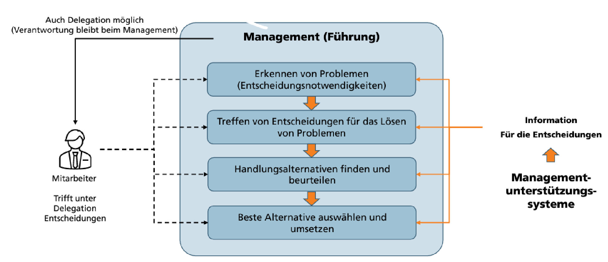

1. Erkennung von **Problemen**
2. Treffen von **Entscheidungen**
3. **Handlungsalternativen** finden und beurteilen
4. **Beste Alternative** auswählen und umsetzen
## 3 Ebenen für Führungskräfte

- Obere Ebene (**Topmanagement**)
- Mittlere Ebene (**Taktische Ebene**)
- Untere Ebene (**Operative Ebene**)

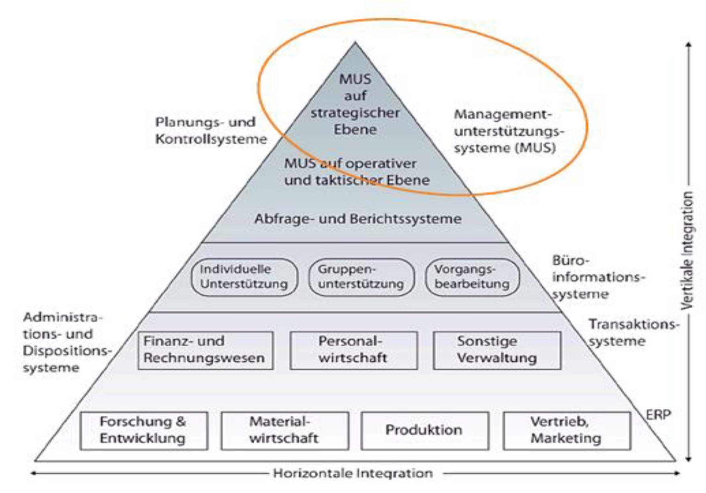

### Obere Ebene (Topmanagement)
- Strategische Aufgabe & Überblick über Betrieb und Umwelt
- Treffen richtungsweisende Entscheidungen
	Beispiele:
	- Vorgabe von Zielen & Strategien
	- Umgang mit Ressourcen (Geld & Mitarbeiter)
	- Preispolitik
- Internationalisierung eines Unternehmens

Braucht Informationen mit Vorhersagecharakter (Aggregierte, periodenbezogene Daten ohne Details)
### Mittlere Ebene (Taktische Ebene)
- Umsetzung strategischer Vorgaben
- Entscheidungen über den Mitteleinsatz, Rabattgestaltung, Werbekampagnen
- Lösung von finanziellen und personellen Problemen
- Ladeneinrichtung von Filialen
- Auswahl von Lieferanten

Braucht wichtige Informationen für die Entscheidung
### Untere Ebene (Operative Ebene)
- Entscheidungen betreffen das Tagesgeschäft
- Welche Artikel und Menge muss nachbestellt werden?

Braucht Informationen möglichst zeitnah
## Probleme der Mangementunterstützung
### Was braucht das Management?
Die richtige Information in richtiger Qualität am richtigen Ort verfügbar
**(wer / was / wann / wo / warum)**
### Probleme
- Vielzahl unterschiedlicher Applikationen und unterschiedlicher Datenformate in heterogenen operativen Informationssystemen
- Schwierige Integration der Datenbestände (inhaltlich, organisatorisch, datentechnisch)
- Welche Daten sind überhaupt verfügbar?
- Wie kommt man zu den Daten?
- Wie können Daten aktuell gehalten werden
## Aktionsfelder der IT-Unterstützung des Managements

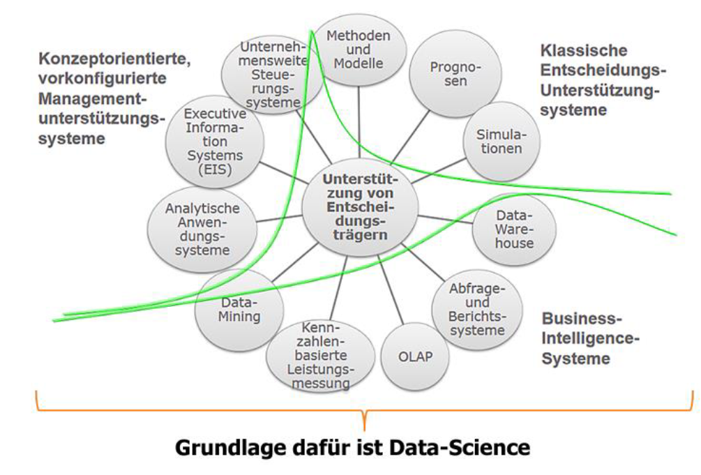

## Methodische Grundlagen der Data-Science
### Definition
Data-Science bezeichnet die Lehre von der Extraktion von Sachverhalten durch die Aufbereitung und Analyse von sehr großen, heterogenen Datenbeständen, um daraus Handlungsempfehlungen für das Management abzuleiten.

**Ziel:** Beschreibung, Diagnose, Vorhersage unbekannter Zusammenhänge, Muster und Trends

**Fragen:**
- Was ist passiert? (Daten der Vergangenheit)
- Warum ist es passiert (Zusammenhänge)
- Wann wird es passieren? (Zukünftige Ereignisse)
- Was kann ich tun? (Handlungsempfehlungen)

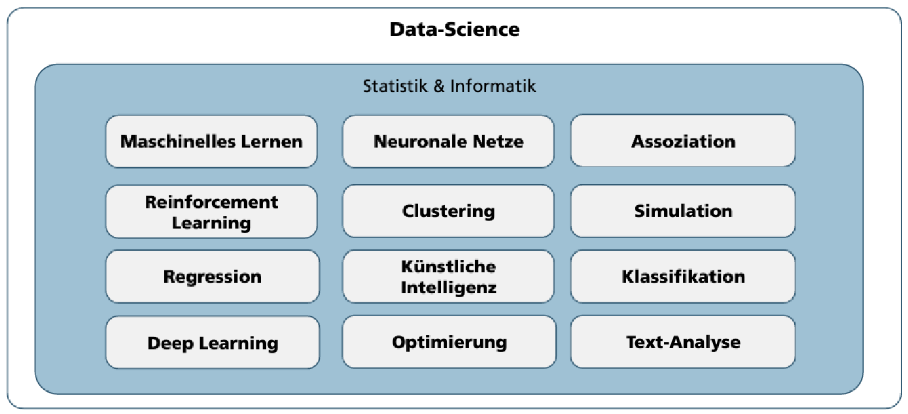

## Künstliche Intelligenz & CO

### Künstliche Intelligenz (KI)
Versuch, sich mit Rechnern den Intelligenzleistungen von Menschen zu nähern.
>Imitation des Menschen
### Maschinelles Lernen (ML)
Maschinen und Roboter, die aus Erfahrung Wissen generieren. Baut durch Techniken der Statistik und der mathematischen Optimierung auf.
>Lösung von Problemen durch neues Wissen
### Deep Learning (DL)
Tiefe neuronale Netze die Erkenntnisse aus Daten gewinnen. Orientation am menschlichen Gehirn.
>Erkenntnisgewinnung von Daten
### Reinforcement Learning (RL)
Form des ML, wobei der RL-Agent benutzt wird, um sequentielle Probleme zu lösen.
>Lösung sequentieller Entscheidungsprobleme

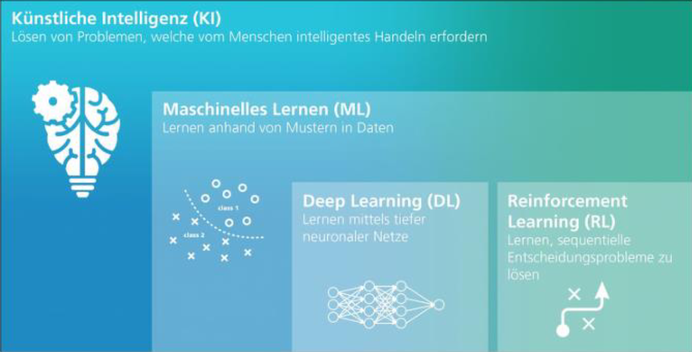

## Maschinelles Lernen (ML)
### Überwachtes Lernen
Überwachtes Lernen ist ein Verfahren des maschinellen Lernens. Es wird ein Datensatz, bei dem die Zielvariable bereits bekannt ist vorgelegt. Algorithmus erlernt Zusammenhänge und Abhängigkeiten, die diese Zielvariable erklären. Danach wird die Qualität der Vorhersage bewertet. Erlernte Muster werden
auf unbekannte Daten angewendet, um Prognosen/Vorhersagen zu erstellen.
- Trainingsdaten werden vom Menschen übernommen
- Hervorragend für Vorhersagen
- Kann Empfehlungen generieren
Beispiele:
- Diagnose
- Vorhersage

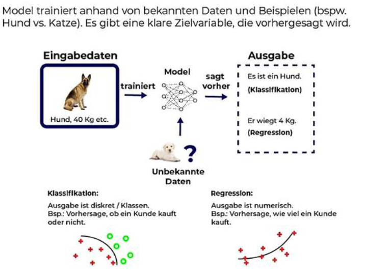
### Regressionsanalyse
Ein statistisches Verfahren, um Beziehungen zwischen abhängigen und verschiedenen unabhängigen Variablen zu bestimmen.

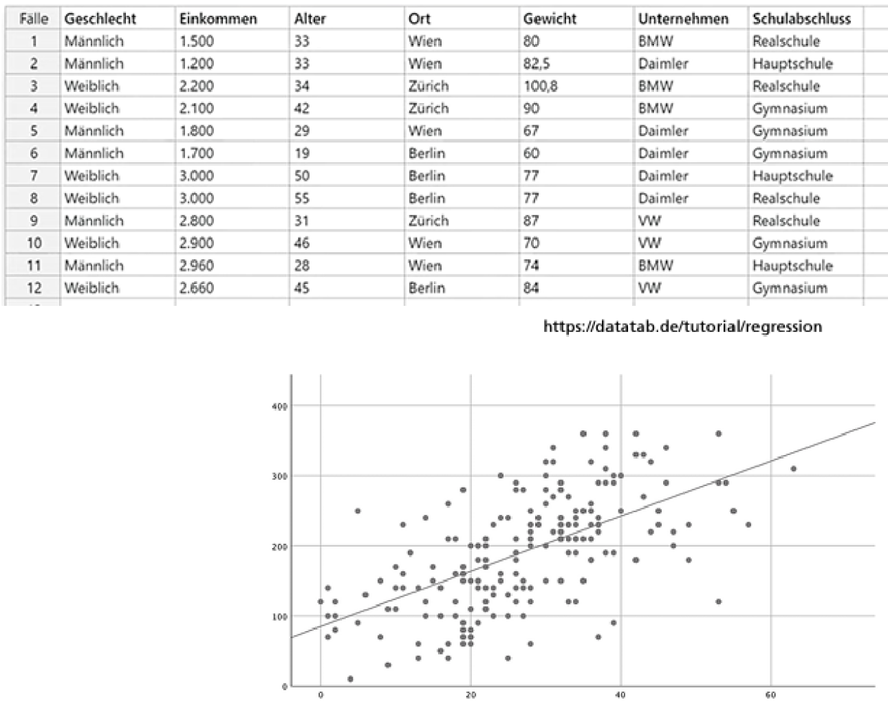

Beispiel:

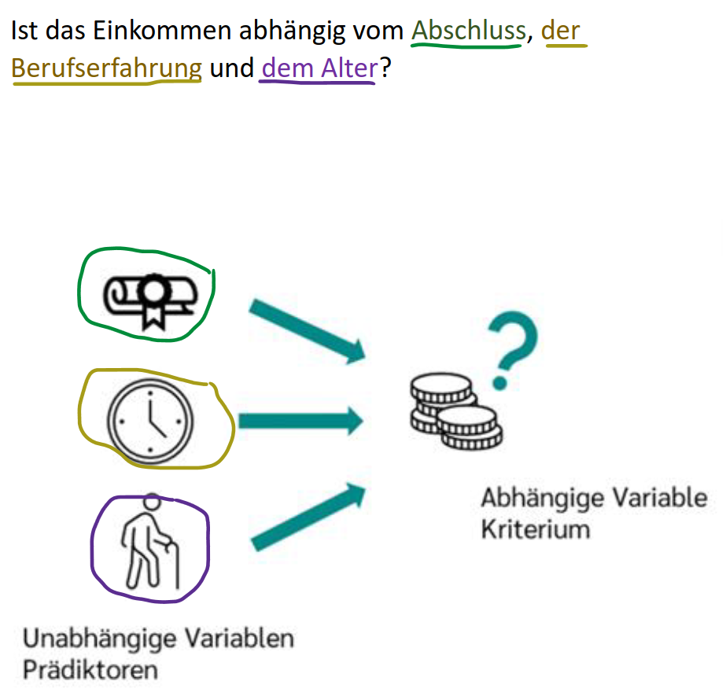

### Unüberwachtes Lernen
Suche nach vorher unbekannten Mustern in nicht kategorisierten Daten. Funktioniert mit minimalem menschlichem Aufwand. Lernt selbständig Muster aus Daten.
- Einsetzung in Clustering und Segmentierung
- NICHT einsetzbar für Prognosen
- Möglich in Echtzeit einzusetzen
- Anzahl Kategorien im Vorfeld nicht bekannt
- Minimaler menschlicher Aufwand
Beispiele:
- Mustererkennung
- Anomalienerkennung: Hacker, Netzstörungen
- Kundengruppierungen

Segmentierung → Algorithmische Verfahren, die Ähnlichkeiten zwischen Datenelementen erkennen

Clustering → Berechnet welche Einträge ähnlich sind aufgrund der Datengrundlage

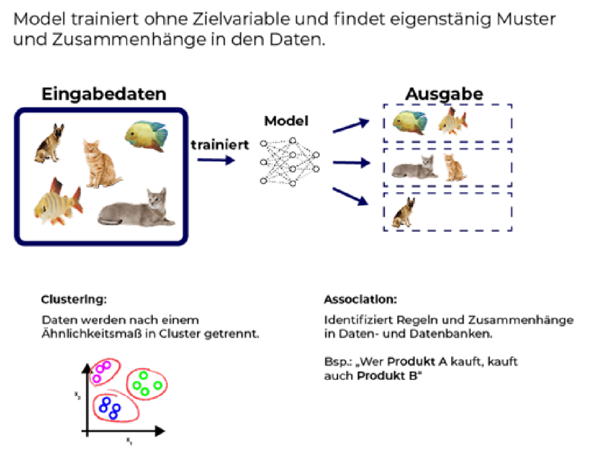

## Reinforcement Learning (RL)
Software-Agent erlernt selbständig eine Strategie, um erhaltene Belohnungen zu maximieren. (Teilgebiet vom Maschinellen Lernen)
**Beispiele:**
- Chatbots
- Ampel-Steuerung
- Staubsaugroboter

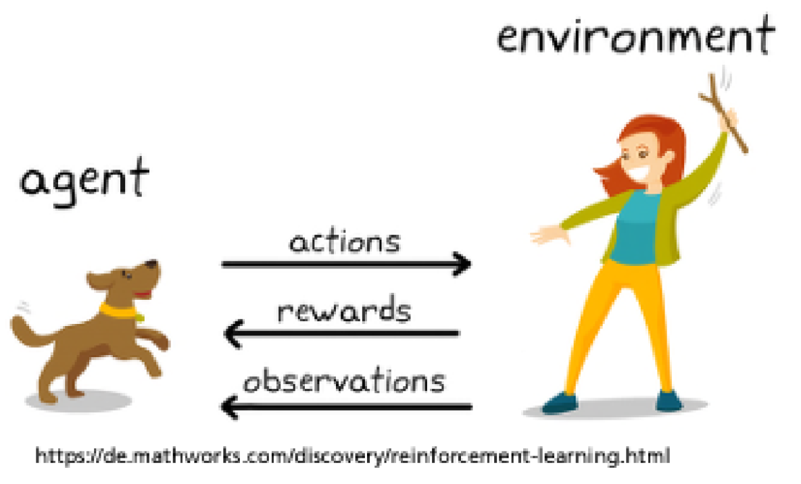

## Deep Learning (DL)
Erkennung von Bildern, Verstehen von Texten und Treffen genauerer Entscheidungen.
**Beispiel:** Unterscheidung zwischen Hund und Katze.
1. Tausende klassifizierte Bilder von Hunden und Katzen als Trainingsdaten
2. Entscheidung ob es sich um einen Hund oder eine Katze handelt
3. Lernen von Fehlern

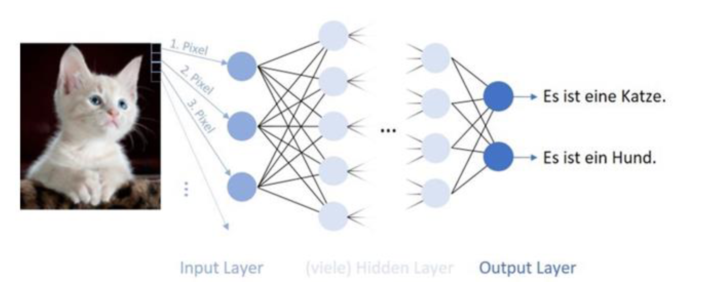

## Klassische Entscheidungssysteme
### Definition
Ein klassisches Entscheidungsunterstützungssystem hilft vor allem Fachspezialisten bei der Entscheidungsvorbereitung für eng abgegrenzte Aufgabenstellungen.
- Untersuchung möglicher Handlungsalternativen mit mathematischen Methoden und Modellen
- Benutzer = Fachspezialist → gibt Annahmen über Zusammenhänge zwischen Entscheidungsvariablen ein und überprüft anhand vorliegender Daten

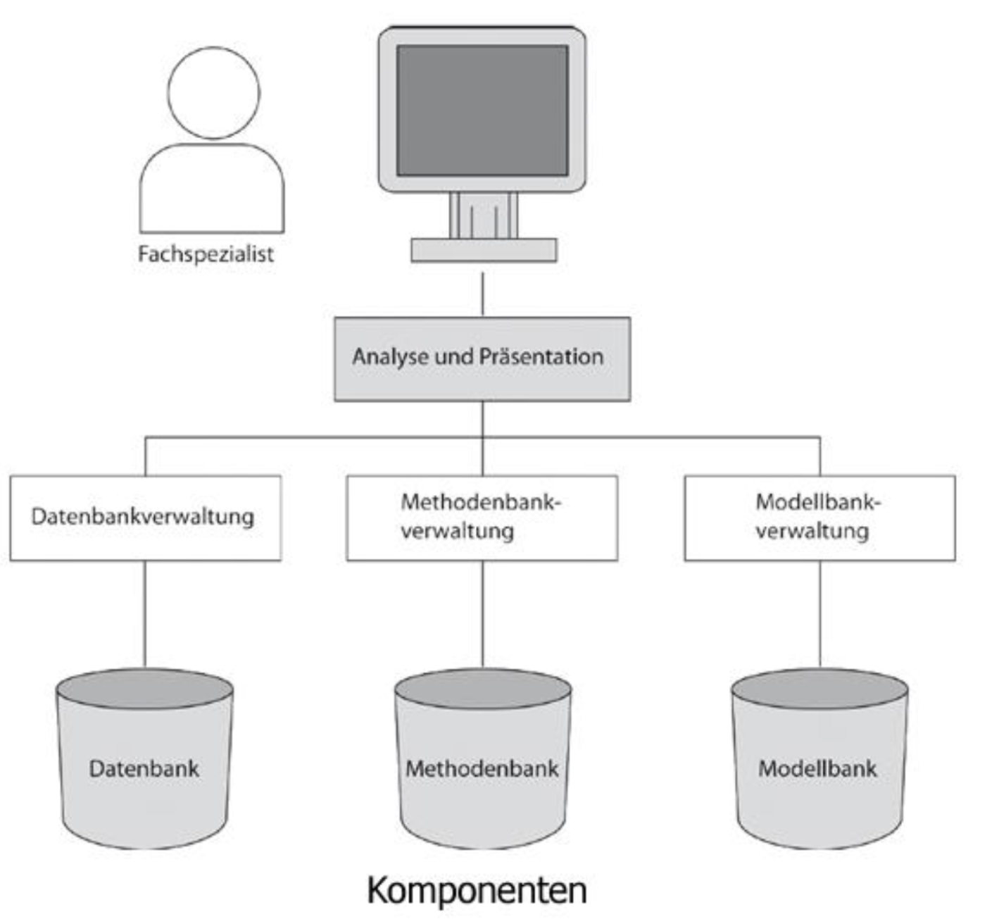

### Simulation
Ein Experiment, bei dem eine komplexe Realweltsituation durch ein Softwaresystem nachgebildet vwird.
**Beispiele:**
- Minimierung notwendiger Maschinen in der Fertigung
- Optimale Routen zur Belieferung von Kunden
- Regaloptimierung im Lebensmitteleinzelhandel

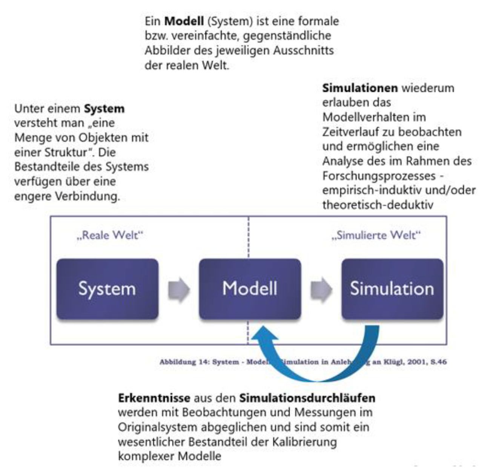

### Regaloptimierung
Bestmögliche Ausnutzung der vorhandenen Verkaufsfläche.

Grundgedanke → Jeder Ware wird der Platz zugeordnet, der ihrem Umsatz- und Ertragsbeitrag am besten entspricht.
**Vorgehen:**
1. Festlegung der Ziele
2. Bereitstellung der Produktdaten
3. Aufbau der Regale
4. Festlegung des Lager- und Merchandisings
5. Erstellung von Regalbefüllungsplänen
6. Durchführung und Kontrolle
## Business-Intelligence-Systeme (BI)
### Definition Business-Intelligence
Beschreibt ein integriertes, betriebsindividuell zu entwickelndes Gesamtkonzept zur IT-Unterstützung des Managements.

**Was sind Business-Intelligence-Systeme?**
An einen Betrieb angepasste analytische Anwendungen zur Integration und Auswertung großer Datenbestände.
### Funktionen
- Berichterstellung
- Datenanalyse
- Kennzeichenvergleiche
- Kundenbewertung
- Clusteranalyse

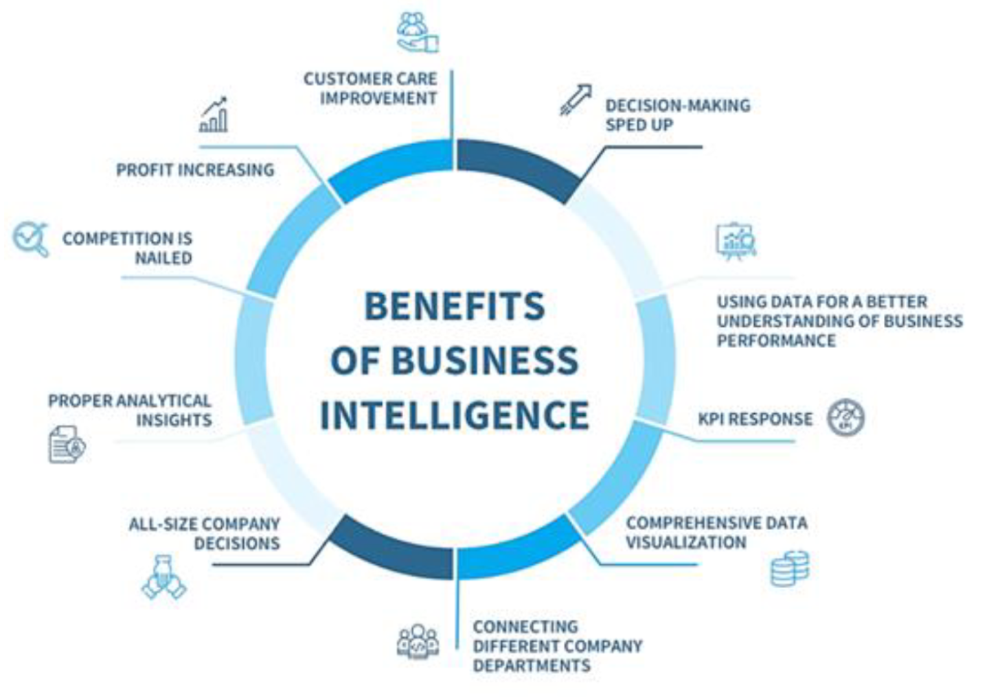
### Komponenten

**Data-Warehouse**
Eine zentrale, strukturierte Datenbank, die verschiedene Datenquellen integriert, um umfassende Analysen und Berichte zu ermöglichen.

**Data-Mart**
Ein kleinerer Ausschnitt eines Data-Warehouses, der spezifische Daten für die Analyse eines bestimmten Geschäftsbereichs oder Teams bereitstellt.

**Data-Lake**
Ein umfassender Speicher für strukturierte und unstrukturierte Daten in ihrem Rohformat, die flexiblere Analysen und Big-Data-Verarbeitung ermöglicht.

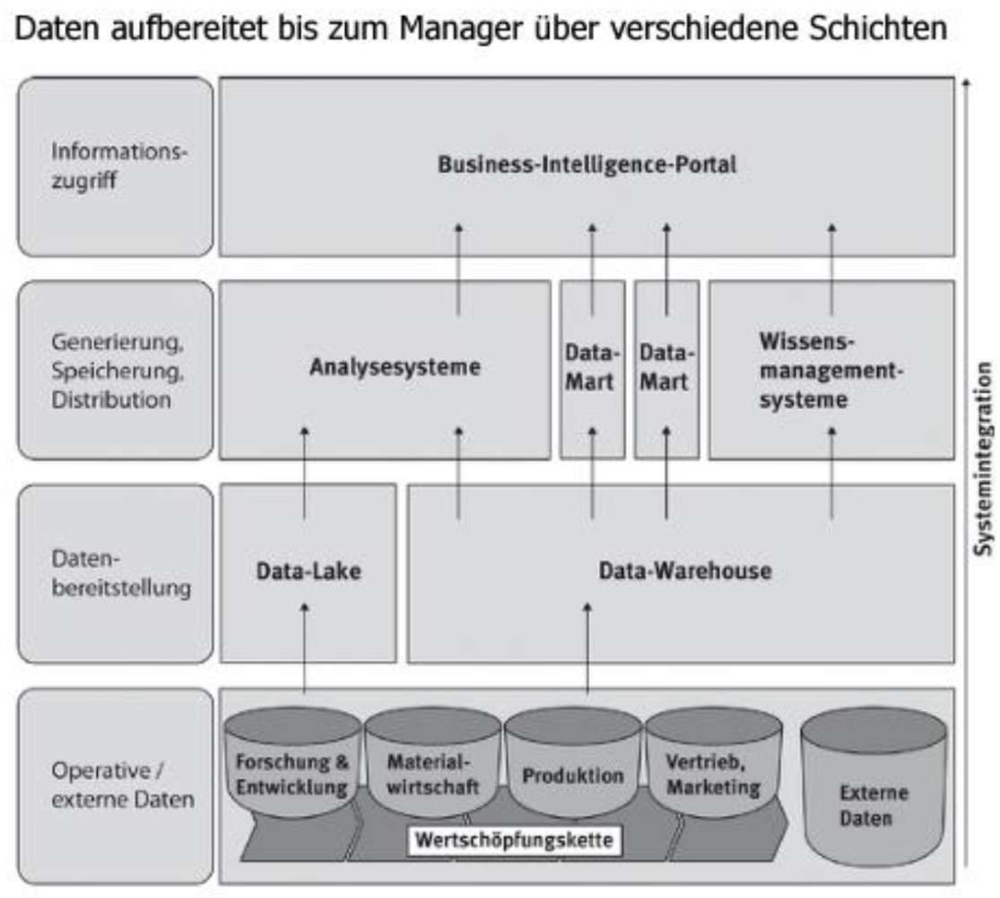

### Hyperwürfel
Stellt eine Datenstruktur dar, die drei oder mehr Dimensionen umfasst. Benutzer können sich intuitiv in dem Würfel bewegen („Dicing“) und an beliebiger Stelle Schnitte durch den Würfel ziehen („Slicing“), um Information zu vergleichen und selbstständig Berichte zu erzeugen. („Slicing and Dicing“)
### Betriebliche Kennzahlen
Sind charakterisierende Maßzahlen und dienen als Verdichtung der komplexen Realität über zahlenmäßig erfassbare Sachverhalte.

**Absolute Kennzahlen:** Anzahl Mitarbeiter, Produkte, etc.
**Relative Kennzhalen:** Umsatz pro Kunde/ pro Quartal

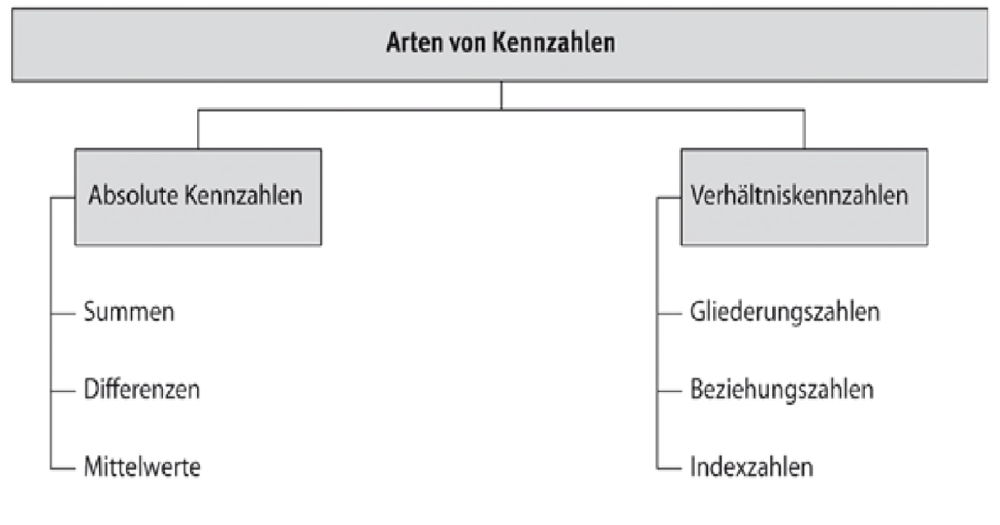

### Dashboard
Als Dashboard wird im Informationsmanagement eine grafische Benutzeroberfläche bezeichnet, die zur Visualisierung von Daten dient.

Beispielbild:
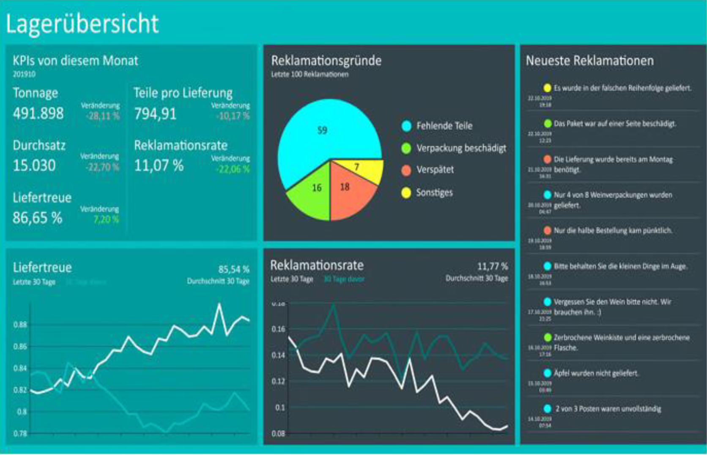
# 06 Informationssysteme
### Was ist Informationssystem-Management?
Umfasst die organisatorischen, planerischen und verfügenden Tätigkeiten für die Planung, Entwicklung, den Betrieb und Kontrolle von betrieblichen Informationssystemen. Das IS- Management muss Informationen und deren Verarbeitung im Fokus haben, was dazu beiträgt, die Erfolgspotenziale des Betriebs zu sichern und weiter auszubauen.
### Umsetzung
- Planung von Informationssystemen
- Entwicklung von Informationssystemen
## Management von Informationssystemen
### Planung Informationssystem-Management
Legt langfristig die **Gesamtkonzeption** und **Realisierung** des **gesamtbetrieblichen Informationssystems** fest.
### Schritte
1. Vorüberlegung:
	→Wo und für wen soll die Planung durchgeführt werden?
2. Analyse der Bedingungslage:
	→ Bestimmung des Handlungsspielraums
	→Untersuchung der Stärken und Schwächen der IT
	→Untersuchung vorhandener Systeme
3. Setzen der strategischen Ziele:
	→Festlegung einer Vision
	→Klarstellung von Richtlinien
4. Entwicklung von IS-Strategien:
	- **Bezug auf Anwendungsarchitektur** →Daten und Anwendungen werden zusammengefasst
	- **Bezug auf Produkte und Dienstleistungen** →Festlegung Art, Umfang und Qualität der angebotenen Dienstleistungen
	- **Bezug auf Ressourcen** →Festhalten der IT-Mitarbeiter
	- **Bezug auf Organisation und Führung** → Regelung der Zusammenarbeit zwischen IT und Fachabteilungen
### IT-Governance
Unter IT-Governance versteht man Maßnahmen, Prozesse und Strukturen, die IT-Leistungen eines Betriebes transparenter und leichter steuerbar machen.
**Ziel:**
- IS-Strategie soll mit der restlichen Unternehmensstrategie übereinstimmen
- Regulatorische Vorgaben sollen eingehalten werden

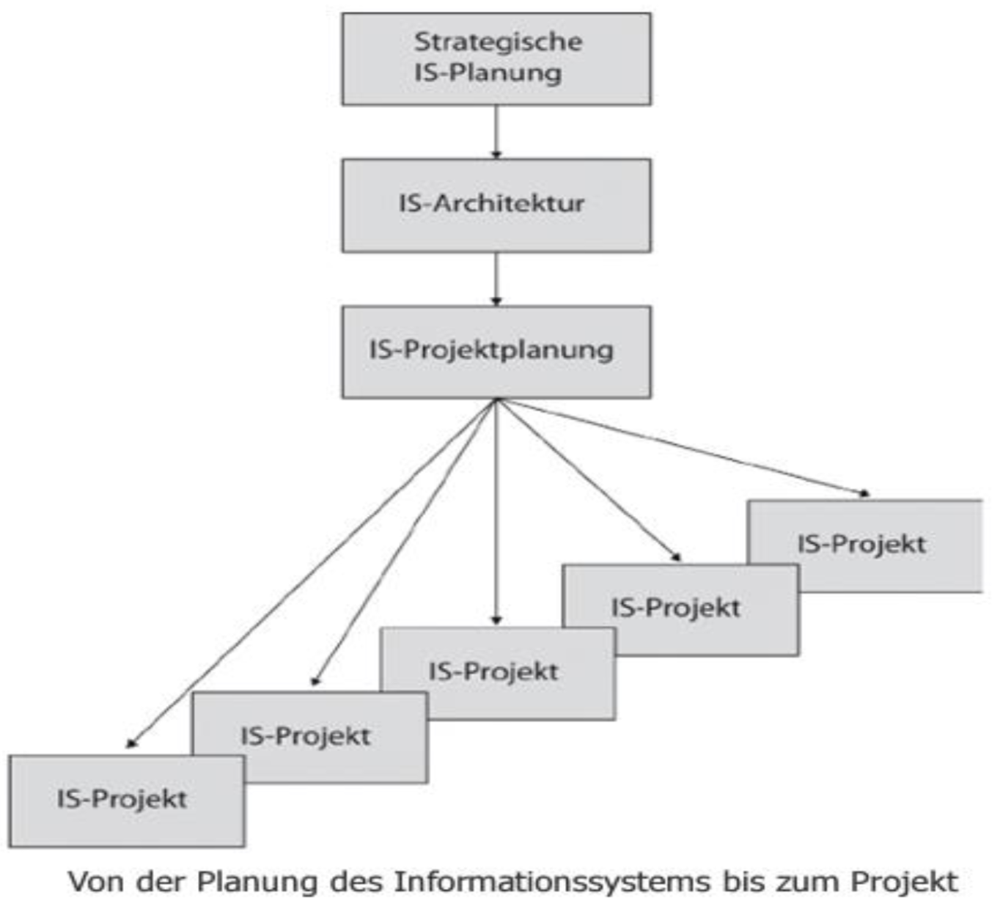
## Entwicklung von Informationssystemen
### Definition
Aufgabe Informationssysteme zu entwickeln, anzupassen und einzuführen. Dabei müssen vorgegebene Termine, Kosten und Qualitätsstandards eingehalten werden.

Für eine erfolgreiche Entwicklung braucht man ein gutes, …
- **IS-Projektmanagement**
- **IS-Projektportfolio**
### IS-Projektportfolio
**Gesamtheit** der IS-Projekte eines Fachbereichs. Fachbereich hat die Aufgabe, die Gesamtheit der IS-Projekte zu **steuern**, das heißt, die Ziele und Auswirkungen der Projekte zu bewerten, **Prioritäten** zu **setzen** und Ressourcen bereitzustellen.

➔ Reihenfolge der Projekte wird hauptsächlich anhand Kosten und Nutzen bestimmt.

## Phasen und Tätigkeiten im Rahmen der IS-Entwicklung

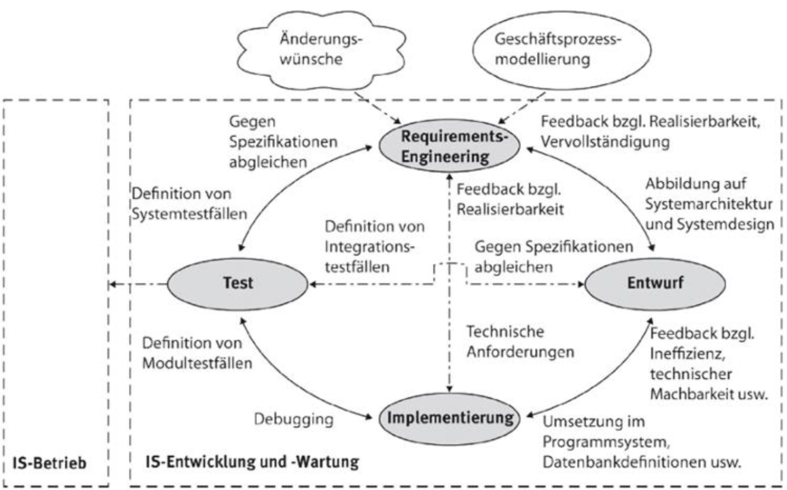

- Requirements Engineering
- Entwurf
- Implementierung
- Test
### Requirements Engineering
Vollständige **Gewinnung** und **Aufzeichnung** der **Anforderungen** an ein System. Es wird eine **Anforderungsspezifikation** erstellt, welche **vollständig, verständlich** sowie **fehler-** und **widerspruchsfrei** sein muss.

**Aufgaben der Anforderungsanalyse:**
- Anforderungen spezifizieren
- Anforderungen verwalten

**Praxis:**
In der Praxis gibt es **unterschiedliches Verständnis** beim **Verstehen** und **Umsetzen** der Anforderungen. → **Klare** und **offene** Kommunikation ist wichtig

### Entwurf
Eine Überführung der fachlichen Anforderungen in eine **technische Konzeption**.

➔ Häufig werden dazu Prototypen gebaut
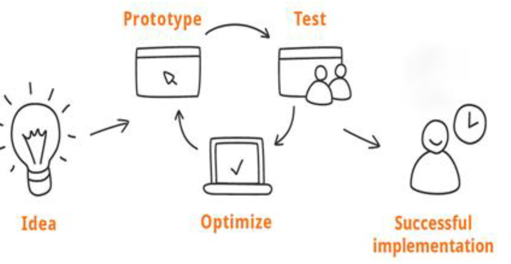
### Implementierung
**Programmierung** und **Konfiguration** der Software basierend auf der Spezifikation.

➔ **Übergang** von abstrakter zu **konkreter Ebene:**

Implementierung einer spezifizierten Software, unter einem speziellen Betriebssystem und Programmiersprache.
1. Alphaversion
2. Betaversion
3. Freigabeversion (Release)

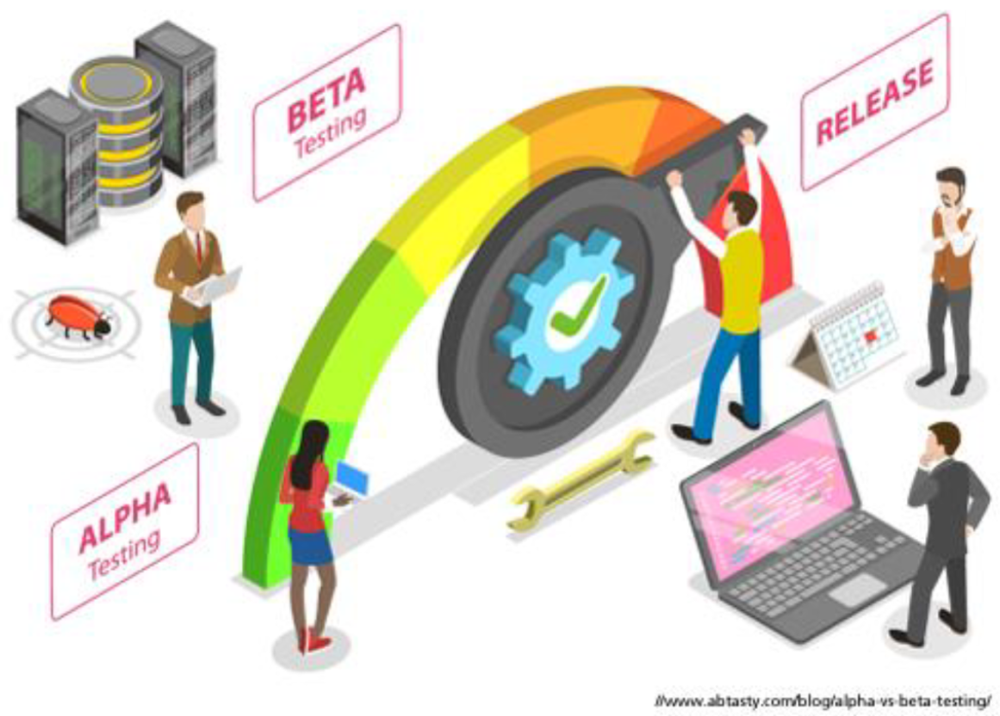
### Test
Umfasst das Testen der Software, auf **Fehler** und **Erfüllung der spezifizierten Anforderungen.**

**5 Arten von Tests:**
- Manual Test
- UI & API Testing
- Integration Testing
- Component Testing
- Unit Testing

### Unterscheidung zwischen White Box Testing & Black Box Testing:

#### Black Box
Tester weiß nicht wie die Software implementiert ist und aus welchen Komponenten sie besteht. Tests erfolgen durch invalide Inputs, durch diese die Funktionsweise eines Systems mit fehlerhaften Eingaben und Aktionen untersucht wird.
#### White Box
Tester haben Kenntnisse über den Code und die Funktionsweise der Software.
# 07 Grundlagen des Computers
## Definitionen
### Computer
Computer als programmgesteuerter Rechenautomat

Computer als Automat für Algorithmen
Algorithmus als Schritt-für-Schritt-Anweisung für die Lösung eines (mathematischen) Problems (z.B. für eine Entscheidung)

Computer Verarbeiten ausschließlich digitale Daten
Computer wandelt analoge und digitale Daten um
### Digitale Daten
Digitale Daten sind in Form von Zahlen dargestellt
Digitale Daten sind die kleinste Informationseinhiet, können nicht weiter aufgelöst werden
Daten liegen aber meist in Form von Bilder, Tönen, Videos, etc vor
### Analog
Daten in Wellenform (Elektrische Signale von variabler Stärke)
### Digital / Binär
Daten mit nur zwei Zuständen: 0 (OFF), 1 (ON)

### Grundgatter (logic gates)
- AND
- OR
- NOT
- NAND
- NOR
- XOR
- etc..
>Mit den Logikbaustreinen kann man Rechnungen durchführen und Daten verarbeiten.
## CPU
### Transistoren
Transistoren haben verschiedene Formen, die meist genutzten lassen nur Strom durch, wenn ein (kleiner) Aktivierungsstrom von der Seite gegeben wird.
Eine große Menge von Transistoren nennt man intigrierte Schaltung (IC) oder Mikrochip.
Computer CPUs bestehen aus milliarden von Transistoren und führen so Rechnungen durch.
### Aufbau Prozessor

### Ausführung Maschinenbefehle

### Taktfrequenz
Die Taktfrequenz eines Prozessors gibt an, mit welcher Frequenz die Verarbeitungseinheiten Operationen durchführen.
### Moore's Law
Faustformel: Leistungsfähigkeit (Anzahl der Transistoren auf Mikro-Chips) verdoppelt sich ca. alle 18 Monate.
## Geschichte des Computers
### Erste Rechenhilfsmittel
Abakus (2500 v.Chr.), Rechenbrett der Antike

Einführung des Stellenwertsystems (Basis-10 Zahlensystem)
Die Ziffer 0 ermöglicht die Vervielfachung des Wertes einer Ziffer
### Erste mechanische Rechenmaschiene
**1642** vom Franzosen **Blaise Pascal** efunden.
Die Pascaline konnte sechstellige Zahlen addieren, und sollte seinem Vater helfen, der als Steuerbeamter tätig war.
### Analytical Engine
Erfunden vom britischen Mathematikprofessor **Charles Babbage (1791-1871)**.
Die Analytical Engine ist der Entwurf einer mechanischen Rechenmaschine für allgemeine Anwendungen.
### Elektromechanischer Rechenautomat
**1940** erfindet **Konrad Zuse** die Z3, den ersten funktionsfähigen programmierbaren, elektromagnetischen Rechenautomaten.

- Verwendung des binären Zahlensystems Gleitkommazahlenberechnung
- Ein- und Ausgabegeräte
- Möglichkeit der Benutzerinteraktion während des Rechenvorgangs
- Mikroprogramme
- Pipelining von Instruktionsfolgen
- Numerische SonderwerteParallele Ausführung von Operationen so weit wie möglich
## Elektrik vs Elektronisch
### Elektrik
Umschreibt alles was mit Strom zu tun hat
### Elektrisches Gerät
Alle Geräte, die elektrische Energie für die Ausführung verwenden. BSP: Generator
### Elektronik
Umschreibt alles was damit zu tun hat, elektrischen Strom zu leiten, kontrollieren und regulieren
### Elektronisches Gerät
Die Vorrichtung, die den Elektronenfluss zur Ausführung der Aufgabe steuert. BSP: Motor
### Elektromechanisches Gerät
Beinhaltet Schaltelemente, die durch einen Elektromagneten gesteuert werden. BSP: Elektromotor
## Rechner
### Entwicklung elektronischer Rechner

### Arten von Rechnern
- Großrechner
- Minicomputer
- Workstation
- Personalcomputer (PC)
- Persönliche Informationshilfsmittel (mobile Geräte, die als universelles Instrument verwendet werden, um geschäftliche und private Aufgaben zu erledigen)
## Software
Software ist ein Sammelbegriff für Computerprogramme
Detaillierte Handlungsanweisung an einen Prozessor
Prozessor führt ausschließlich Maschinenbefehle durch

Erstellung komplexer Handlungsanweisungen in Maschinenbefehlen für den Menschen aufwendig, fehleranfällig und prozessorabhängig.
Deshalb Proframmiersprachen
## Programmiersprache
Eine Programmiersprache, deren Befehle sich am Anwendungsbereich orientieren, wird als höhere Programmiersprache bezeichnet. 
Höhere Programmiersprachen abstrahieren vom Befehlssatz des Prozessors und verwenden Elemente der natürlichen Sprache und/oder der Mathematik für das Formulieren von Programmen.
### Arten von Programmiersprachen

| Art | Beschreibung | Beispiel |
| ---- | ---- | ---- |
| Imperativ | - Formulierung von komplexen Anweisungen | C, C++ |
| Objektorientiert | - Beschreibung des Realweltprogramms durch Objekte und Klassen des Anwendungsbereiches - Leichter durch die Abstraktion | Python, Java |
| Funktional | - Definition von Funktionen (input -> output) | Haskell, F# |
| Logisch | -Beschreibung des Realweltprogramms durch (Prädikaten-)Logik | Prolog, ASP |
# 08 Hardware
## Physikalische Grundlagen
Verarbeitung -> Zentraleinheit
	- Prozessor, inkl. Rechen- Steuerwerk, Eingabe- und Ausgabewerk, Speicherwerk, Datentransfer-System
Ein- & Ausgabe + Speicher -> Peripherie
	- Maus, Tastatur, Monitor, Drucker, Festplatte, Server etc
## EVA(S) Prinzip
Grundlegendes Prinzip der Datenverarbeitung und Reihenfolge

E - Eingabeeinheit
V - Verarbeitungseinheit
A - Ausgabeeinheit
(S - Speicher)

>Dieser Prozess existiert auch bei uns Menschen, daher universeller Prozess der Datenverarbeitung

## Hardware-Komponenten

### Mainboard

Hauptplatinen sind immer ähnlich aufgebaut, wichtigste Komponenten:
- Northbridge
	  verbindet alle Computerkomponente, welche besonders schnell miteinander kommunizieren müssen, also Prozessor, Arbeitsspeicher(RAM) und schnelle Grafikkarten
- Southbridge
	  verbindet restliche Komponente, Festplatten, Netzwerkkarte und das BIOS

In modernen Systemen wird die Northbridge oft auch direkt im Prozessor integriert, zudem enthält die Southbridge meist einen Netzwerk- und Grafikkontroller.

### Grafikkarte (GPU)
Aufgaben
- Erzeugen einer Pixelgrafik aus einer anderen Darstellungsform
- Speichern dieser Pixelgrafik, des Bildschirminhalts
- Steuerung des Bildschirms, damit er den Bildschirminhalt anzeigt

Kenngrößen
- maximale Auflösung BSP: 1920x1080 Pixel (Full HD)
- Taktfrequenz, wie schnell Berechnungen durchgeführt werden können. Wird in Hertz angegeben (bedeutet pro Sekunde)
- Speicherkapazität, eigener Arbeitsspeicher der GPU. BSP: 8GB
### Netzwerkkarte
Kommunkation mit dem Internet
**WLAN** (dratlos) oder **LAN** (per Kabel)
 
**Übertragungsrate**, wie viele Daten pro Sekunde. 
BSP: Megabit pro Sekunde, Mbps
### Schnittstellen
- PCI
	  Eine der ersten und bis heute immer noch in verbesserter Form angewandte Technik und Möglichkeit, schnell und einfach interne Peripheriegeräte an das Mainboard anschließen zu können.
- PCIe
	  PCI-Express Schnittstelle oder PCIe bzw. PCI-E genannt, ist ein Erweiterungsstandard zur Verbindung von Peripheriegeräten 
	  BSP: Controller, Maus; aber auch: GPU, Netzwerkkarte
- SATA
	  Anschluss von von Massenspeichern wie Festplatten, SSDs und CD/DVD-Laufwerken an Computern
- IDE
	  Alte Festplatten-Schnittstelle, bei der die Steuerungselektronik bzw. der Controller in das Festplattengehäuse integriert ist.
### Eingabegeräte
- Maus
	  Cursor auf Bildschirm bewegen, Maustasten
- Scanner
	  Überbegriff für Geräte, welche flache Gegenstände, meist Bilder oder Textseiten in den Computer übertragen
- Mikrofon
	  Ton-Eingabe
- Webcam
	  Im Rahmen von Videoconferencing mittels VoIPdas Bild des Gesprächsteilnehmers aufzunehmen
### Ausgabegeräte
>Das Ausgabegerät zeigt das Ergebnis der Verarbeitung von Rohdaten an, die über ein Eingabegerät in den Computer eingegeben werden

- peripheres Gerät zur Ausgabe von Computerdaten
- Es gibt eine Reihe von Ausgabegeräten, z.B. Text, Bilder, Hardcopy, Audio oder Video 
  BSP: Bildschirm / Monitor, Touchscreen, Kopfhörer
### Monitore
- CRT - alt
- LCD - weit verbreited
- LED - neu

Touchscereen: ermöglicht Input
### Speicher
Ein Schreib-Lese-Speicher kann gelesen und beschrieben werden.

Festwertspeicher (ROM) kann nur gelesen werden und Informationen sind unveränderbar.

Direktzugriffsspeicher (Arbeitsspeicher, ROM) ist ein Speicher, bei dem jede einzelne Speicherstelle über ihre fest zugeordnete Adresse gelesen oder beschrieben (und damit auch gelöscht) werden kann. Die Zugriffszeit ist für alle Speicherstellen in etwa gleich lang.

Flüchtiger Speicher verliert bei Ausfall der Versorgungsspannung seinen Inhalt.

Nicht flüchtiger Speicher behält seinen Inhalt auch ohne Versorgungsspannung.

Flash Speicher ist ein spezieller ROM-Typ, dessen Inhalt durch Anlegen eines elektrischen Felds in bestimmten Speicherbereichen, sogenannten Sektoren oder Blöcken (zum Beispiel 512 Bytes), auf einmal gelöscht wird.
- Die Speicherzellen können nicht – wie bei gewöhnlichen ROM-Chips – einzeln gelöscht werden. Das Schreiben erfolgt je nach Chiparchitektur selektiv für jede einzelne Zelle oder auf einmal für einen gesamten Block
- Flash-Speicher haben eine begrenzte Lebensdauer, die sich durch die maximale Anzahl von Löschzyklen ergibt.

### Ram
Arbeitsspeicher bezeichnet den kurzfristigen Speicher eines Computers. Dieser enthält alle Daten, die Sie gerade nutzen – von geöffneten Webseiten bis hin zu einer Mausbewegung über den Bildschirm

**DDR** steht für Double Data Rate, DDR ist die RAM-Technologie

RAM besteht aus einer Reihe an nummerierten Speicherzellen gleicher Größe.
Die Bit-Zahl der Architektur bestimmt sowohl die maximale Anzahl, als auch die Größe der Speicherzellen.
Auf jede Speicherzelle kann gleich schnell zugegriffen werden, wenn man ihre Adresse kennt.
### Hardware & Software
- Hardware, alle physischen Bestandteile
- Software, alle nicht physischen Komponenten

# 09 Mathematische Grundlagen
## Logik
Warum ist ein Verständnis der Logik in der Wirtschaftsinformatik 
Teilmenge: $C \subseteq A$
relevant?
- Repräsentation von Wissen (z.B. im Bereich KI)
- Grundlage für Datenbank-Anfragesprachen (SQL)
## Aussagenlogik
### Definition
> Die Basis sind strukturlose Elementaraussagen, denen ein Wahrheitswert zugeordnet wird.
> In der klassischen Aussagelogik gilt:
> - Aussage ist **WAHR** oder
> - Aussage ist **FALSCH**
### Junktoren / Logische Operatoren

| Verknüpfung | Schreibweise | Beispiel |
| ---- | ---- | ---- |
| Konjunktion | $a \land b$ | Ich bink krank und gehe zum Arzt. |
| Disjunktion | $a \lor b$ | Ich gehe zum Arzt oder der Arzt kommt vorbei (oder beides). |
| Subjunktion | $a \rightarrow b$ | Wenn ich krank bin, dann gehe ich zum Arzt. |
| Bijunktion | $a \leftrightarrow b$ | Wenn ich krank bin, dann gehe ich zum Arzt und umgekehrt. (Ich gehe genau dann zum Arzt, wenn ich krank bin.) |

Negation: $\lnot$
### De-Morgen-Theorem
>Die De Morganschen Gesetze sind zwei grundlegende Regeln für logische Aussagen.

- NOT
- NAND
- NOR
- AND
- OR
## Mengen
### Defintion
>Die Mengenlehre schafft Grundlagen zur Logik

Mengen werden über ihre Elemente bestimmt.
Ist m ein Element von M so schreibt man $m \in M$

Elemente von Mengen können selber Mengen sein.
Ist m kein Element von M so schreibt man $m \notin M$

Die leere Menge.
Es gilt $\varnothing = \{ \}$

Teilmenge: $C \subseteq A$

Teilmenge: $B \subset A$

### Zahlenmengen

| System | Beispiel |
| ---- | ---- |
| Natürliche Zahlen | $\mathbb{N} = \{1,2,3,...\}$ |
| Natürliche Zahlen mit 0 | $\mathbb{N}_0 = \{0,1,2,3,...\}$  |
| Ganze Zahlen | $\mathbb{Z} = \{...,-3,-2,-1,0,1,2,3,...\}$ |
| Rationale Zahlen | $\mathbb{Q}$ (alle Bruchzahlen) |
| Reelle Zahlen | $\mathbb{R}$ (Kommazahlen) |
### Mengenoperationen

| Operation | Schreibweise |
| ---- | ---- |
| Schnitt | $A \cap B$ |
| Vereinigung | $A \cup B$ |
| Differenz | $A \ \backslash \ B$ |
### Zahlensysteme

Binärsystem = Base 2

Oktalsystem = Base 8

Hexadezimasystem = Base 16
# 10 Betriebssysteme
## Hardwaresicht und Anwendersicht

| Hardwaresicht | Anwendersicht |
| ---- | ---- |
| Ein Rechnersystem besteht aus einer Menge kooperierender Hardwarekomponenten. | Ein Rechensystem stellt (benutzerfreundliche) Konzepte bereit, mit denen Daten und Informationen verarbeited werden können. |
## Betriebssystem
### Definition
>Ist **Softwarekomponente**, die die abstrakte Anwendersicht auf der Grundlage der realen Hardwaresicht umsetzt.

- macht die Hardware für den Anwender benutzbar
- Enthält interne Programme und Datenstrukturen

>Betriebssystem besteht aus einem Betriebssystemkern und einer Schnittstelle
### Aufgaben

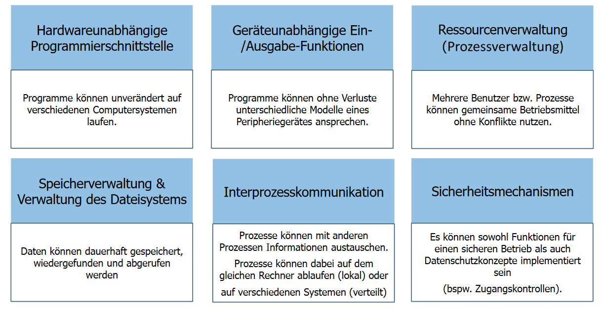

- Prozessverwaltung
	  Erzeugen und Löschen von Prozessen.
- Geräteverwaltung
	  Überwachung der Datenübertragung.
- Speicherverwaltung
	  Zuteilung des verfügbaren physikalischen Speichers an Prozesse.
- Verwalten des Dateisystems
	  Erzeugen, Löschen, Lesen, Schreiben, Kopieren, etc.
## Betriebsarten

| Einprogrammbetrieb | Mehrprogrammbetrieb |
| ---- | ---- |
| Im Einprogrammbetrieb werden einzelne Benutzeraufträge von der CPU nacheinander bearbeitet. Nur ein Anwendungsprogramm im Arbeitsspeicher, das alle vorhandenen Betriebsmittel (Prozessoren, Speicher, periphere Geräte) zugeteilt bekommt. | m Mehrprogrammbetrieb werden mehrere Benutzeraufträge von der CPU gemeinsam bearbeitet. Die Bearbeitung erfolgt abwechselnd, in Zeitabschnitten. Es befinden sich gleichzeitig mehrere Anwendungs- Programme ganz oder teilweise im Arbeitsspeicher. |

| Einbenutzerbetrieb | Mehrbenutzerbetrieb |
| ---- | ---- |
| Beim Einbenutzerbetrieb kann nur ein Benutzer einen Rechner zu einem Zeitpunkt nutzen. Ein Benutzer belegt das gesamte Rechensystem und erteilt Aufträge, die streng sequentiell abgearbeitet werden. | Mehrbenutzerbetrieb, bei dem eine Zentraleinheit von mehreren Benutzern zur Verfügung steht (z.B. WindowsNT/XP, Mac OS X, Linux/Unix). Jedem dieser Arbeitsplätze werden Systemressourcen (z.B. Festplattenkapazität) und Rechte (z.B. Lese- oder Schreibrechte) Zugeteilt. |

| Einprozessorbetrieb | Multiprozessorsystemen |
| ---- | ---- |
| Der Einprozessorbetrieb kann nur ein Programm ablaufen lassen. | In Multiprozessorsystemen können gleichzeitig mehrere Programme auf verschiedenen physischen Prozessoren ablaufen. |
## Komponenten eines Betriebssystems

| Komponente | Aufgabe |
| ---- | ---- |
| Auftragsverwaltung | Verwaltung der gleichzeitig ablaufenden Programme und übernimmt die Steuerung mehrerer Tasks/Prozesse. |
| Arbeitsspeicherverwaltung | Bietet einen Speicherschutz, der verhindert, dass gleichzeitig laufende Programme sich irrtümlich gegenseitig überschreiben. |
| Geräteansteuerung | Eine weitere Aufgabe des Betriebssystems ist es, eine möglichst standardisierte Abstraktionsschicht zwischen der real verfügbaren Hardware und den Anwendungsprogrammen anzubieten. |
| Benutzerverwaltung | Definition von Benutzungsbeschränkungen für die Nutzung einzelner Ressourcen zur Verfügung stellen. |
| Dateisystem | Organisiert die Daten auf einem Datenträger in der Form von Dateien. Arten von Dateisystemen: - Lineare Dateisysteme - Hierarchische Dateisysteme |
## Drei große Betriebssysteme
- Windows-Familie
- Linux
- MacOS X

**Nicht alles wissen, aber Aspekte kennen** (Frage wäre z.B. Nenn Sie ein Unterschied der Schwächen zw. Windows und Linux)

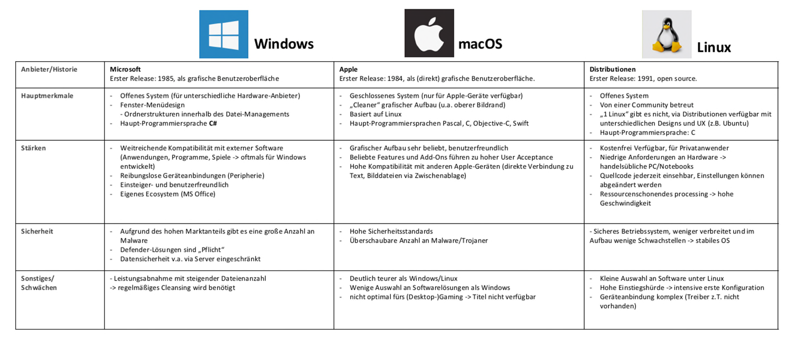

# 11 Datenkommunikation und Rechnernetze
## Anwendung der Datenkommunikation
- Rechnernetze entwickelten sich von einer Forschungsplattform hin zu einer kritischenInfrastruktur
- mit Rechnernetzen erbringen Betriebe operative Leistungen
- Private Haushalte können Informationsbedürfnisse erfüllen
- Grundlage für Rechnernetze ist die Datenkommunikation, denn sie überträgt relevante Informationen in digitaler Form (von Sender zu Empfänger)
-> Rechnergeschützte Kommunikation Ist der Austausch von Informationen zwischen zwei Rechnern auf räumlicher Distanz
## Datenübertragung
### Datenübertragungssystem:
Besteht aus zwei oder mehreren Datenstationen, zum Zwecke des Datenaustausches durch ein Übertragungsmedium miteinander verbunden sind.
### Konvergenz der Medien:
Es gibt keinen Unterschied für die Datenübertragung (egal ob Text, Bilder, Videos,..)

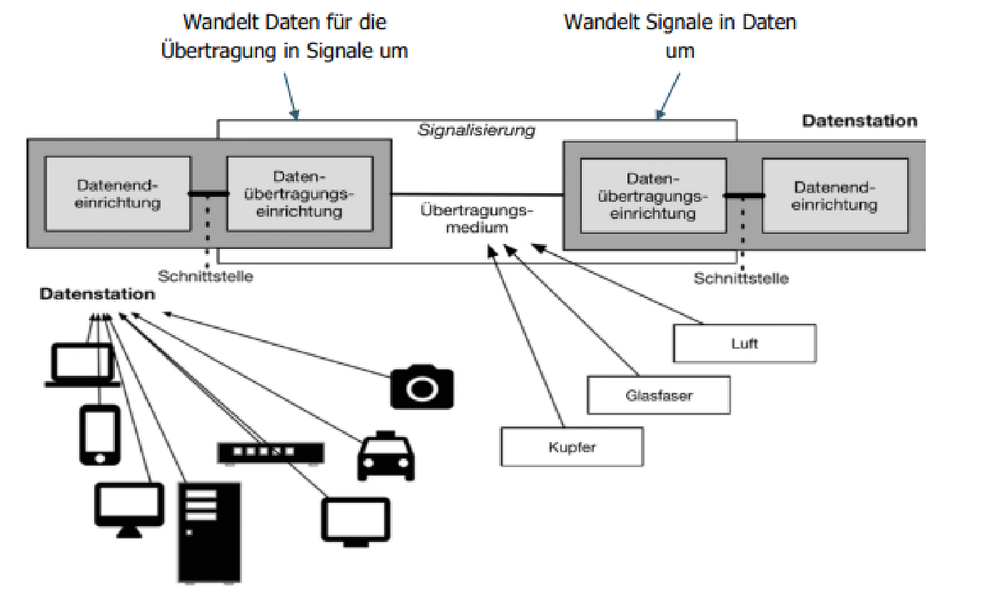
### Wichtigsten Datenübertragungseinrichtungen:
- Modem: Wandelt digitale Daten in analoge Übertragungsdaten um und überträgt bzw. empfängt diese; Wir unterscheiden unter:
  - Telefonmodem (Umwandlung digitaler Daten in Töne)
  - Funkmodem (Umwandlung digitaler Daten in Radiosignale)
  - Glasfasermodem (Umwandlung von digitalen Daten in optische Signale)
- Netzwerkadapter: Überträgt digitale Daten über ein Netzwerk und übernimmt Signalisierung
### Übermittlung von Signalen:
- Jede Bitfolge wird durch elektromagnetische Wellen übertragen
- Bitfolge muss bei einer physischen Übertragung in Wellenmuster kodiert werden (Umgekehrt beim Empfang)
- Interpretiert werden sie durch Frequenz, Wellenlänge und Amplitude
- Frequenz = Anzahl der Schwingungen pro Zeiteinheit (in Hz)

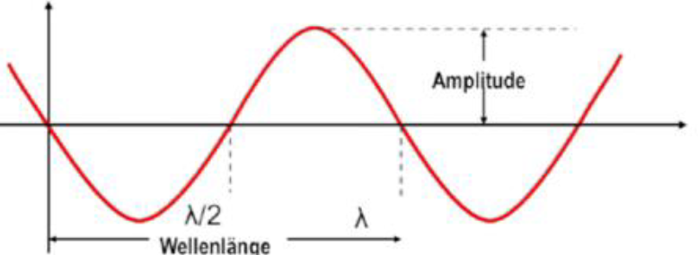
### Frequenzen und das elektromagnetische Spektrum:

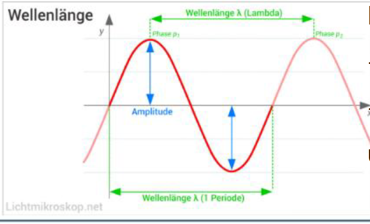
- verschiedene Frequenzbänder: Radiowellen, Mikrowellen, Infrarotwellen, Röntgenwellen..
- Für Datenübertragung sind höhere Frequenzen besser, da in kürzerer Zeit mehr Daten übertragen werden.
### Informationsdarstellung mit Signalparametern:
- Informationen kann man mit folgenden Signalparametern darstellen:
- Amplitudenmodulation (AM): Wert „1“ wird durch eine höhere Spannung (yAchse) als „0“ dargestellt
- Frequenzmodulation (FM): Wert „1“ wird durch eine höhere Frequenz als „0“ Dargestellt
- Phasenmodulation: Wert „1“ hat eine andere Phase als der Wert „0“

>Letztendlich will man es ja in 0 und 1 angeben, die Frage ist nur wie kann man die Signale als 1 und 0 lesen? Bei den Amplituden bspw. Ist die 1 4 größere Ausschläge, bei Frequenz bspw. Ist die 1 4 Amplituden.
### Übertragungsleistung:
- Übertragungskapazität: Welche Datenmenge kann in einer bestimmten Zeit übertragen werden? ; Werden in der Einheit bit/Sekunde angegeben (z.B. Kbit/s, Mbit/s)
- Signallaufzeit = Zeitspanne, die ein Signal benötigt, um eine Strecke zwischen zwei Punkten zu durchlaufen (Einheit s, ms, ns)
- Latenz = Verzögerung zwischen Versenden und Ankunft des ersten Datenbits (ping in ms) ; Relevant bei Spielen und Sprach- und Videokonferenzen
### Multiplexverfahren:
- Multiplexverfahren = Übertragungstechnik, durch die mehrere getrennte Verbindungen über ein einzelnes physisches Übertragungsmedium übertragen werden. Dabei wird die verfügbare Übertragungskapazität zwischen den logischen Kanälen aufgeteilt.
- Zu unterscheiden sind:
  - **Frequenzmultiplexverfahren**: verwendet mehrere verschiedene Frequenzbänder des gemeinsamen Übertragungsmediums
  - **Zeitmultiplexverfahren**: erlaubt logischen Kanälen exklusive Nutzungsrechte für kurze Zeitintervalle

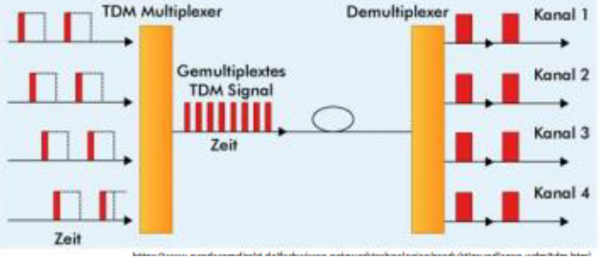
## Übertragungsmedien

### Verdrillte Kupferkabel:
- in der Telefonie verwendet
- weitesten verbreitetes Übertragungsmedium
- Vorteile: Preiswert, einfach zu Verlegen
- Nachteile: Geringe Bandbreite, hohe Störanfälligkeit
### Koaxialkabel:
- Zwei Kupferleiter ineinander liegend angeordnet
- Vorteile: Hohe Sicherheit gegen Störungen, höherer Frequenzen möglich (daher der Name Breitbandkabel)
- Nachteile: Kabel ist eher unbeweglich -> verlegen manchmal problematisch
### Glasfaserkabel:
- Informationsübertragung durch dünne Glas- oder Kunststofffasern mittels Laserlichtimpulse
- Daten werden optisch Übertragen
- Vorteile: Kabel kann beliebig gekrümmt werden ohne Einbußen, sehr hohe Übertragungsleistungen
- Nachteile: Einsatz ist teuer
## Rechnernetze
### Allgemeines:
Rechnernetz = räumlich verteiltes System von Datenstationen, die durch Datenübertragungseinrichtungen und -wege miteinander verbunden sind.
### Klassifikation von Rechnernetzen:
- Es gibt verschiedene Formen von Rechnernetzen für verschiedene Einsatzgebiete
- Es gibt:
  - Organisatorische Kriterien: Wer betreibt das Rechnernetz?
    - öffentliches Netz (Fokus auf Betreiber)
    - privates Netz (Fokus auf Unternehmen oder privater Haushalt)
  - Strukturelle Kriterien: Wie sieht sie Struktur aus, also welche Knotenpunkte und Verbindungen?
    - Netzwerktopologie beschreibt das:
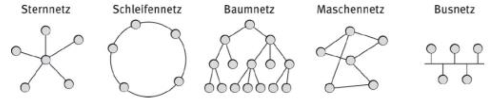
- Geographische Kriterien: Räumliche Ausdehnung des Rechennetzes
  - PAN: Persönliches Netzwerk (personal area network) / 1m2
  - LAN: Lokales Netz (local area network) / Abteilung, Betrieb
  - MAN: Netz für städtisches Ballungszentrum (metropolitan area network)
  - WAN: Weitverkehrsnetz (wide area network)

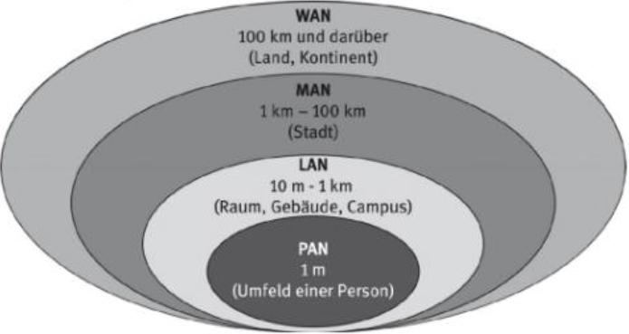
## Kommunikation in Rechnernetzen
### Allgemeines
Anfangs war die Kommunikation keine Herausforderung, da es keine großen Rechnernetze, und demensprechend keine Standards gab. Jedoch war die Kommunikation nicht aufs Internet übertragbar. Das war der Beginn für:
- Offenes Kommunikationssystem (TCP/IP)
	-Herstellerunabhängig
	- unterstützt Interoperabilität (heterogene Netzwerke)
- Kommunikationsprotokoll
  - Festgeschriebene Konvention für die Kommunikation zw Datenstationen (z.B. http)
- Regelt Aufbau von Meldungen:
  - Syntax - Repräsentationsgrößen
  - notwendige Inhalte
  - legt fest, welche Antworten auf Meldungen erfolgen müssen
### ISO/OSI-Referenzmodell:
- Definiert die Kommunikation zwischen Datenstationen in einem offenen Netzwerk
- Ordnet Kommunikationsprotokolle nach Aufgaben ein
- Kommunikationsprotokolle schaffen Regeln für unmissverständliche Kommunikation
zwischen Rechnern
- Übertragungsmedium (Kabel) ist für Kommunikation irrelevant

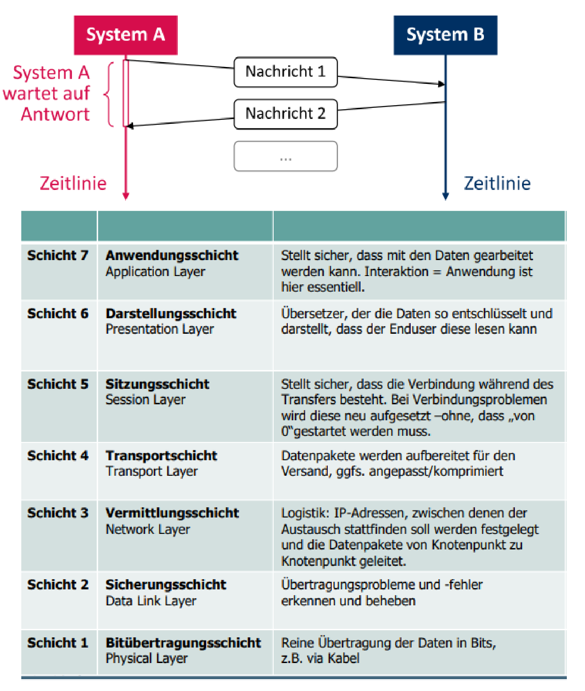
### Wichtiges zur Sicherungsschicht – Frame:
- Sicherungsschicht kümmert sich darum, dass Datenpakete gesichert werden
- gewährleistet zuverlässige und fehlerfreie Übertragung
- regelt Zugriff auf das Übertragungsmedium
### Wichtiges zur Sicherungsschicht – Flussteuerung:
- Flusssteuerung = Synchronisation der Übertragungsrate zwischen zwei Datenstationen
- Wie erfährt der Sender, dass der Empfänger weitere Pakete empfangen kann?
  - Es gibt zwei Protokolle:
    - Send-and-Wait Protokoll
    - Sliding-Window Protokoll

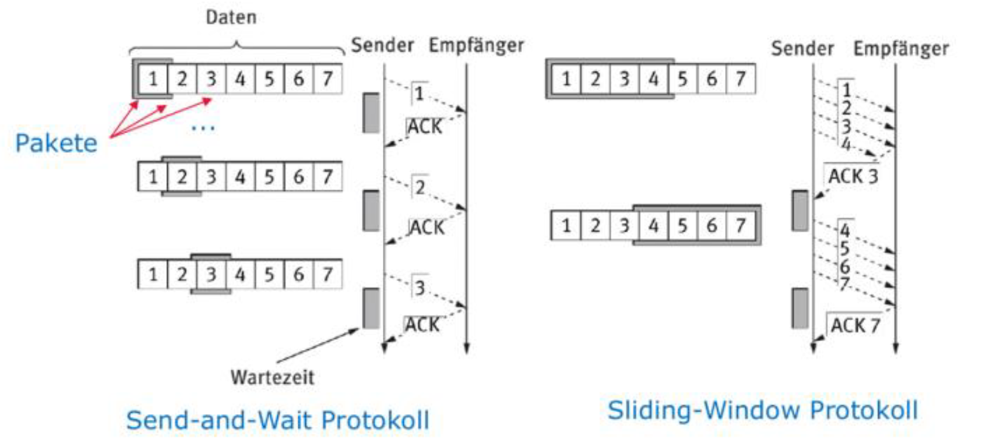
### Wichtiges zur Sicherungsschicht – Adressierung:
- Punkt-Adressierung: Adressierung einer Datenstation
- Broadcast-Adressierung: Adressierung aller Datenstationen. Ein Paket wird an alle (an das Medium angeschlossenen) Datenstationen gesendet.
- Mehrpunkt-Adressierung: Adressierung mehrerer Datenstationen. Ein Paket ist für mehrere Empfänger bestimmt, das Paket wird von allen bezeichneten Datenstationen empfangen.
## Internet-Protokolle:
### Definition TCP/IP:
Wichtigsten Protokolle sind die Internetprotokolle auf der 4-7 Schicht des OSI-Modells. Internetprotokolle werden auch als TCP/IP Protokolle bezeichnet.

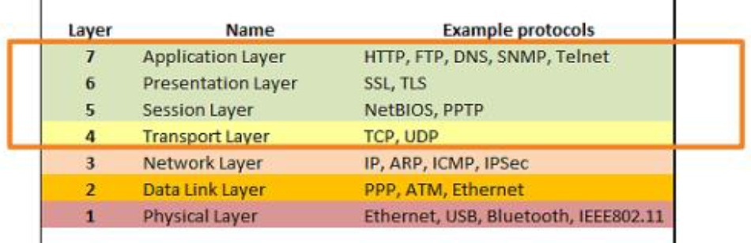
### Entwicklung des Internets:
- Netzneutralität = offener Zugang zu einem Rechnernetz, Gleichbehandlung von allen rechtmäßigen Daten bei der Datenübertragung
- Besitzt drei Regeln:
  - Keine Websperren (Blockieren von Angeboten)
  - Keine Tempobremsen (keine Reduktion der Übertragungsrate)
  - Keine Bevorzugung des Internet-Verkehrs eines Teilnehmers gegenüber eines anderen
### Schichtenmodell von TCP/IP – HTTP Protokoll:
- HTTP ist mit URL und HTML eines der wichtigsten Konzepte des Internets
- Es definiert die Kommunikation im WWW
- Verwendet auf der Transportschicht das Protokoll TCP
- Definiert zwei unterschiedliche Arten von Nachrichten:
  - Anfrage vom Client (Request)
  - Antwort vom Server (Response) an den Client
- Nachricht besteht aus 2 Teilen: http-Header + http-Body
- HTTPS (hypertext transfer protocol secure)
  - Übertragung von http über TLS (Transportverschlüsselung und Authentifizierung des Servers)
### Schichtenmodell von TCP/IP – TCP Protokoll:
- TCP ist das wichtigste Protokoll der Transportschicht
- Aufgaben:
  - Fügt IP-Pakete zusammen
  - fordert verloren gegangene Pakete nach, korrigiert Reihenfolge
### Schichtenmodell von TCP/IP – IP Protokoll:
- Internet Protocol (IP) = Protokoll oder Regelsatz zum Weiterleiten und Adressieren von Datenpaketen, damit diese über Netzwerke übertragen und am richtigen Ziel ankommen
- Daten, die das Internet durchlaufen, sind in kleinere Teile unterteilt, die man Pakete nennt
# 12 Datenspeicherung
## Informationen von Daten
### Arten von Daten
- Daten stellen Informationen in maschinell verarbeitbaren Form dar
- Digitale Daten werden durch Zeichen repräsentiert
- Analoge Daten werden durch kontinuierliche Funktionen repräsentiert
### Bits und Bytes
- Binärzeichen oder Bit = Zeichen aus Zeichenvorrat von 2 Zeichen
- Zur Darstellung wird die 0 (binäre Null) und 1 (binäre Eins) verwendet
- Heute ist ein Byte die kleinste Einheit und entspricht einer Folge von 8 Bits
### Repräsentationsgröße von Zahlen
- Legt die vorgesehene Datenmenge fest, die für ein Datenelement vorgesehen ist.
- Bestimmt wie viele unterschiedliche Werte in dem Datenelement dargestellt werden können

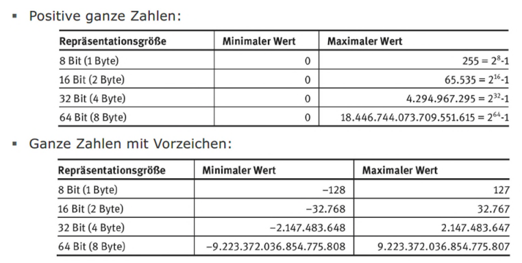
### ASCII
- Genormter, relativ alter Zeichenart für Schrift- und Steuerzeichen mit einer Repräsentationsgröße von 7 Bit
- Reicht aus, um beliebige englische Texte darstellen zu können
## Datenstrukturen
### Datenelemente
- Datenelement = Speicherbereich der einen Namen, Inhalt und Datentyp enthält
- Datentyp bestimmt, welche Operationen mit Werten durchgeführt werden und wie die Werte repräsentiert werden
- Datenelemente, die verändert werden können durch Operationen heißen
Variablen. Unveränderbare heißen Konstanten.

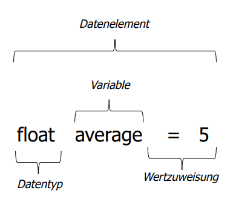

### Aggregation und Datensatz
- Aggregation: drückt aus, dass eine konzeptionelle Einheit Bestandteil einer anderen ist
- Datensatz: ist die Aggregation von unterschiedlichen Datenelementen

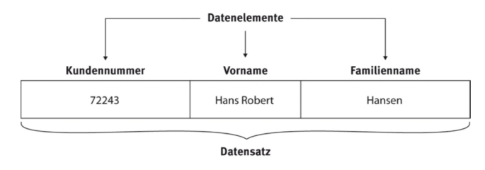
### Graphenbasierte Datenstrukturen

- Graph = Datenstruktur, die aus Knoten und Kanten aufgebaut ist.
- Knoten sind durch Kanten verbunden
- Gerichteter Graph = wenn die Kanten nur in eine Richtung gehen
- Ungerichteter Graph = wenn die Kanten in beide Richtungen gehen
### Baum
- Baum = gerichteter Graph mit einem Wurzelknoten, bei dem jeder Knoten maximal einen Vorgängerknoten hat
- Die sog. Ordnung bestimmt die Maximale Anzahl der Nachfolger eines
Knoten
- Baum der Ordnung zwei heißt Binärbaum

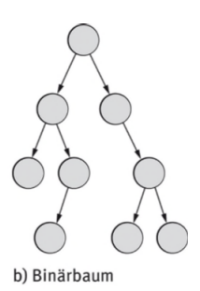
### Liste
- Liste = Graph der Ordnung eins. Jedes Element besitzt maximal einen
Vorgänger und einen Nachfolger
- Wurzel des Baums heißt Anker
## Datenbanken
### Definition
- Datenbank = zentral verwalteter Datenbestand, der über Zugriffsverfahren nutzbar gemacht wird
- Datenbankverwaltungssystem = verwaltet Datenbank, regelt Zugriffsschutz, ermöglicht gleichzeitige Zugriffe von mehreren Anwendungen, verwendet eigene Sprache für Abfrage von Daten
### Wichtige Typen von Datenbanken
- Transaktionsorientierte Datenbank: für Transaktionen, wichtigste Form, Standardannahme.
- Historische Datenbank: erlaubt Abfragen über Zustände und Ereignisse zu einem früheren Zeitpunkt (wer hat wann welche Werte eingefügt).
- Temporale Datenbank: ermöglicht beliebige Abfragen zu beliebigen Zeitpunkten
- Blockchain: spezielle Form einer historischen Datenbank, bei der die Unveränderbarkeit der Daten durch Kryptografische Prüfsummen zugesichert wird.
- In-Memory-Datenbank = Datenbank, die nur den (flüchtigen) Arbeitsspeicher für die Datenhaltung nutzt. Durch den Entfall des Zugriffs auf externe Speicher sind die Zugriffs- und Verarbeitungszeiten sehr kurz, allerdings können bei Systemabstürzen Daten verloren gehen
### Transaktionsorientierte Datenbanken
- Atomarität
- Konsistenz
- Isolation
- Dauerhaftigkeit
### Relationales Datenmodell
- Datenmodell: wie werden Daten gespeichert (Strukturierung, Datenelemente,...)
- Relationales Datenmodell: Daten werden von Relationen definiert und in Tabellen gespeichert
- Tabellen
  - Speichern Daten
  - Ausprägung entspricht einer Zeile
  - Merkmale (Attribute) entsprechen den Spalten
### SQL
- Strucured Query Language ist eine Abfragesprache
- SQL ist mengenorientiert und deskriptiv
### Nicht relationale Datenmodelle
- Hierarchisches Datenmodell: Anwendungsdaten werden durch Baumstrukturen repräsentiert
- Netzwerkdatenmodell: Informationsstrukturen werden durch Graphstrukturen dargestellt
### Dokumentenzentrierte Datenorganisation
- Allgemeines
  - Datenaustauschformat dient als Schnittstelle zum Import und Export von Daten
  - Strukturiertes Dokument ermöglicht Darstellung von semantisch zusammengehörenden Daten
- JSON
  - JSON = offener Standard für die Beschreibung baumstrukturierter Daten
  - JSONObjekt kann weitere Datenelemente enthalten, wobei jedes Attribut einen oder mehrere Werte enthalten kann
- Extensible Markup Language (XML)
  - XML = Metasprache für die Definition von anwendungsspezifischen Auszeichnungssprechen
  - Für den Menschen intuitiv verständlich und relativ einfach maschinell verarbeitbar

