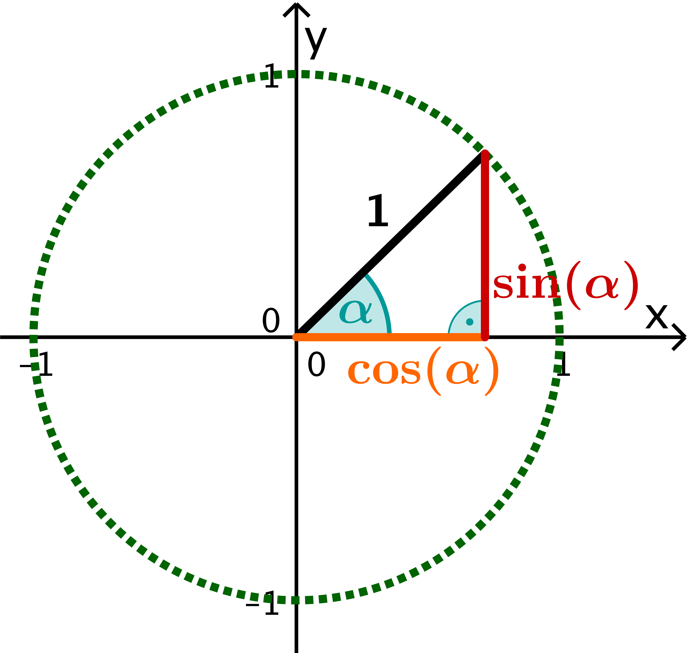
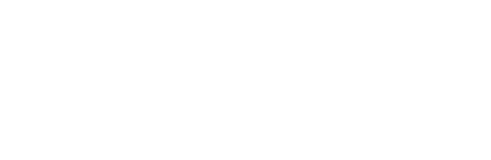
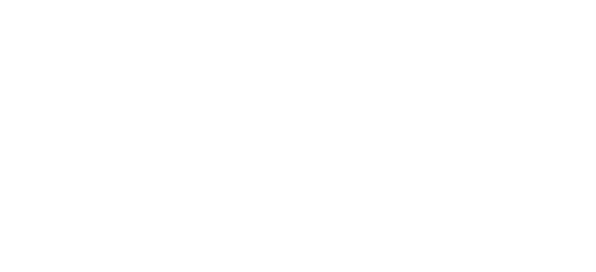
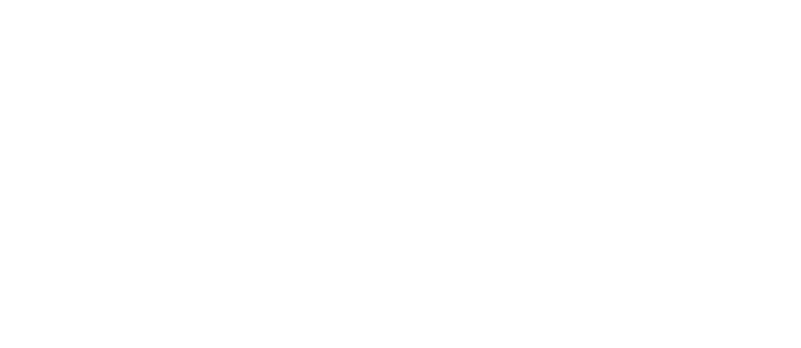
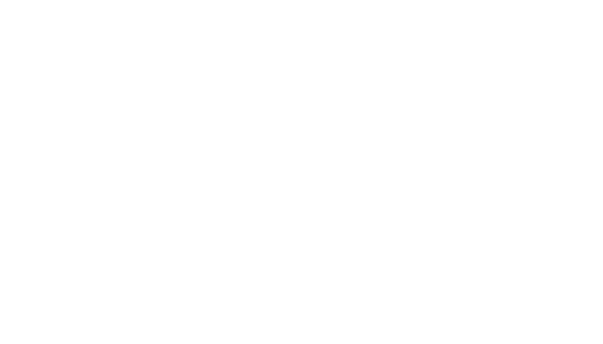
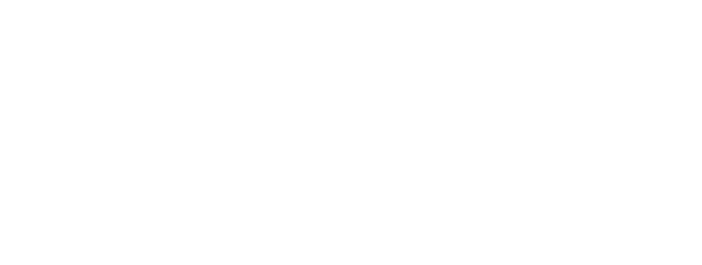

# 02 Grundlegende Datenstrukturen
## Feld / array
- elementare Datenstrukturen
- feste Anzahl einzelner Daten, die zusammenhängend gespeichert sind.
- Jeder Speicherzelle eines Arrays wird mittels eines Indices adressiert.
> In Python kommt die Klasse list dem Konzept am nächsten

## Verkettete Liste / linked list
- Einzelne Elemente sind durch Zeiger oder Referenzen miteinandere verbunden
- Vorteile zu Feldern/Arrays:
  - größe dynamisch anpassbar
  - Elemente können in effizienter Weise umgeordnet werden

Intrusive Realisierung:
  - Pointer in Elementen gespeichert

Nicht-intrusive Realisierung:
  - Pointer extern gespeichert
  - flexibler

## Stapel / Stack
- lineare Liste bei dem sämtliche Einfüge-, Löschoperationen (inkl. Lesezugriffen) auf ein Ende der Liste angewendet werden

Push: Schieben einese Datensatzes auf den Stack
Pop: Auslesen bei (idr.) gleichzeitigem Entfernen des obersten Elements

> Alle Operationen beziehen sich nur auf das oberste Stapelelement!

## Schlange / Queue
- lineare Liste bei der sämtliche Enfügeoperationen an einem Ende, sämtliche Löschoperationen (und andere Zugriffe) jedoch am anderen Ende angewendet werden.
- Deque (double-ended queue / deck) ist eine Queue bei der sämtliche Operationen an beiden Enden angewendet werden können
- Queues arbeiten nach dem Prinzip first in, first out (FIFO)

> In python befindet sich in collections die Klasse deque

# 03 Matrizen
## Rechnen mit Vektoren
### Skalarmultiplikation
$\lambda a = ( ^{\lambda a_1}_{\lambda a_2} )$
### Länge
$||a|| = \sqrt{a^2_1 + ... + a^2_n}$
## Transposition
Due zu $A$ transponierte Matrix $A^T$ entsteht durch Vertauschen der Zeien und Spalten bzw. durch die Spiegelung der Einträge von $A$ an der Hauptdiagonalen.

Es sei $A$ eine $(n \times n)$ Matrix. $A = (a_{ij})$ heißt:
- Diagonalmatrix, wenn $a_{ij} = 0$ für alle $i \neq j$
- obere Dreiecksmatrix, wenn $a_{ij}$ für alle $i \gt j$
- unterer Dreiecksmatrix, wenn $a_{ij}$ für alle $i \lt j$

## Matrixaddition
Für zwei $(m \times n)$ Matrizen $A= (a_{ij})$ und $B= (b_{ij})$ sei definiert:

$A + B = ( a_{ij} + b_{ij})$

## Skalarmultiplikation
Es sei $A$ wie oben, dann sei definiert:

$\lambda A = ( \lambda a_{ji})$

## Matrixmultiplikation
$c_{ji} = \sum^n_{j=1} a_{ij} b_{jk}$

## Rotation
$(^{x'} _{y'}) = (^{cos \theta \ \ -sin \theta} _{sin \theta \ \ \ \ \ cos \theta}) \cdot(^x_y)$

## Translation
Achtung: Die Multiplikation ist i.A. nicht kommutativ! D.h.: Reihenfolge beachten!
Vorteil (analog zu Rotation und Skalierung): Bei Verkettung mehrerer Translationen und Anwendung auf ggf. eine Vielzahl von Punkten, kann man alle Einzelmatrizen zunächst zu einer multiplizieren und diese dann auf die Punkte anwenden.

$\begin{pmatrix} x' \\ y' \\ 1 \end{pmatrix} = \begin{pmatrix} 1 \ 0 \ d_x \\ 0 \ 1 \ d_y \\ 0 \ 0 \ 1 \end{pmatrix} \cdot \begin{pmatrix} x \\ y \\ 1 \end{pmatrix}$

## Skalierung
$\begin{pmatrix} x' \\ y' \\ 1 \end{pmatrix} = \begin{pmatrix} s_x \ 0 \ 0 \\ 0 \ s_y \ 0 \\ 0 \ 0 \ 1 \end{pmatrix} \cdot \begin{pmatrix} x \\ y \\ 1 \end{pmatrix}$

## Komposiotion von 2D-Transformationen
1. alter translation $P_1$ to origin
2. alter rotation
3. alter translation to original $P_1$

## Darstellung
$E = \{e_1, e_2, e_3, e_4, e_5 \}$

$K = \{(e_1, e_2),(e_2, e_3),(e_3, e_5),(e_5, e_4),(e_2, e_4)\}$

## Definitionen
### Adjazent
(Benachbart)
Wenn sie durch eine Kante direkt verbunden sind.

### Inzidiert
(liegt auf)
wenn $e$ Anfagns- oder Entdecke von Kante $k$ ist.

### Kettenzug
Eine Folge von Kanten $k_1, k_2, ..., k_s$ wird Kantenzug genannt, falls eine Folge von Ecken $e_0, e_1, e_2, ..., e_s$ gibt, so dass jede Kante $k_i$ von $e_{i-1}$ nach $e_i$, führt, $i = 1, ..., s$.

**Beispiel:** $e_1 k_1 e_2 k_2 e_3 k_4 e_5$

### Weg
Ein Kantenzug heißt Weg, wenn alle Kanten des Kantenzug verschieden sind.

### Einfacher Weg
Ein Weg heißt einfacher Weg, wenn alle verwendeten Ecken (bis auf Anfangs- und Endecke) verschieden sind.

Ein Weg wird auch a-b-Weg genannt, wobei a Anfangs- und b Endecke des Weges sind.

### Kreis
Ein Weg wird Kreis genannt, wenn Anfangs- und Endecke des Weges gleich sind.
Graphen, die keine Kreise besitzen, werden als azyklische Graphen bezeichnet.

### Schlinge
Ein Kreis, der nur aus einer Ecke besteht, wird Schlinge genannt.

### Eulerischer Kreis
Ein geschlossener Kantenzug heißt eulersch, wenn er jede Kante des Graphen genau einmal enthält.

Enthält ein Graph einen eulerschen Kreis, dann wird auch der Graph eulersch genannt.

### Hamiltonscher Kreis
Ein Hamiltonscher Kreis ist ein Kreis, der jede **Ecke** des Graphen, genau einmal besucht.

Ein Graph, der einen Hamiltonschen Kreis enthält, wird selbst Hamiltonscher Graph genannt.

### Mehrfachkanten
Ein Graph besitzt Mehrfachkanten, falls es mehr als eine Kante mit gleicher Anfangs- und Endecke gibt.

### Schlicht
Ein Graph heißt schlicht, wenn er frei von Schlingen und Mehrfachkanten ist.

### Baum
Ein Graph ist ein Baum, wenn je zwei Ecken dieses Graphs durch genau einen Weg verbunden sind.

### Blätter
Knoten ohne Kinder heißen Blätter.

## Adjazenzmatrix
Adjazenzmatrix $A$, mit $a_{ji} = 1$, wenn es eine Kante von $e_i$ nach $e_j$ gibt, sonst $a_{ij} = 0$.

> Bei ungerichteten Graphen ist A symmetrisch (Speicherplatzoptmierung)!

> Im allg. benötigt die Adjazenzmatrix bei $n$ Knoten $n^2$ Speicherplätze (unabhängig von der Zahl der Kanten)

## Adjazenzlisten
Für jede Ecke wird eine Liste von Nachbarn gespeichert.

Speicherverbrauch ist somit direkt von der Anzahl der Kanten des Graphs abhängig (kein unnötiger Speicherverbrauch)!

Mittels Adjazenzlisten können gerichtete und ungerichtete Graphen dargestellt werden.

## Inzidenzmatrix
### Gerichtet
Inzidenzmatrix $I$ eines ungerichteten Graphen, mit:
$0$, wenn die Kante $k_m$ nicht mit $e_n$ inzidiert.
$1$, wenn die Kante $k_m$ mit $e_n$ inzidiert.
$2$, wenn die Kante $k_m$ eine Schlinge an $e_n$ ist.

> Die Spaltensummen ergeben stets 2

### Ungerichtet
Inzidenzmatrix $I$ eines gerichteten Graphen, mit:
$0$, wenn die Kante $k_m$ nicht mit $e_n$ inzidiert.
$1$, wenn $e_n$ Startecke der Kante $k_m$ ist.
$-1$, wenn $e_n$ Zielecke der kante $k_m$ ist.
$-0$, wenn die Kante $k_m$ eine Schlinge an $e_n$ ist.

> Die Spaltensummen ergeben stets 0

# 05 Graphenalgorithmen

# 06 Automaten und formale Sprachen
## Deterministische endliche Automaten

| $A = ( Q, \Sigma, \delta, q_0, F)$       | akzeptierte Sprache               |
|------------------------------------------|-----------------------------------|
| $Q$                                      | endliche Zustandsmenge            |
| $\Sigma$                                 | endliches Eingabealphabet (Sigma) |
| $\delta = Q \times \Sigma \rightarrow Q$ | Zustandsübergangsfunktion (delta) |
| $q_0$                                    | Anfangszustand                    |
| $F$                                      | Menge möglicher Endzustände       |

### Mathematische Darstellung

$Q = { q_0, q_1, q_2 }$
 
$\Sigma = { a, b }$
 
$\delta (q_0, a) = q_1$
 
$\delta (q_1, a) = q_1$
 
$\delta (q_1, b) = q_2$
 
$F = { q_2 }$

### Zustandsübergangsdiagramm

### $\delta$-Tableaus

|       | a             | b             |
|-------|---------------|---------------|
| $q_0$ | $q_0$         | $\varnothing$ |
| $q_1$ | $q_1$         | $q_2$         |
| $q_2$ | $\varnothing$ | $\varnothing$ |

## Nichtdeterministische endliche Automaten

| $A = ( Q, \Sigma, \delta, q_0, F)$     | akzeptierte Sprache               |
|----------------------------------------|-----------------------------------|
| $Q$                                    | endliche Zustandsmenge            |
| $\Sigma$                               | endliches Eingabealphabet (Sigma) |
| $\delta=Q\times\Sigma\rightarrow P(Q)$ | Zustandsübergangsfunktion (delta) |
| $q_0$                                  | Anfangszustand                    |
| $F$                                    | Menge möglicher Endzustände       |

> $P(Q)$ ist die Potenzmenge (Menge aller Teilmengen) von Q (auch als $2^Q$ dargestellt)

## Nichtdeterministischer endlicher Automat mit  $\varepsilon$-Übergängen

| $A = ( Q, \Sigma, \delta, q_0, F)$                      | akzeptierte Sprache               |
|---------------------------------------------------------|-----------------------------------|
| $Q$                                                     | endliche Zustandsmenge            |
| $\Sigma$                                                | endliches Eingabealphabet (Sigma) |
| $\delta=Q\times(\Sigma\cup\varepsilon)\rightarrow P(Q)$ | Zustandsübergangsfunktion (delta) |
| $q_0$                                                   | Anfangszustand                    |
| $F$                                                     | Menge möglicher Endzustände       |

> Die Epsilon-Übergänge $\varepsilon$ erlauben einen Zustandsübergang ohne Eingabe eines Symbols

## Akzeptierte Sprache
### Akzeptierte Sprache von DEAen

$L(A) = \{w | \^\delta(q_0,w) \in F \}$

### Akzeptierte Sprache von NEAen

$L(A) = \{w | \^\delta(q_0,w) \textnormal{ enthält einen Zustand aus F} \}$

### Akzeptierte Sprache von $\varepsilon-$NEAen

$L(A) = \{w | \^\delta(q_0,w) \textnormal{ enthält einen Zustand aus F} \}$

> Eine von einem endlichen Automaten (DEA, NEA, $\varepsilon-$NEA) akzeptierte Sprache wird als reguläre Menge bezeichnet bzw. heißt regulär.

> Wichtig: Die Ausdrucksmöglichkeiten von DEA, NEA und $\varepsilon-$NEA sind äquivalent. Man kann die einzelnen Automatentypen ineinander überführen.

## Übersicht Automaten

## Reguläre Ausdrücke

Die Kleensche Hülle von $L$, kurz $L^*$, ist die Menge

$L^*= \bigcup_{l=0}^\infty L^i$

Die Positive Hülle von $L$, kurz $L^+$, ist die Menge

$L^*= \bigcup_{l=1}^\infty L^i$

> Prioriät: \*, dann Konkatenation, dann + \
> 01*+0 statt ((0(1*))+1)

#### Beispiele:

${\{"ab","c"\}}^*=\{\varepsilon, "a", "b", "c", "aa", "ab", "ac", "ba", "bb", "bc", "ca", "cb", "cc", "aaa", "aab", ...\}$

${\{"ab","c"\}}^+=\{"a", "b", "c", "aa", "ab", "ac", "ba", "bb", "bc", "ca", "cb", "cc", "aaa", "aab", ...\}$

 

$L_1 = \{a,aa,aaa\}$

$L_2 = \{b,bb,bbb\}$

$L_1L_2 = \{ab,aab,aaab,abb,aabb,aaabb,abbb,aabbb,aaabbb\}$

 

digit+(.digit+)?(E(+|-)?digit+)? \
wobei digit $\rightarrow$ 0|1|...|9 \
Mögliche Zhalen, z.B: 10, 67.23, 1.12E6, 178005E-3

 

0|(1(0|1)*)\
Mögliche Zahlen, z.B.: 0,1,10,100,101,1111,100001

## Kontextfreie Grammtiken (kfG)

### Definition

$G=(V,T,P,S)$

$V$ und $T$ sind endliche Mengen von Variablen und Terminalen

$P$ ist eine endliche Menge an Produktionen\
Jede Produktion ist von der Form $A \rightarrow \alpha$, wobei $A$ eine Variable und $\alpha$ eine Zeichenkette von Symbolen $(V \cup T)^*$ ist.

$S$ ist eine spezielle Variable, die Startsymbol genannt wird

### Beispeil (Grundrechenarten)

$G = (\{E\},\{+,-,\cdot,/,(,),id\}, P,E)$, wobei $P$ aus folgenden Produktionen besteht:

$E \rightarrow E + E$\
$E \rightarrow E - E$\
$E \rightarrow E \cdot E$\
$E \rightarrow E / E$\
$E \rightarrow (E)$\
$E \rightarrow id$

Auch so zu schreiben:\
$E\rightarrow E+E\ |\ E-E\ |\ E\cdot E\ |\ E/E\ |\ (E)\ |\ id$

### Konventionen

- Großbuchstaben $A,B,C,D,E$ und $S$ bezeichnen Variable. $S$ ist, falls nicht anders gesagt, das Startsymbol.
- Die Kleinbuchstaben $a,b,c,d,e$, Ziffern und fettgedruckte Zeichenketten sind Terminale.
- Die Großbuchstaben $X,Y,Z$ bezeichnen Symbole, die sowohl Terminale als auch Variable sein können.
- Die Kleinbuchstaben $u,v,w,x,y,z$ bezeichnen Zeichenketten aus Terminalen.
- Die griechischen Kleinbuchstaben $\alpha,\beta,\gamma$ bezeichnen Zeichenketten aus Variablen und Terminalen.
- Wenn man sich an 1.-5. hält, so kann man $(V,T,P,S)$ allein aus den Produktionen herleiten.

### Beispiel

Beschreibung der SPrache $a^n b^n$ mit $n>0$.\
$G=(V,T,P,S)$, mit\
$V=\{S\}$,\
$T=\{a,b\}$\
$P=\{S\rightarrow aSb, S\rightarrow ab\}$

Wörter der Sprache:\
ab, aabb, aaabbb, aaaabbbb, ...

### Ableitungsbäume
Ableitungsbäume (engl. Parse-Tree) stellen Ableitungen graphisch dar\
Ableitungsbäume geben einer Sprache eine Struktur\
Nützlich z.B. für den Compilerbau

$G = (\{E\},\{+,-,\cdot,/,(,),id\}, P,E)$, wobei $P$ aus folgenden Produktionen besteht:\
$E\rightarrow E+E\ |\ E-E\ |\ E\cdot E\ |\ E/E\ |\ (E)\ |\ id$

Ableitungsbaum für\
$(id + id) \cdot id$

## Kellerautomaten
Ein KA ist ein EA, der um einen Keller (engl. Stack) erweitert wurde.

KAen sind i.a. nichtdeterministisch! Die deterministische Form des KA akzeptiert nur eine Teilmenge der kfG!\
Diese Teilmenge ist jedoch für die Syntax vieler Programmiersprachen ausreichend.

### Definition

| $M = (Q,\Sigma,\Gamma,\delta,q_0,Z_0,F)$                                                         | Kellerautomat                     |
|--------------------------------------------------------------------------------------------------|-----------------------------------|
| $Q$                                                                                              | endliche Zustandsmenge            |
| $\Sigma$                                                                                         | endliches Eingabealphabet         |
| $\Gamma$                                                                                         | endliches Kelleralphabet          |
| $\delta : Q \times ( \Sigma \cup \{\varepsilon\})\times \Gamma \rightarrow P(Q \times \Gamma^*)$ | Zustandsübergangsfunkbon          |
| $q_0 \in Q$                                                                                      | Anfangszustand                    |
| $Z_0 \in \Gamma$                                                                                 | Kellergrundsymbol (Anfangssymbol) |
| $F \subseteq Q$                                                                                  | Menge möglicher Endzustände       |

\
Eine Zustandsbeschreibung ist ein Tripel $(q,w,\gamma)$
| $(q,w,\gamma)$           | Zustandsbeschreibung          |
|--------------------------|-------------------------------|
| $q \in Q, w \in \Sigma*$ | Eingabezeichenkette           |
| $\gamma \in \Gamma*$     | eine Folge von Kellersymbolen |

### Konventionen 

- Kleinbuchstaben vom Anfang des Alphabets (z.B. $a,b,c$) werden als Eingabesymbole verwendet.
- Kleinbuchstaben vom Ende des Alphabets (z.B. $x,y,z$) werden als Zeichenketten von Eingabesymbolen verwendet.
- Großbuchstaben bezeichnen Kellersymbole
- Griechische Kleinbuchstaben bezeichnen Zeichenketten von Kellersymbolen

### Akzeptierte Sprache
Bei KAen existieren 2 Möglichkeiten der Akzeptanz:
- Erreichen eines Endzustands
- Leeren des Kellers

$M = (Q,\Sigma,\Gamma,\delta,q_0,Z_0,F)$

Die durch einen Endzustand akzeptierte Sprache ist definiert als:\
$L(M)= \{ w|(q_0,w,Z_0)\ _{vdash}^*\ (p,\varepsilon,\gamma)\text{ für ein } p \in F\text{ und ein }\gamma \in \Gamma^*\}$

Die durch einen leeren Keller akzeptierte Sprache ist definiert als:\
$N(M)=\{ w|(q_0,w,Z_0)\ _{\vdash}^*\ (p,\varepsilon,\varepsilon)\text{ für ein }p \in Q\}\text{, wobei }F = \varnothing$

## Deterministische Kellerautomaten

Ein KA $M = (Q,\Sigma,\Gamma,\delta,q_0,Z_0,F)$ ist deterministisch, wenn:
1. für jedes $q \in Q$ und $Z \in \Gamma$ gilt, dass $\delta(q,a,Z)$ für alle $a \in \Sigma$ leer sein muss, wenn $\delta(q,\varepsilon,\Sigma)$ nicht leer ist;
2. für kein $q \in Q, Z \in \Gamma$ und $a \in \Sigma \cup \{\varepsilon\}$ in $\delta(q,a,Z)$ mehr als ein Element enthalten ist.

Erläuterung:
1. verhindert die Wahlmöglichkeit zwischen Eingabesymbolabhängigen und -unabhängigen (e-Bewegungen) Schritten.
2. schränkt die Wahlmöglichkeiten soweit ein, dass sie eindeutig werden.

# 07 Analyse von Algorithmen

# 08 Rekursion

# 09 Suchen und Sortieren

# 10 Suchen in Bäumen

