# 07 Grundlagen des Computers
## Definitionen
### Computer
Computer als programmgesteuerter Rechenautomat

Computer als Automat für Algorithmen
Algorithmus als Schritt-für-Schritt-Anweisung für die Lösung eines (mathematischen) Problems (z.B. für eine Entscheidung)

Computer Verarbeiten ausschließlich digitale Daten
Computer wandelt analoge und digitale Daten um
### Digitale Daten
Digitale Daten sind in Form von Zahlen dargestellt
Digitale Daten sind die kleinste Informationseinhiet, können nicht weiter aufgelöst werden
Daten liegen aber meist in Form von Bilder, Tönen, Videos, etc vor
### Analog
Daten in Wellenform (Elektrische Signale von variabler Stärke)
### Digital / Binär
Daten mit nur zwei Zuständen: 0 (OFF), 1 (ON)

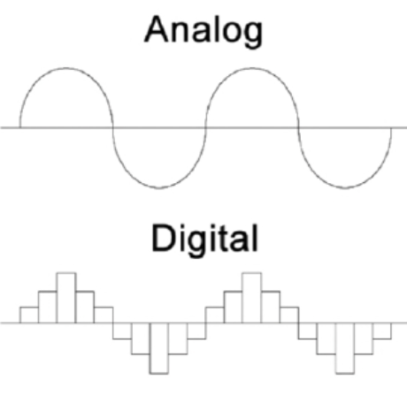
### Grundgatter (logic gates)
- AND
- OR
- NOT
- NAND
- NOR
- XOR
- etc..
>Mit den Logikbaustreinen kann man Rechnungen durchführen und Daten verarbeiten.
## CPU
### Transistoren
Transistoren haben verschiedene Formen, die meist genutzten lassen nur Strom durch, wenn ein (kleiner) Aktivierungsstrom von der Seite gegeben wird.
Eine große Menge von Transistoren nennt man intigrierte Schaltung (IC) oder Mikrochip.
Computer CPUs bestehen aus milliarden von Transistoren und führen so Rechnungen durch.
### Aufbau Prozessor

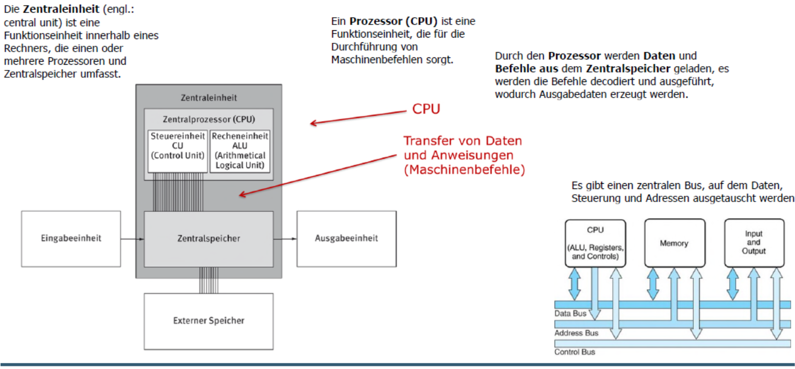
### Ausführung Maschinenbefehle

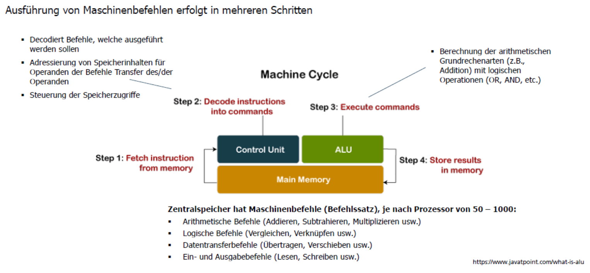
### Taktfrequenz
Die Taktfrequenz eines Prozessors gibt an, mit welcher Frequenz die Verarbeitungseinheiten Operationen durchführen.
### Moore's Law
Faustformel: Leistungsfähigkeit (Anzahl der Transistoren auf Mikro-Chips) verdoppelt sich ca. alle 18 Monate.
## Geschichte des Computers
### Erste Rechenhilfsmittel
Abakus (2500 v.Chr.), Rechenbrett der Antike

Einführung des Stellenwertsystems (Basis-10 Zahlensystem)
Die Ziffer 0 ermöglicht die Vervielfachung des Wertes einer Ziffer
### Erste mechanische Rechenmaschiene
**1642** vom Franzosen **Blaise Pascal** efunden.
Die Pascaline konnte sechstellige Zahlen addieren, und sollte seinem Vater helfen, der als Steuerbeamter tätig war.
### Analytical Engine
Erfunden vom britischen Mathematikprofessor **Charles Babbage (1791-1871)**.
Die Analytical Engine ist der Entwurf einer mechanischen Rechenmaschine für allgemeine Anwendungen.
### Elektromechanischer Rechenautomat
**1940** erfindet **Konrad Zuse** die Z3, den ersten funktionsfähigen programmierbaren, elektromagnetischen Rechenautomaten.

- Verwendung des binären Zahlensystems Gleitkommazahlenberechnung
- Ein- und Ausgabegeräte
- Möglichkeit der Benutzerinteraktion während des Rechenvorgangs
- Mikroprogramme
- Pipelining von Instruktionsfolgen
- Numerische SonderwerteParallele Ausführung von Operationen so weit wie möglich
## Elektrik vs Elektronisch
### Elektrik
Umschreibt alles was mit Strom zu tun hat
### Elektrisches Gerät
Alle Geräte, die elektrische Energie für die Ausführung verwenden. BSP: Generator
### Elektronik
Umschreibt alles was damit zu tun hat, elektrischen Strom zu leiten, kontrollieren und regulieren
### Elektronisches Gerät
Die Vorrichtung, die den Elektronenfluss zur Ausführung der Aufgabe steuert. BSP: Motor
### Elektromechanisches Gerät
Beinhaltet Schaltelemente, die durch einen Elektromagneten gesteuert werden. BSP: Elektromotor
## Rechner
### Entwicklung elektronischer Rechner

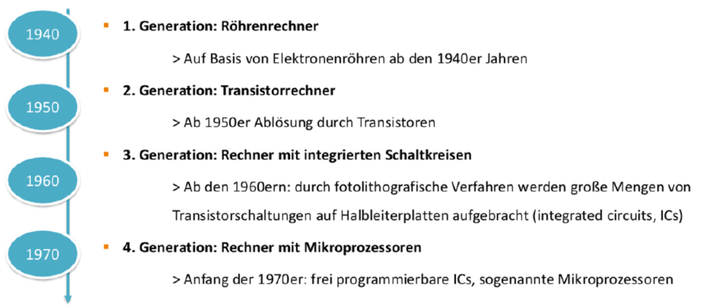

### Arten von Rechnern
- Großrechner
- Minicomputer
- Workstation
- Personalcomputer (PC)
- Persönliche Informationshilfsmittel (mobile Geräte, die als universelles Instrument verwendet werden, um geschäftliche und private Aufgaben zu erledigen)
## Software
Software ist ein Sammelbegriff für Computerprogramme
Detaillierte Handlungsanweisung an einen Prozessor
Prozessor führt ausschließlich Maschinenbefehle durch

Erstellung komplexer Handlungsanweisungen in Maschinenbefehlen für den Menschen aufwendig, fehleranfällig und prozessorabhängig.
Deshalb Proframmiersprachen
## Programmiersprache
Eine Programmiersprache, deren Befehle sich am Anwendungsbereich orientieren, wird als höhere Programmiersprache bezeichnet. 
Höhere Programmiersprachen abstrahieren vom Befehlssatz des Prozessors und verwenden Elemente der natürlichen Sprache und/oder der Mathematik für das Formulieren von Programmen.
### Arten von Programmiersprachen

| Art | Beschreibung | Beispiel |
| ---- | ---- | ---- |
| Imperativ | - Formulierung von komplexen Anweisungen | C, C++ |
| Objektorientiert | - Beschreibung des Realweltprogramms durch Objekte und Klassen des Anwendungsbereiches - Leichter durch die Abstraktion | Python, Java |
| Funktional | - Definition von Funktionen (input -> output) | Haskell, F# |
| Logisch | -Beschreibung des Realweltprogramms durch (Prädikaten-)Logik | Prolog, ASP |
# 08 Hardware
## Physikalische Grundlagen
Verarbeitung -> Zentraleinheit
	- Prozessor, inkl. Rechen- Steuerwerk, Eingabe- und Ausgabewerk, Speicherwerk, Datentransfer-System
Ein- & Ausgabe + Speicher -> Peripherie
	- Maus, Tastatur, Monitor, Drucker, Festplatte, Server etc
## EVA(S) Prinzip
Grundlegendes Prinzip der Datenverarbeitung und Reihenfolge

E - Eingabeeinheit
V - Verarbeitungseinheit
A - Ausgabeeinheit
(S - Speicher)

>Dieser Prozess existiert auch bei uns Menschen, daher universeller Prozess der Datenverarbeitung

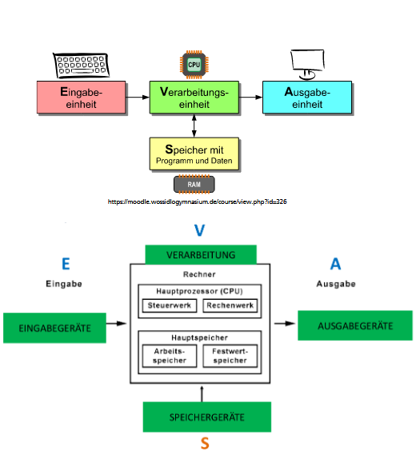

## Hardware-Komponenten

### Mainboard

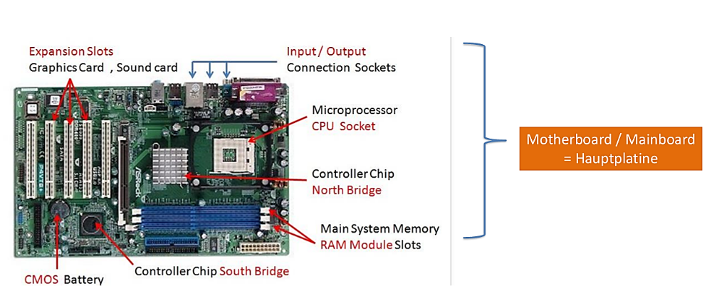

Hauptplatinen sind immer ähnlich aufgebaut, wichtigste Komponenten:
- Northbridge
	  verbindet alle Computerkomponente, welche besonders schnell miteinander kommunizieren müssen, also Prozessor, Arbeitsspeicher(RAM) und schnelle Grafikkarten
- Southbridge
	  verbindet restliche Komponente, Festplatten, Netzwerkkarte und das BIOS

In modernen Systemen wird die Northbridge oft auch direkt im Prozessor integriert, zudem enthält die Southbridge meist einen Netzwerk- und Grafikkontroller.

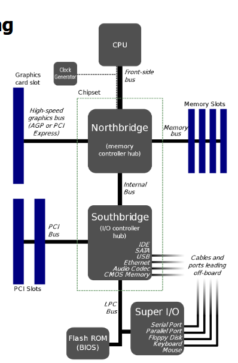
### Grafikkarte (GPU)
Aufgaben
- Erzeugen einer Pixelgrafik aus einer anderen Darstellungsform
- Speichern dieser Pixelgrafik, des Bildschirminhalts
- Steuerung des Bildschirms, damit er den Bildschirminhalt anzeigt

Kenngrößen
- maximale Auflösung BSP: 1920x1080 Pixel (Full HD)
- Taktfrequenz, wie schnell Berechnungen durchgeführt werden können. Wird in Hertz angegeben (bedeutet pro Sekunde)
- Speicherkapazität, eigener Arbeitsspeicher der GPU. BSP: 8GB
### Netzwerkkarte
Kommunkation mit dem Internet
**WLAN** (dratlos) oder **LAN** (per Kabel)
 
**Übertragungsrate**, wie viele Daten pro Sekunde. 
BSP: Megabit pro Sekunde, Mbps
### Schnittstellen
- PCI
	  Eine der ersten und bis heute immer noch in verbesserter Form angewandte Technik und Möglichkeit, schnell und einfach interne Peripheriegeräte an das Mainboard anschließen zu können.
- PCIe
	  PCI-Express Schnittstelle oder PCIe bzw. PCI-E genannt, ist ein Erweiterungsstandard zur Verbindung von Peripheriegeräten 
	  BSP: Controller, Maus; aber auch: GPU, Netzwerkkarte
- SATA
	  Anschluss von von Massenspeichern wie Festplatten, SSDs und CD/DVD-Laufwerken an Computern
- IDE
	  Alte Festplatten-Schnittstelle, bei der die Steuerungselektronik bzw. der Controller in das Festplattengehäuse integriert ist.
### Eingabegeräte
- Maus
	  Cursor auf Bildschirm bewegen, Maustasten
- Scanner
	  Überbegriff für Geräte, welche flache Gegenstände, meist Bilder oder Textseiten in den Computer übertragen
- Mikrofon
	  Ton-Eingabe
- Webcam
	  Im Rahmen von Videoconferencing mittels VoIPdas Bild des Gesprächsteilnehmers aufzunehmen
### Ausgabegeräte
>Das Ausgabegerät zeigt das Ergebnis der Verarbeitung von Rohdaten an, die über ein Eingabegerät in den Computer eingegeben werden

- peripheres Gerät zur Ausgabe von Computerdaten
- Es gibt eine Reihe von Ausgabegeräten, z.B. Text, Bilder, Hardcopy, Audio oder Video 
  BSP: Bildschirm / Monitor, Touchscreen, Kopfhörer
### Monitore
- CRT - alt
- LCD - weit verbreited
- LED - neu

Touchscereen: ermöglicht Input
### Speicher
Ein Schreib-Lese-Speicher kann gelesen und beschrieben werden.

Festwertspeicher (ROM) kann nur gelesen werden und Informationen sind unveränderbar.

Direktzugriffsspeicher (Arbeitsspeicher, ROM) ist ein Speicher, bei dem jede einzelne Speicherstelle über ihre fest zugeordnete Adresse gelesen oder beschrieben (und damit auch gelöscht) werden kann. Die Zugriffszeit ist für alle Speicherstellen in etwa gleich lang.

Flüchtiger Speicher verliert bei Ausfall der Versorgungsspannung seinen Inhalt.

Nicht flüchtiger Speicher behält seinen Inhalt auch ohne Versorgungsspannung.

Flash Speicher ist ein spezieller ROM-Typ, dessen Inhalt durch Anlegen eines elektrischen Felds in bestimmten Speicherbereichen, sogenannten Sektoren oder Blöcken (zum Beispiel 512 Bytes), auf einmal gelöscht wird.
- Die Speicherzellen können nicht – wie bei gewöhnlichen ROM-Chips – einzeln gelöscht werden. Das Schreiben erfolgt je nach Chiparchitektur selektiv für jede einzelne Zelle oder auf einmal für einen gesamten Block
- Flash-Speicher haben eine begrenzte Lebensdauer, die sich durch die maximale Anzahl von Löschzyklen ergibt.

### Ram
Arbeitsspeicher bezeichnet den kurzfristigen Speicher eines Computers. Dieser enthält alle Daten, die Sie gerade nutzen – von geöffneten Webseiten bis hin zu einer Mausbewegung über den Bildschirm

**DDR** steht für Double Data Rate, DDR ist die RAM-Technologie

RAM besteht aus einer Reihe an nummerierten Speicherzellen gleicher Größe.
Die Bit-Zahl der Architektur bestimmt sowohl die maximale Anzahl, als auch die Größe der Speicherzellen.
Auf jede Speicherzelle kann gleich schnell zugegriffen werden, wenn man ihre Adresse kennt.
### Hardware & Software
- Hardware, alle physischen Bestandteile
- Software, alle nicht physischen Komponenten

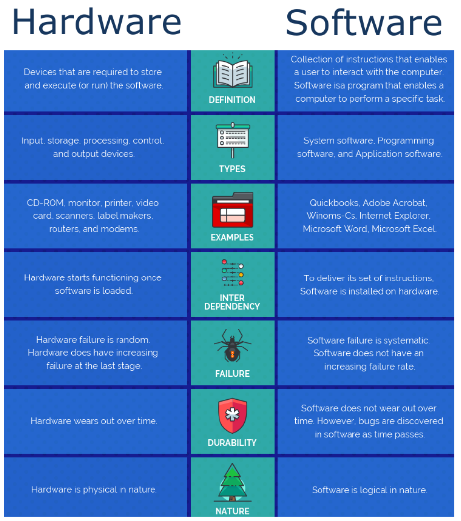
# 09 Mathematische Grundlagen
## Logik
Warum ist ein Verständnis der Logik in der Wirtschaftsinformatik 
Teilmenge: $C \subseteq A$
relevant?
- Repräsentation von Wissen (z.B. im Bereich KI)
- Grundlage für Datenbank-Anfragesprachen (SQL)
## Aussagenlogik
### Definition
> Die Basis sind strukturlose Elementaraussagen, denen ein Wahrheitswert zugeordnet wird.
> In der klassischen Aussagelogik gilt:
> - Aussage ist **WAHR** oder
> - Aussage ist **FALSCH**
### Junktoren / Logische Operatoren

| Verknüpfung | Schreibweise | Beispiel |
| ---- | ---- | ---- |
| Konjunktion | $a \land b$ | Ich bink krank und gehe zum Arzt. |
| Disjunktion | $a \lor b$ | Ich gehe zum Arzt oder der Arzt kommt vorbei (oder beides). |
| Subjunktion | $a \rightarrow b$ | Wenn ich krank bin, dann gehe ich zum Arzt. |
| Bijunktion | $a \leftrightarrow b$ | Wenn ich krank bin, dann gehe ich zum Arzt und umgekehrt. (Ich gehe genau dann zum Arzt, wenn ich krank bin.) |

Negation: $\lnot$
### De-Morgen-Theorem
>Die De Morganschen Gesetze sind zwei grundlegende Regeln für logische Aussagen.

- NOT
- NAND
- NOR
- AND
- OR
## Mengen
### Defintion
>Die Mengenlehre schafft Grundlagen zur Logik

Mengen werden über ihre Elemente bestimmt.
Ist m ein Element von M so schreibt man $m \in M$

Elemente von Mengen können selber Mengen sein.
Ist m kein Element von M so schreibt man $m \notin M$

Die leere Menge.
Es gilt $\varnothing = \{ \}$

Teilmenge: $C \subseteq A$

Teilmenge: $B \subset A$

### Zahlenmengen

| System | Beispiel |
| ---- | ---- |
| Natürliche Zahlen | $\mathbb{N} = \{1,2,3,...\}$ |
| Natürliche Zahlen mit 0 | $\mathbb{N}_0 = \{0,1,2,3,...\}$  |
| Ganze Zahlen | $\mathbb{Z} = \{...,-3,-2,-1,0,1,2,3,...\}$ |
| Rationale Zahlen | $\mathbb{Q}$ (alle Bruchzahlen) |
| Reelle Zahlen | $\mathbb{R}$ (Kommazahlen) |
### Mengenoperationen

| Operation | Schreibweise |
| ---- | ---- |
| Schnitt | $A \cap B$ |
| Vereinigung | $A \cup B$ |
| Differenz | $A \ \backslash \ B$ |
### Zahlensysteme

Binärsystem = Base 2

Oktalsystem = Base 8

Hexadezimasystem = Base 16
# 10 Betriebssysteme
## Hardwaresicht und Anwendersicht

| Hardwaresicht | Anwendersicht |
| ---- | ---- |
| Ein Rechnersystem besteht aus einer Menge kooperierender Hardwarekomponenten. | Ein Rechensystem stellt (benutzerfreundliche) Konzepte bereit, mit denen Daten und Informationen verarbeited werden können. |
## Betriebssystem
### Definition
>Ist **Softwarekomponente**, die die abstrakte Anwendersicht auf der Grundlage der realen Hardwaresicht umsetzt.

- macht die Hardware für den Anwender benutzbar
- Enthält interne Programme und Datenstrukturen

>Betriebssystem besteht aus einem Betriebssystemkern und einer Schnittstelle
### Aufgaben

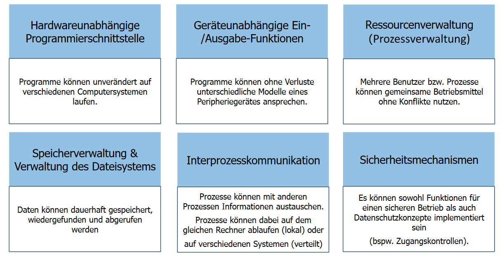

- Prozessverwaltung
	  Erzeugen und Löschen von Prozessen.
- Geräteverwaltung
	  Überwachung der Datenübertragung.
- Speicherverwaltung
	  Zuteilung des verfügbaren physikalischen Speichers an Prozesse.
- Verwalten des Dateisystems
	  Erzeugen, Löschen, Lesen, Schreiben, Kopieren, etc.
## Betriebsarten

| Einprogrammbetrieb | Mehrprogrammbetrieb |
| ---- | ---- |
| Im Einprogrammbetrieb werden einzelne Benutzeraufträge von der CPU nacheinander bearbeitet. Nur ein Anwendungsprogramm im Arbeitsspeicher, das alle vorhandenen Betriebsmittel (Prozessoren, Speicher, periphere Geräte) zugeteilt bekommt. | m Mehrprogrammbetrieb werden mehrere Benutzeraufträge von der CPU gemeinsam bearbeitet. Die Bearbeitung erfolgt abwechselnd, in Zeitabschnitten. Es befinden sich gleichzeitig mehrere Anwendungs- Programme ganz oder teilweise im Arbeitsspeicher. |

| Einbenutzerbetrieb | Mehrbenutzerbetrieb |
| ---- | ---- |
| Beim Einbenutzerbetrieb kann nur ein Benutzer einen Rechner zu einem Zeitpunkt nutzen. Ein Benutzer belegt das gesamte Rechensystem und erteilt Aufträge, die streng sequentiell abgearbeitet werden. | Mehrbenutzerbetrieb, bei dem eine Zentraleinheit von mehreren Benutzern zur Verfügung steht (z.B. WindowsNT/XP, Mac OS X, Linux/Unix). Jedem dieser Arbeitsplätze werden Systemressourcen (z.B. Festplattenkapazität) und Rechte (z.B. Lese- oder Schreibrechte) Zugeteilt. |

| Einprozessorbetrieb | Multiprozessorsystemen |
| ---- | ---- |
| Der Einprozessorbetrieb kann nur ein Programm ablaufen lassen. | In Multiprozessorsystemen können gleichzeitig mehrere Programme auf verschiedenen physischen Prozessoren ablaufen. |
## Komponenten eines Betriebssystems

| Komponente | Aufgabe |
| ---- | ---- |
| Auftragsverwaltung | Verwaltung der gleichzeitig ablaufenden Programme und übernimmt die Steuerung mehrerer Tasks/Prozesse. |
| Arbeitsspeicherverwaltung | Bietet einen Speicherschutz, der verhindert, dass gleichzeitig laufende Programme sich irrtümlich gegenseitig überschreiben. |
| Geräteansteuerung | Eine weitere Aufgabe des Betriebssystems ist es, eine möglichst standardisierte Abstraktionsschicht zwischen der real verfügbaren Hardware und den Anwendungsprogrammen anzubieten. |
| Benutzerverwaltung | Definition von Benutzungsbeschränkungen für die Nutzung einzelner Ressourcen zur Verfügung stellen. |
| Dateisystem | Organisiert die Daten auf einem Datenträger in der Form von Dateien. Arten von Dateisystemen: - Lineare Dateisysteme - Hierarchische Dateisysteme |
## Drei große Betriebssysteme
- Windows-Familie
- Linux
- MacOS X

**Nicht alles wissen, aber Aspekte kennen** (Frage wäre z.B. Nenn Sie ein Unterschied der Schwächen zw. Windows und Linux)

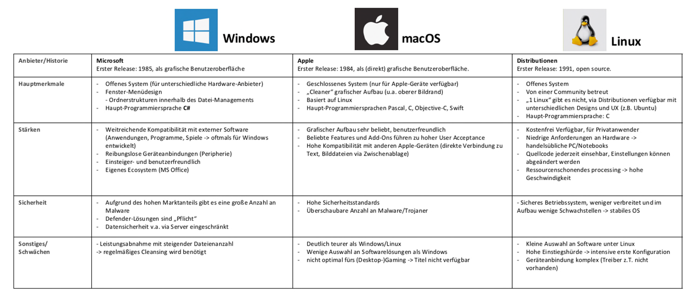

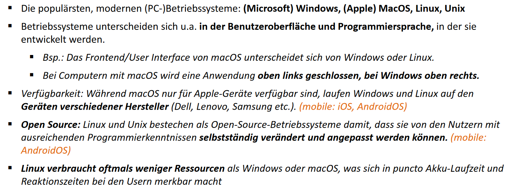
# 11 Datenkommunikation und Rechnernetze
## Anwendung der Datenkommunikation
- Rechnernetze entwickelten sich von einer Forschungsplattform hin zu einer kritischenInfrastruktur
- mit Rechnernetzen erbringen Betriebe operative Leistungen
- Private Haushalte können Informationsbedürfnisse erfüllen
- Grundlage für Rechnernetze ist die Datenkommunikation, denn sie überträgt relevante Informationen in digitaler Form (von Sender zu Empfänger)
-> Rechnergeschützte Kommunikation Ist der Austausch von Informationen zwischen zwei Rechnern auf räumlicher Distanz
## Datenübertragung
### Datenübertragungssystem:
Besteht aus zwei oder mehreren Datenstationen, zum Zwecke des Datenaustausches durch ein Übertragungsmedium miteinander verbunden sind.
### Konvergenz der Medien:
Es gibt keinen Unterschied für die Datenübertragung (egal ob Text, Bilder, Videos,..)

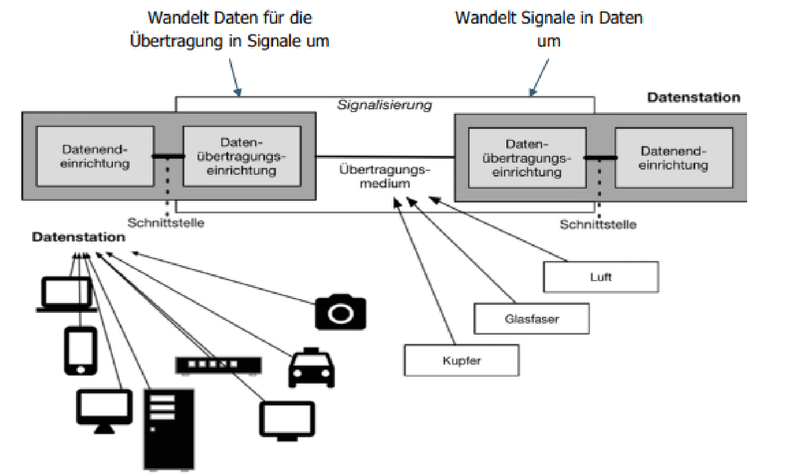
### Wichtigsten Datenübertragungseinrichtungen:
- Modem: Wandelt digitale Daten in analoge Übertragungsdaten um und überträgt bzw. empfängt diese; Wir unterscheiden unter:
  - Telefonmodem (Umwandlung digitaler Daten in Töne)
  - Funkmodem (Umwandlung digitaler Daten in Radiosignale)
  - Glasfasermodem (Umwandlung von digitalen Daten in optische Signale)
- Netzwerkadapter: Überträgt digitale Daten über ein Netzwerk und übernimmt Signalisierung
### Übermittlung von Signalen:
- Jede Bitfolge wird durch elektromagnetische Wellen übertragen
- Bitfolge muss bei einer physischen Übertragung in Wellenmuster kodiert werden (Umgekehrt beim Empfang)
- Interpretiert werden sie durch Frequenz, Wellenlänge und Amplitude
- Frequenz = Anzahl der Schwingungen pro Zeiteinheit (in Hz)

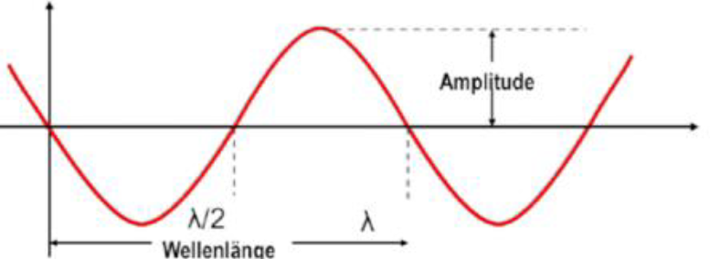
### Frequenzen und das elektromagnetische Spektrum:

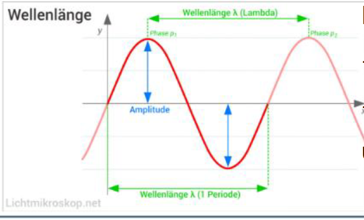
- verschiedene Frequenzbänder: Radiowellen, Mikrowellen, Infrarotwellen, Röntgenwellen..
- Für Datenübertragung sind höhere Frequenzen besser, da in kürzerer Zeit mehr Daten übertragen werden.
### Informationsdarstellung mit Signalparametern:
- Informationen kann man mit folgenden Signalparametern darstellen:
- Amplitudenmodulation (AM): Wert „1“ wird durch eine höhere Spannung (yAchse) als „0“ dargestellt
- Frequenzmodulation (FM): Wert „1“ wird durch eine höhere Frequenz als „0“ Dargestellt
- Phasenmodulation: Wert „1“ hat eine andere Phase als der Wert „0“

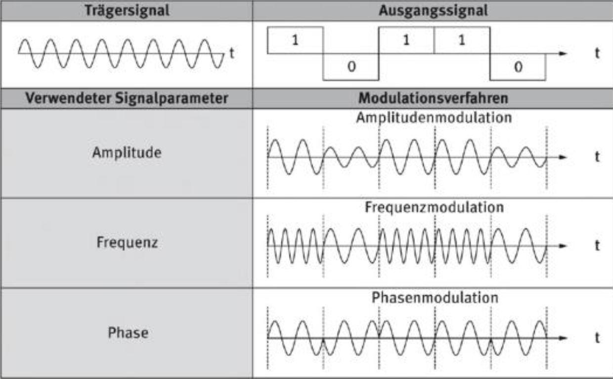
>Letztendlich will man es ja in 0 und 1 angeben, die Frage ist nur wie kann man die Signale als 1 und 0 lesen? Bei den Amplituden bspw. Ist die 1 4 größere Ausschläge, bei Frequenz bspw. Ist die 1 4 Amplituden.
### Übertragungsleistung:
- Übertragungskapazität: Welche Datenmenge kann in einer bestimmten Zeit übertragen werden? ; Werden in der Einheit bit/Sekunde angegeben (z.B. Kbit/s, Mbit/s)
- Signallaufzeit = Zeitspanne, die ein Signal benötigt, um eine Strecke zwischen zwei Punkten zu durchlaufen (Einheit s, ms, ns)
- Latenz = Verzögerung zwischen Versenden und Ankunft des ersten Datenbits (ping in ms) ; Relevant bei Spielen und Sprach- und Videokonferenzen
### Multiplexverfahren:
- Multiplexverfahren = Übertragungstechnik, durch die mehrere getrennte Verbindungen über ein einzelnes physisches Übertragungsmedium übertragen werden. Dabei wird die verfügbare Übertragungskapazität zwischen den logischen Kanälen aufgeteilt.
- Zu unterscheiden sind:
  - **Frequenzmultiplexverfahren**: verwendet mehrere verschiedene Frequenzbänder des gemeinsamen Übertragungsmediums
  - **Zeitmultiplexverfahren**: erlaubt logischen Kanälen exklusive Nutzungsrechte für kurze Zeitintervalle

## Übertragungsmedien

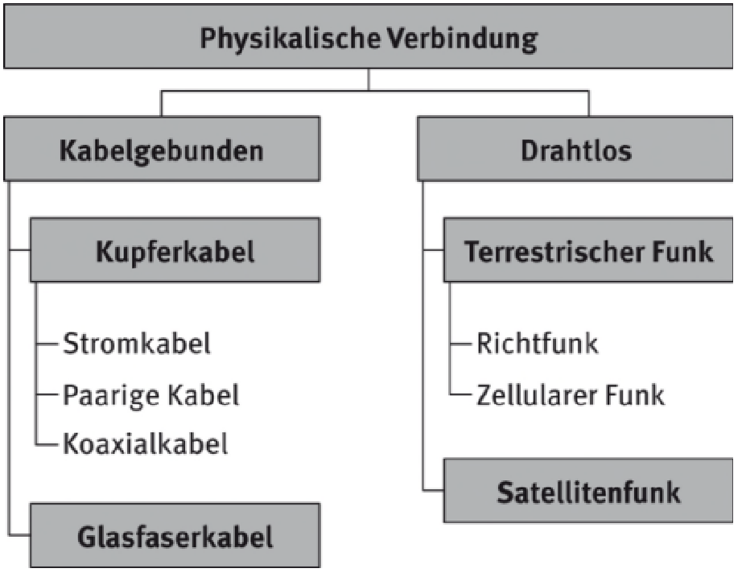
### Verdrillte Kupferkabel:
- in der Telefonie verwendet
- weitesten verbreitetes Übertragungsmedium
- Vorteile: Preiswert, einfach zu Verlegen
- Nachteile: Geringe Bandbreite, hohe Störanfälligkeit
### Koaxialkabel:
- Zwei Kupferleiter ineinander liegend angeordnet
- Vorteile: Hohe Sicherheit gegen Störungen, höherer Frequenzen möglich (daher der Name Breitbandkabel)
- Nachteile: Kabel ist eher unbeweglich -> verlegen manchmal problematisch
### Glasfaserkabel:
- Informationsübertragung durch dünne Glas- oder Kunststofffasern mittels Laserlichtimpulse
- Daten werden optisch Übertragen
- Vorteile: Kabel kann beliebig gekrümmt werden ohne Einbußen, sehr hohe Übertragungsleistungen
- Nachteile: Einsatz ist teuer
## Rechnernetze
### Allgemeines:
Rechnernetz = räumlich verteiltes System von Datenstationen, die durch Datenübertragungseinrichtungen und -wege miteinander verbunden sind.
### Klassifikation von Rechnernetzen:
- Es gibt verschiedene Formen von Rechnernetzen für verschiedene Einsatzgebiete
- Es gibt:
  - Organisatorische Kriterien: Wer betreibt das Rechnernetz?
    - öffentliches Netz (Fokus auf Betreiber)
    - privates Netz (Fokus auf Unternehmen oder privater Haushalt)
  - Strukturelle Kriterien: Wie sieht sie Struktur aus, also welche Knotenpunkte und Verbindungen?
    - Netzwerktopologie beschreibt das:
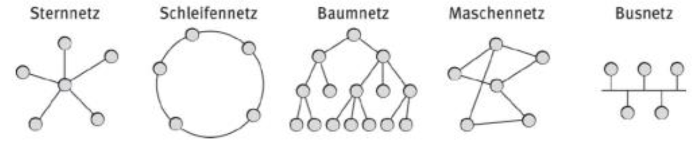
- Geographische Kriterien: Räumliche Ausdehnung des Rechennetzes
  - PAN: Persönliches Netzwerk (personal area network) / 1m2
  - LAN: Lokales Netz (local area network) / Abteilung, Betrieb
  - MAN: Netz für städtisches Ballungszentrum (metropolitan area network)
  - WAN: Weitverkehrsnetz (wide area network)

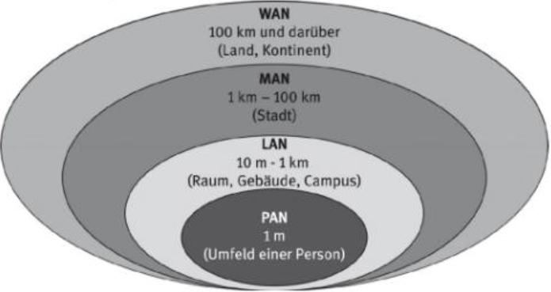
## Kommunikation in Rechnernetzen
### Allgemeines
Anfangs war die Kommunikation keine Herausforderung, da es keine großen Rechnernetze, und demensprechend keine Standards gab. Jedoch war die Kommunikation nicht aufs Internet übertragbar. Das war der Beginn für:
- Offenes Kommunikationssystem (TCP/IP)
	-Herstellerunabhängig
	- unterstützt Interoperabilität (heterogene Netzwerke)
- Kommunikationsprotokoll
  - Festgeschriebene Konvention für die Kommunikation zw Datenstationen (z.B. http)
- Regelt Aufbau von Meldungen:
  - Syntax - Repräsentationsgrößen
  - notwendige Inhalte
  - legt fest, welche Antworten auf Meldungen erfolgen müssen
### ISO/OSI-Referenzmodell:
- Definiert die Kommunikation zwischen Datenstationen in einem offenen Netzwerk
- Ordnet Kommunikationsprotokolle nach Aufgaben ein
- Kommunikationsprotokolle schaffen Regeln für unmissverständliche Kommunikation
zwischen Rechnern
- Übertragungsmedium (Kabel) ist für Kommunikation irrelevant

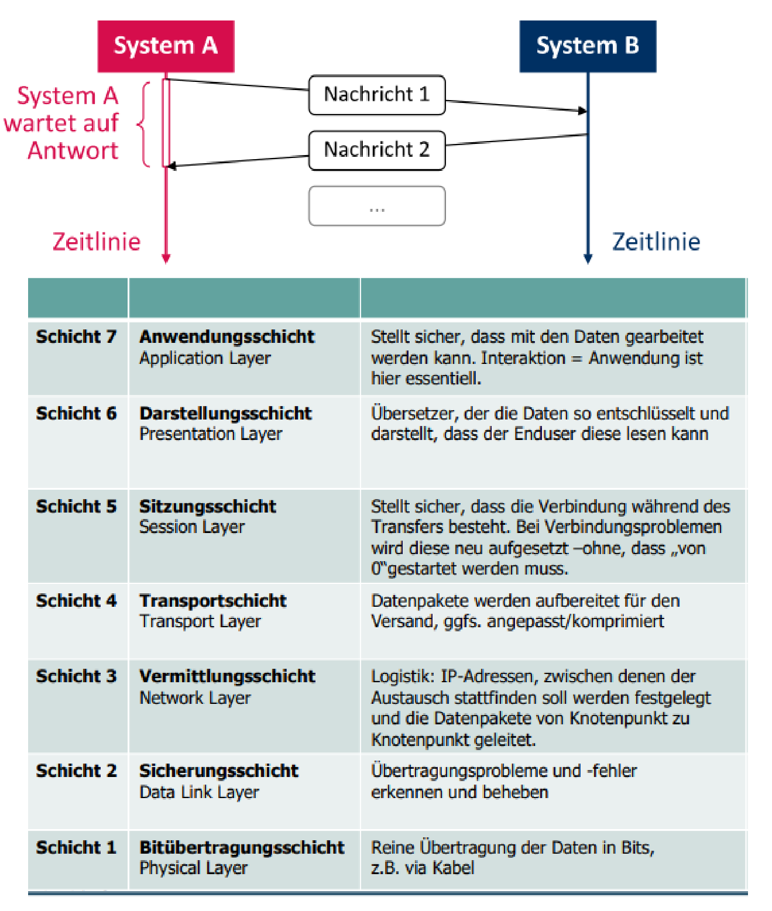
### Wichtiges zur Sicherungsschicht – Frame:
- Sicherungsschicht kümmert sich darum, dass Datenpakete gesichert werden
- gewährleistet zuverlässige und fehlerfreie Übertragung
- regelt Zugriff auf das Übertragungsmedium
### Wichtiges zur Sicherungsschicht – Flussteuerung:
- Flusssteuerung = Synchronisation der Übertragungsrate zwischen zwei Datenstationen
- Wie erfährt der Sender, dass der Empfänger weitere Pakete empfangen kann?
  - Es gibt zwei Protokolle:
    - Send-and-Wait Protokoll
    - Sliding-Window Protokoll

### Wichtiges zur Sicherungsschicht – Adressierung:
- Punkt-Adressierung: Adressierung einer Datenstation
- Broadcast-Adressierung: Adressierung aller Datenstationen. Ein Paket wird an alle (an das Medium angeschlossenen) Datenstationen gesendet.
- Mehrpunkt-Adressierung: Adressierung mehrerer Datenstationen. Ein Paket ist für mehrere Empfänger bestimmt, das Paket wird von allen bezeichneten Datenstationen empfangen.
## Internet-Protokolle:
### Definition TCP/IP:
Wichtigsten Protokolle sind die Internetprotokolle auf der 4-7 Schicht des OSI-Modells. Internetprotokolle werden auch als TCP/IP Protokolle bezeichnet.

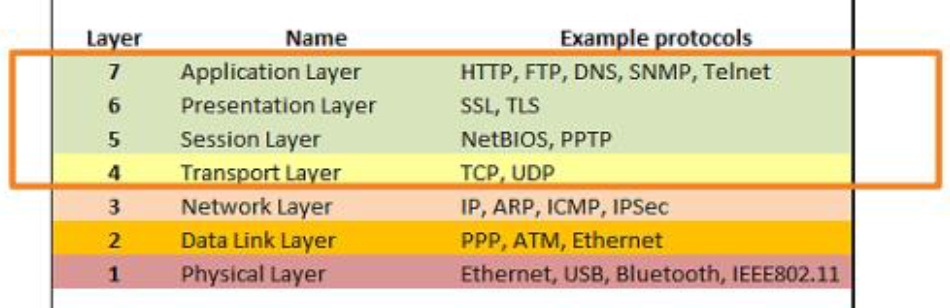
### Entwicklung des Internets:
- Netzneutralität = offener Zugang zu einem Rechnernetz, Gleichbehandlung von allen rechtmäßigen Daten bei der Datenübertragung
- Besitzt drei Regeln:
  - Keine Websperren (Blockieren von Angeboten)
  - Keine Tempobremsen (keine Reduktion der Übertragungsrate)
  - Keine Bevorzugung des Internet-Verkehrs eines Teilnehmers gegenüber eines anderen
### Schichtenmodell von TCP/IP – HTTP Protokoll:
- HTTP ist mit URL und HTML eines der wichtigsten Konzepte des Internets
- Es definiert die Kommunikation im WWW
- Verwendet auf der Transportschicht das Protokoll TCP
- Definiert zwei unterschiedliche Arten von Nachrichten:
  - Anfrage vom Client (Request)
  - Antwort vom Server (Response) an den Client
- Nachricht besteht aus 2 Teilen: http-Header + http-Body
- HTTPS (hypertext transfer protocol secure)
  - Übertragung von http über TLS (Transportverschlüsselung und Authentifizierung des Servers)
### Schichtenmodell von TCP/IP – TCP Protokoll:
- TCP ist das wichtigste Protokoll der Transportschicht
- Aufgaben:
  - Fügt IP-Pakete zusammen
  - fordert verloren gegangene Pakete nach, korrigiert Reihenfolge
### Schichtenmodell von TCP/IP – IP Protokoll:
- Internet Protocol (IP) = Protokoll oder Regelsatz zum Weiterleiten und Adressieren von Datenpaketen, damit diese über Netzwerke übertragen und am richtigen Ziel ankommen
- Daten, die das Internet durchlaufen, sind in kleinere Teile unterteilt, die man Pakete nennt
# 12 Datenspeicherung
## Informationen von Daten
### Arten von Daten
- Daten stellen Informationen in maschinell verarbeitbaren Form dar
- Digitale Daten werden durch Zeichen repräsentiert
- Analoge Daten werden durch kontinuierliche Funktionen repräsentiert
### Bits und Bytes
- Binärzeichen oder Bit = Zeichen aus Zeichenvorrat von 2 Zeichen
- Zur Darstellung wird die 0 (binäre Null) und 1 (binäre Eins) verwendet
- Heute ist ein Byte die kleinste Einheit und entspricht einer Folge von 8 Bits
### Repräsentationsgröße von Zahlen
- Legt die vorgesehene Datenmenge fest, die für ein Datenelement vorgesehen ist.
- Bestimmt wie viele unterschiedliche Werte in dem Datenelement dargestellt werden können

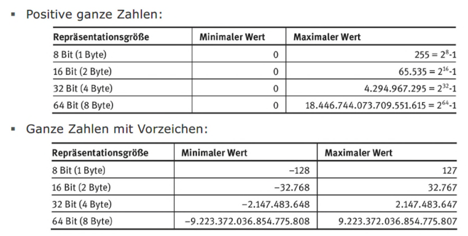
### ASCII
- Genormter, relativ alter Zeichenart für Schrift- und Steuerzeichen mit einer Repräsentationsgröße von 7 Bit
- Reicht aus, um beliebige englische Texte darstellen zu können
## Datenstrukturen
### Datenelemente
- Datenelement = Speicherbereich der einen Namen, Inhalt und Datentyp enthält
- Datentyp bestimmt, welche Operationen mit Werten durchgeführt werden und wie die Werte repräsentiert werden
- Datenelemente, die verändert werden können durch Operationen heißen
Variablen. Unveränderbare heißen Konstanten.

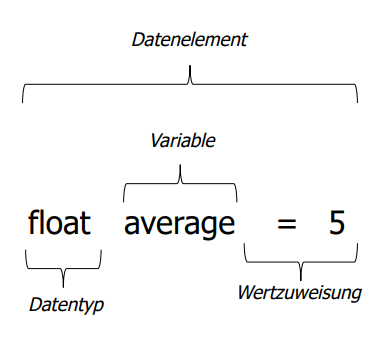

### Aggregation und Datensatz
- Aggregation: drückt aus, dass eine konzeptionelle Einheit Bestandteil einer anderen ist
- Datensatz: ist die Aggregation von unterschiedlichen Datenelementen

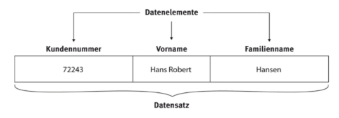
### Graphenbasierte Datenstrukturen

- Graph = Datenstruktur, die aus Knoten und Kanten aufgebaut ist.
- Knoten sind durch Kanten verbunden
- Gerichteter Graph = wenn die Kanten nur in eine Richtung gehen
- Ungerichteter Graph = wenn die Kanten in beide Richtungen gehen
### Baum
- Baum = gerichteter Graph mit einem Wurzelknoten, bei dem jeder Knoten maximal einen Vorgängerknoten hat
- Die sog. Ordnung bestimmt die Maximale Anzahl der Nachfolger eines
Knoten
- Baum der Ordnung zwei heißt Binärbaum

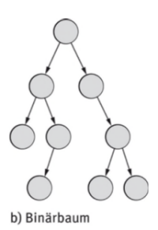
### Liste
- Liste = Graph der Ordnung eins. Jedes Element besitzt maximal einen
Vorgänger und einen Nachfolger
- Wurzel des Baums heißt Anker
## Datenbanken
### Definition
- Datenbank = zentral verwalteter Datenbestand, der über Zugriffsverfahren nutzbar gemacht wird
- Datenbankverwaltungssystem = verwaltet Datenbank, regelt Zugriffsschutz, ermöglicht gleichzeitige Zugriffe von mehreren Anwendungen, verwendet eigene Sprache für Abfrage von Daten
### Wichtige Typen von Datenbanken
- Transaktionsorientierte Datenbank: für Transaktionen, wichtigste Form, Standardannahme.
- Historische Datenbank: erlaubt Abfragen über Zustände und Ereignisse zu einem früheren Zeitpunkt (wer hat wann welche Werte eingefügt).
- Temporale Datenbank: ermöglicht beliebige Abfragen zu beliebigen Zeitpunkten
- Blockchain: spezielle Form einer historischen Datenbank, bei der die Unveränderbarkeit der Daten durch Kryptografische Prüfsummen zugesichert wird.
- In-Memory-Datenbank = Datenbank, die nur den (flüchtigen) Arbeitsspeicher für die Datenhaltung nutzt. Durch den Entfall des Zugriffs auf externe Speicher sind die Zugriffs- und Verarbeitungszeiten sehr kurz, allerdings können bei Systemabstürzen Daten verloren gehen
### Transaktionsorientierte Datenbanken
- Atomarität
- Konsistenz
- Isolation
- Dauerhaftigkeit
### Relationales Datenmodell
- Datenmodell: wie werden Daten gespeichert (Strukturierung, Datenelemente,...)
- Relationales Datenmodell: Daten werden von Relationen definiert und in Tabellen gespeichert
- Tabellen
  - Speichern Daten
  - Ausprägung entspricht einer Zeile
  - Merkmale (Attribute) entsprechen den Spalten
### SQL
- Strucured Query Language ist eine Abfragesprache
- SQL ist mengenorientiert und deskriptiv
### Nicht relationale Datenmodelle
- Hierarchisches Datenmodell: Anwendungsdaten werden durch Baumstrukturen repräsentiert
- Netzwerkdatenmodell: Informationsstrukturen werden durch Graphstrukturen dargestellt
### Dokumentenzentrierte Datenorganisation
- Allgemeines
  - Datenaustauschformat dient als Schnittstelle zum Import und Export von Daten
  - Strukturiertes Dokument ermöglicht Darstellung von semantisch zusammengehörenden Daten
- JSON
  - JSON = offener Standard für die Beschreibung baumstrukturierter Daten
  - JSONObjekt kann weitere Datenelemente enthalten, wobei jedes Attribut einen oder mehrere Werte enthalten kann
- Extensible Markup Language (XML)
  - XML = Metasprache für die Definition von anwendungsspezifischen Auszeichnungssprechen
  - Für den Menschen intuitiv verständlich und relativ einfach maschinell verarbeitbar

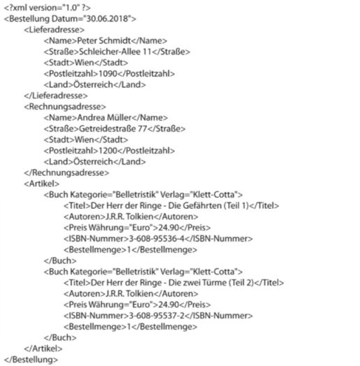
